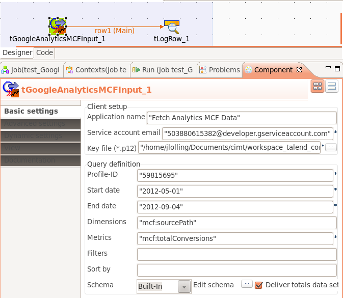

## tGoogleAnalyticsMCFInput

### Overview
This component collects data from the Google Analytics Multi Channel Funnel API.
Please take a look at the documentation inside.
For questions and suggestions please please do not use the rating function. Instead contact me directly or use the Forum.
### Details
* MCF dimensions and metrics
* Can use service accounts
### Images

### Resources
 * <a href=http://jan-lolling.de/talend/components/help/tGoogleAnalyticsMCFInput.pdf>Documentation</a>
 * <a href=http://jan-lolling.de/talend/howtos/google_service_account/create-a-google-service-account.html>How to create a Google service account</a>

#### Release Notes

##### 1.7 - 2014-06-28 13:08:13
release 1.7
less footprint because of cleaning up the library
##### 1.8 - 2014-09-19 12:47:31
Use the latest Google Analytics Java API r100-1.19.0
Does not throw an exception if the schema have more columns than the result set provides, only a warning will be printed.
### Compatible
 -  5.1 (obsolete)
 -   5.4 (obsolete)
 -   5.5 (obsolete)
 -   5.6 (obsolete)
 -   6.0 (obsolete)
 -   6.1 (obsolete)
 -   6.2 (obsolete)