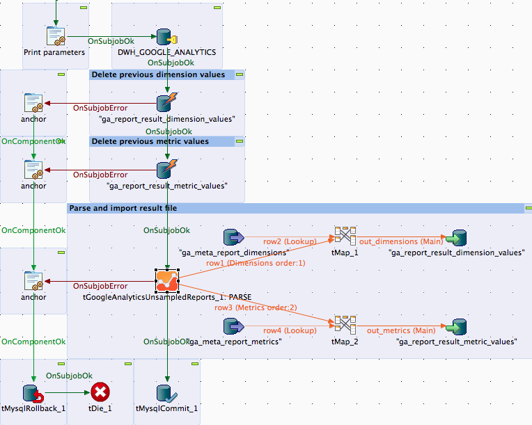

## tGoogleAnalyticsUnsampledReports

### Overview
This component managed un-sampled reports for Google Analytics.
It can only be used with a Google Analytics Premium Account.
It is recommended to take care the reports needs to be treated this way because the quotas for un-sampled reports are much lower than for normal reports.
It is a good practice to run the report first as normal reports with tGoogleAnalyticsInput and check the sampling state and decide which reports needs to run as un-sampled reports.
Un-sampled reports are treated in an asynchronous process. Everything whats necessary to do the steps are build-in in this component, except the download of the files. Please us the new component tGoogleDrive to do this.

Please read the linked documentation. The procedure is a bit complex!

In case of questions feel free to contact me: jan.lolling@gmail.com
### Details
* Create an unsampled report
* Check the status of your unsampled reports
* Parse the downloaded report file (to download it use tGoogleDrive component)
* Provide the output as plain rows or as normalized output
### Images

### Resources
 * <a href=https://github.com/jlolling/talendcomp_tGoogleAnalyticsUnsampledReports>Source Code on Github</a>
 * <a href=http://jan-lolling.de/talend/components/help/tGoogleAnalyticsUnsampledReports.pdf>Documentation</a>
 * <a href=http://jan-lolling.de/talend/howtos/google_service_account/create-a-google-service-account.html>How to create a Google service account</a>

#### Release Notes

##### 1.1 - 2014-12-24 01:05:45
Second release but first published.
##### 1.2 - 2015-01-08 15:52:18
Bug fixed: End date provided as Date object causes IllegalArgumentException.
##### 2.0 - 2015-01-18 15:38:35
New feature: Allows to exclude the ga:date dimension from the normalized dimension flow and provide the value as return variable.
Bug fixed: In the Parse-Mode the client setup settings are still active.
### Compatible
 -  5.1 (obsolete)
 -   5.3 (obsolete)
 -   5.4 (obsolete)
 -   5.5 (obsolete)
 -   5.6 (obsolete)
 -   6.0 (obsolete)
 -   6.1 (obsolete)
 -   6.2 (obsolete)