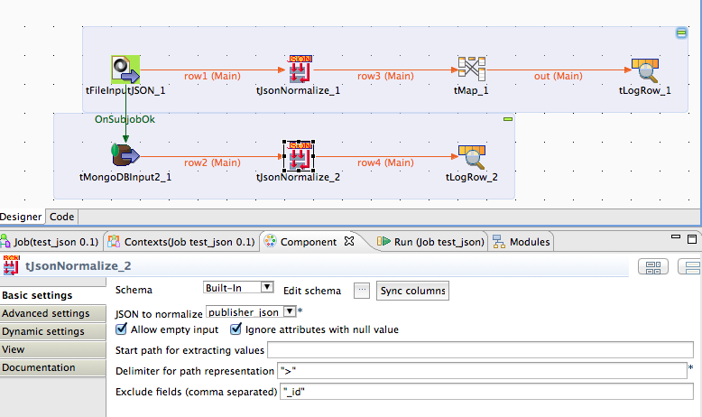

## tJsonNormalize

### Overview
It normalizes JSON objects (received as text column or from a MongoDB).
The component goes recursive through the JSON object and returns all simple values (also in arrays) with the value, and the path the the attribute.

Documentation: http://jan-lolling.de/talend/components/help/tJsonNormalize.pdf
### Details
Traverse through the JSON document it children and silbings and extracts all key value pairs including arrays.
### Images

### Resources
 * <a href=http://jan-lolling.de/talend/components/help/tJsonNormalize.pdf>Documentation</a>

#### Release Notes

##### 1.3 - 2014-06-29 12:43:12
republished
### Compatible
 -  5.1 (obsolete)
 -   5.4 (obsolete)
 -   5.5 (obsolete)
 -   5.6 (obsolete)