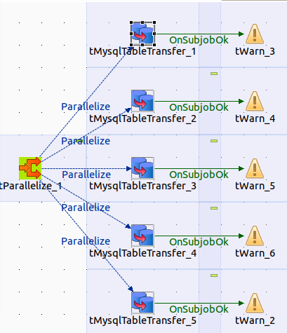

## tMysqlTableTransfer

### Overview
This component is dedicated to transfer the table content from one database to another database.
The component can truncate the target table before or disable all constraints while importing the data.
This component does not care about schema differences. All columns existing in source and target table will be transferred, all other ignored. The necessary schema will be created internally, therefore you have to provide only the source and target table name, thats it.
The component uses asynchronous transfer to half the duration because reading and writing can take place at the same time (or overlapping).
### Details
* Read and write in parallel
* Can ignore missing columns
* Do not need to configure a schema
* Can disable indexes while import runs
* Can truncate table before the transfer starts
### Images

### Resources
 * <a href=http://jan-lolling.de/talend/components/help/tMysqlTableTransfer.pdf>Documentation</a>
 * <a href=http://sourceforge.net/projects/talend-user-components/>Source Code</a>

#### Release Notes

##### 1.8 - 2014-08-27 10:10:43
republished and renewed.
### Compatible
 -  5.1 (obsolete)
 -   5.4 (obsolete)
 -   5.5 (obsolete)
 -   5.6 (obsolete)
 -   6.0 (obsolete)
 -   6.1 (obsolete)
 -   6.2 (obsolete)