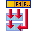
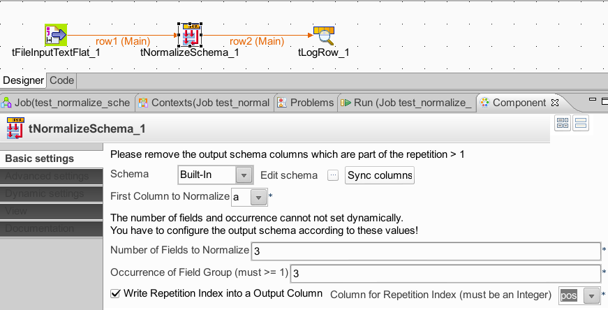

## tNormalizeSchema

### Overview
This component normalises denormalized schemas.
If you have repeated column groups and you need to have them only once but as rows.
You can actually do the same with tSplitRow but in tSplitRow you have to configure every assignment by hand which leads for a large number of columns and large number or repetitions to a nightmare and error prone task. 
Please take a look at the documentation.

Documentation: http://jan-lolling.de/talend/components/help/tNormalizeSchema.pdf
### Details
Normalizes schema columns or (column groups) which repeats a lot.
Avoid increasing the method size ->prevents the job reaches the byte limititation for a method.
### Images

### Resources
 * <a href=http://jan-lolling.de/talend/components/help/tNormalizeSchema.pdf>Documentation</a>

#### Release Notes

##### 1.0 - 2014-06-29 12:38:34
republished
### Compatible
 -  5.1 (obsolete)
 -   5.4 (obsolete)
 -   5.5 (obsolete)
 -   5.6 (obsolete)
 -   6.0 (obsolete)
 -   6.1 (obsolete)
 -   6.2 (obsolete)
 -   6.3 (obsolete)
 -   6.4 (obsolete)
 -  6.5 (retired)
 -  7.0 (retired)
 -  7.1 (retired)