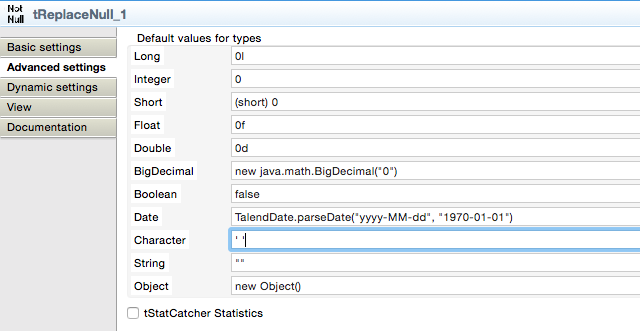
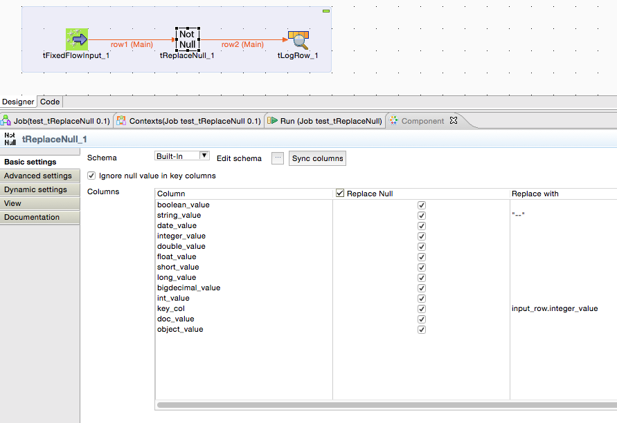

## tReplaceNull

### Overview
This component checks the input row if values are null and set a default value.
The output value will be (the order in which the check takes place, like a coalesce function):
1. the input value if not null
2. the Null replacement defined in the basic settings
3. the default value defined in the schema for the column
4. the default value for the data type defined in the advanced settings
The purpose of this component is especially for large schemas to avoid time consuming configurations in a tReplace or a tMap.
For all data types there are useful default values already configured.
### Details
Avoid a lot of handmade code to check and replace null values.
### Images

### Resources
 * <a href=https://sourceforge.net/p/talend-user-components/code/HEAD/tree/talendcomp_tReplaceNull/>Source Code</a>

#### Release Notes

##### 1.1 - 2015-03-11 23:56:22
Avoid disturbing job java code if non flows connected
##### 1.2 - 2015-03-12 16:52:11
Problem solved with incompatibility to 5.4.2. Now the component works well also here.
### Compatible
 -  5.1 (obsolete)
 -   5.2 (obsolete)
 -   5.3 (obsolete)
 -   5.4 (obsolete)
 -   5.5 (obsolete)
 -   5.6 (obsolete)
 -   6.0 (obsolete)
 -   6.1 (obsolete)
 -   6.2 (obsolete)
 -   6.3 (obsolete)
 -   6.4 (obsolete)
 -  6.5 (retired)
 -  7.0 (retired)
 -  7.1 (retired)