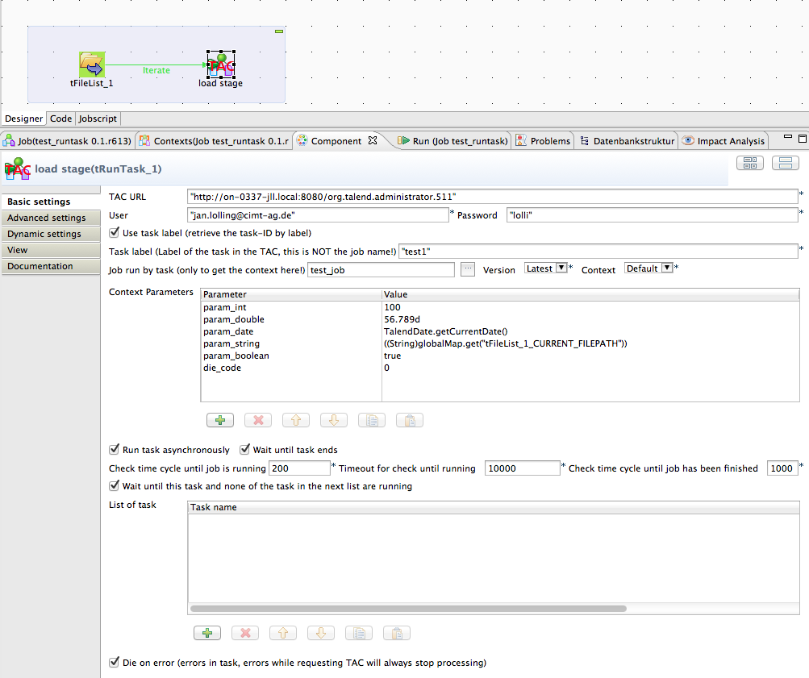

## tRunTask

### Overview
This component can trigger or check task in the Talend Administration Center.
It helps to create sophisticated job chains because you can detect in the unlimited flexibility the necessary events or parameters to start a task in the TAC.
With the help of this component you can avoid deploying "monster" jobs containing all jobs needed in a complex task. You simply deploy all necessary jobs as tasks and starts them with a another job.
You can stop the "trigger" job and all currently running task will finishes they work without being interrupted.

Because of the check functionality you can create watchdog jobs for important tasks.

### Details
* Run Task
* Provide context parameter to the task
* Check the task status
* Can execute the requests synchronously or ansynchronously
* Can handle errors while the communication with the TAC
* Starting with Talend release 5.6.1 it returns the real exit code of a job
### Images

### Resources
 * <a href=http://jan-lolling.de/talend/components/help/tRunTask.pdf>Documentation</a>
 * <a href=https://github.com/jlolling/talendcomp_tRunTask>Source Code on Github</a>

#### Release Notes

##### 1.7 - 2014-06-29 12:22:43
republished
##### 1.8 - 2014-09-12 16:11:17
Problem with no ready to run task solved.
##### 2.0 - 2015-03-11 14:15:24
Can return the real job exit code when running in Talend release 5.6+
Has addition mode to retrieve the task status (without running it).
Has improved method to handle preparing status like generate or deploy.
Can repeat requests in case of TAC errors
### Compatible
 -  5.1 (obsolete)
 -   5.2 (obsolete)
 -   5.3 (obsolete)
 -   5.4 (obsolete)
 -   5.5 (obsolete)
 -   5.6 (obsolete)
 -   6.0 (obsolete)
 -   6.1 (obsolete)
 -   6.2 (obsolete)