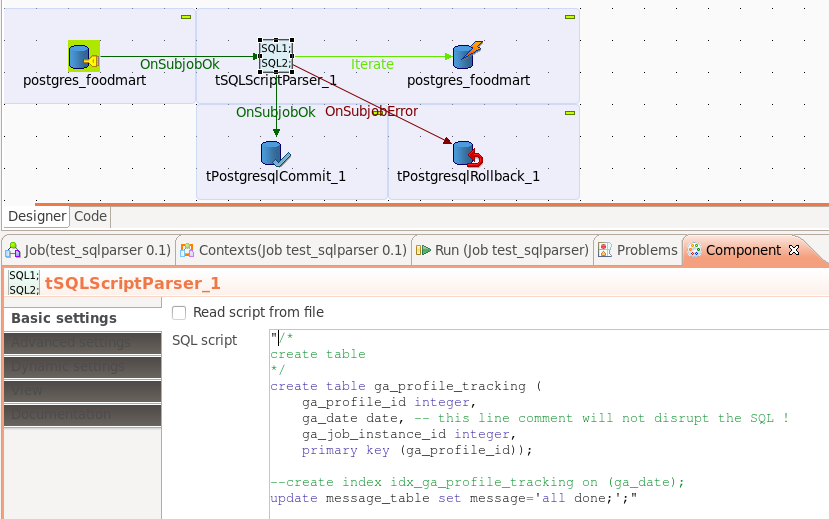

## tSQLScriptParser

### Overview
This component can iterate through SQL statements in a script read from the SQL input in the component or from a file.
It detects the OraclePlus delimiter / to separate complex statements like begin-end or create or replace procedure etc.

The current statement can be retrieved with the return value (see the Outline view) e.g. ((String)globalMap.get("tSQLScriptParser_1_STATEMENT_SQL")).
A common use case is to trigger a tMysqlRow with the Iterate flow and use in the Row component as query ((String)globalMap.get("tSQLScriptParser_1_STATEMENT_SQL")).
Take care you do not put this expression NOT in quotas unlike you would do for SQL code.

### Details
* Recognizes complex statements in PL/SQL scripts
* Handles comments
### Images

### Resources
 * <a href=http://sourceforge.net/projects/talend-user-components/>Source Code</a>

#### Release Notes

##### 1.2 - 2014-06-29 12:28:37
republished
### Compatible
 -  5.1 (obsolete)
 -   5.2 (obsolete)
 -   5.3 (obsolete)
 -   5.4 (obsolete)
 -   5.5 (obsolete)
 -   5.6 (obsolete)
 -   6.0 (obsolete)
 -   6.1 (obsolete)
 -   6.2 (obsolete)
 -   6.3 (obsolete)
 -   6.4 (obsolete)
 -  6.5 (retired)
 -  7.0 (retired)
 -  7.1 (retired)