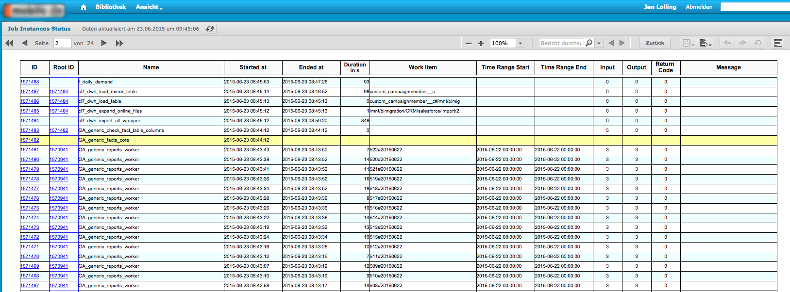
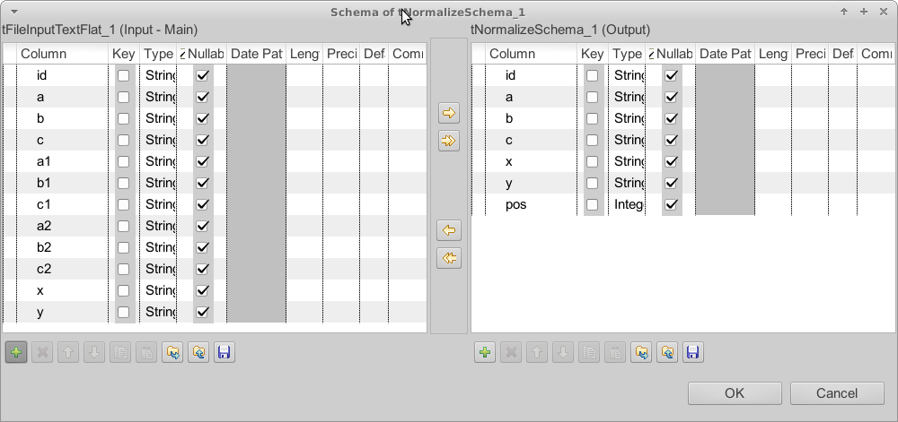

# jlolling
  Located in Berlin, Open Source addicted.
     <http://github.com/jlolling>
  <nospam+jan.lolling@gmail.com>

## <a href='./components/tCalendar/readme.md'> tCalendar</a>
 :white_check_mark: Compatible with Talend 7.x / 8.x 

Data warehouses needs a date dimension and this component creates the most of the needed data (also fully localised).
The schema of this component is fully commented.

## <a href='./components/tDB2TableTransfer/readme.md'> tDB2TableTransfer</a>
 :white_check_mark: Compatible with Talend 7.x / 8.x 

This component is dedicated to transfer the table content from one database to another database.
The component can truncate the target table before.
This component does not care about schema differences. All columns existing in source and target table will be transferred, all other ignored. The necessary schema will be created internally, therefore you have to provide only the source and target table name, thats it.
The component uses asynchronous transfer to half the duration because reading and writing can take place at the same time (or overlapping).

## <a href='./components/tDB2TemporalMergeELT+tDB2TemporalDeleteELT/readme.md'> tDB2TemporalMergeELT+tDB2TemporalDeleteELT</a>
 :white_check_mark: Compatible with Talend 7.x / 8.x 

This package contains 2 components:
tDB2TemporalMergeELT
tDB2TemporalDeleteELT

These components supports the ELT usage of the IBM DB2 temporal tables, introduced with the release 10.1 of the IBM DB2 database.

Please refer to the linked documentation!

tDB2TemporalMergeELT create and updates temporal tables.
tDB2TemporalDeleteELT performs temporal deletes.
Temporal tables are a native Slowly Changing Dimension Type 2 implementation (with bi-temporal means you have a business time period and a system time period for the validity of your data).

Documentation for the tDB2TemporalMergeELT: http://jan-lolling.de/talend/components/help/tDB2TemporalMergeELT.pdf
Documentation for the tDB2TemporalDeleteELT: http://jan-lolling.de/talend/components/help/tDB2TemporalDeleteELT.pdf

## <a href='./components/tFileExcel-Components/readme.md'> tFileExcel-Components</a>
 :warning: Compatibility not known

This component open an existing Excel workbook or creates a new one. 
This component is the basis for all other tFileExcel* component.
It uses the latest Apache POI API 3.12 final and recognise the kind of workbook by the file name, it is not necessary to decide at start which kind of document you want to load.
The component has an option to use the xml parser already loaded by the JDK or Runtime or the parser shipped with the component (advanced settings). 
This should solve incompatibility problems.

## <a href='./components/tFileInputTextFlat/readme.md'> tFileInputTextFlat</a>
 :warning: Compatibility not known

This component is dedicated to read text files. 
The component allows to read text files with not stable structures and provide a feature similar to the dynamic schema but for the Open Studio edition.
The configuration can be read from an external file.

## <a href='./components/tFTPClose/readme.md'> tFTPClose</a>
 :warning: Compatibility not known

Closes a FTP connection (also SFTP the other supported connection types).
Embedded jobs connection to a FTP/SFTP/FTPS Server without closing them can cause serious problems. 
This component is designed to detect the kind of connection beased on the settings of the tFTPConnection component and builds the necessary code to close it correctly.

## <a href='./components/tGoogleAnalyticsManagement/readme.md'> tGoogleAnalyticsManagement</a>
 :warning: Compatibility not known

This component uses the Management API to collect all available items for your account like web property, profiles, segments and goals (also with URL destination steps and event conditions).
NEW: provides an output flow with describing information about all available dimensions and metrics (all columns).

NEW: Provides output flows for the user permissions to accounts, web properties and views.
The schemas has been changed (some additional columns added). 
Therefore please remove the component from your job and add it again. Unfortunately I do not know any other way to force the Studio to accept a new fixed defined schema.

## <a href='./components/tGoogleAnalyticsMCFInput/readme.md'> tGoogleAnalyticsMCFInput</a>
 :warning: Compatibility not known

This component collects data from the Google Analytics Multi Channel Funnel API.
Please take a look at the documentation inside.
For questions and suggestions please please do not use the rating function. Instead contact me directly or use the Forum.

## <a href='./components/tGoogleAnalyticsUnsampledReports/readme.md'> tGoogleAnalyticsUnsampledReports</a>
 :warning: Compatibility not known

This component managed un-sampled reports for Google Analytics.
It can only be used with a Google Analytics Premium Account.
It is recommended to take care the reports needs to be treated this way because the quotas for un-sampled reports are much lower than for normal reports.
It is a good practice to run the report first as normal reports with tGoogleAnalyticsInput and check the sampling state and decide which reports needs to run as un-sampled reports.
Un-sampled reports are treated in an asynchronous process. Everything whats necessary to do the steps are build-in in this component, except the download of the files. Please us the new component tGoogleDrive to do this.

Please read the linked documentation. The procedure is a bit complex!

In case of questions feel free to contact me: jan.lolling@gmail.com

## <a href='./components/tGoogleDrive/readme.md'> tGoogleDrive</a>
 :warning: Compatibility not known

This component manages files and folders on a Google Drive via the Google Drive API v2.
It has various operational modes to:
- upload a file (also with set permissions to other users)
- download a file
- list files (with filtering)
- get the properties of a file/folder
- move files
- delete files

Especially for the usage in conjunction with tGoogleAnalyticsUnsampledReports this component provides the same authentication methods as for the Google Analytics and is able to work directly with file-Ids.
   
Please refer the linked documentation.
For questions and suggestions please contact me: jan.lolling@gmail.com
Please do not use the rating function to post questions.

## <a href='./components/tJasperReportExec/readme.md'> tJasperReportExec</a>
 :warning: Compatibility not known

This component can use a local jrxml file and compiles, fills and exports the report in a Talend job without a JasperServer.
It detect the need of compiling the report as well as subreports.
It uses the JasperLibrary 6.1.1
If you need Barcodes you have to add all necessary libraries with tLoadLibrary and it will work.
Please refer to the linked documentation to get more information about the necessary libraries and how to setup them.
Unlike the build in components tJasperOutput this component can use all typical data sources:
JDBC connection (all possible database connections from Talend are enabled)
You can set parameters and you can use resource bundles.
XML files
Dummy records for reports which gets its values from other sources e.g. in sub reports.
Please take care building a report with the correct compatibility settings inn Jaspersoft Studio. Please refer to the linked documentation how to do that. 

## <a href='./components/tJasperServerReportStarter/readme.md'> tJasperServerReportStarter</a>
 :warning: Compatibility not known

This component uses the scheduler web service of the JasperServer to start a report on the JasperServer. The report must be deployed already.
It is tested with the latest JasperServer releases.
You can set all possible parameters to the report and you can use all features of the scheduling service of the Jasper server.

## <a href='./components/tJobInstance_component_collection/readme.md'> tJobInstance_component_collection</a>
 :warning: Compatibility not known

These 4 components:
- tJobInstanceStart
- tJobInstanceEnd
- tJobDataRangeScanner
- tJobInstanceLiveCheck
are dedicated to manage job monitoring.
Helps you to have all essential information for every job run:
What has the job done, what comes in, what is the result...
Where, when, how how runs the jobs....
 
Please refer the linked documentation
The release 3.0 needs slightly changed tables!
Please contact me in case of questions and do not use the rating function to post questions.

## <a href='./components/tJsonNormalize/readme.md'> tJsonNormalize</a>
 :warning: Compatibility not known

It normalizes JSON objects (received as text column or from a MongoDB).
The component goes recursive through the JSON object and returns all simple values (also in arrays) with the value, and the path the the attribute.

Documentation: http://jan-lolling.de/talend/components/help/tJsonNormalize.pdf

## <a href='./components/tLOBDownload/readme.md'> tLOBDownload</a>
 :white_check_mark: Compatible with Talend 7.x / 8.x 

This component downloads a LOB (BLOB or CLOB) object.
For CLOB content you can set a charset because the CLOBs like BLOBs are always byte streams.
Select in a query the BLOB or CLOB columns and setup for these columns file names where the content have to be downloaded. 
The file names can contains placeholders referring to other columns (e.g. IDs or if the file name is also stored in a column).

## <a href='./components/tMysqlTableTransfer/readme.md'> tMysqlTableTransfer</a>
 :warning: Compatibility not known

This component is dedicated to transfer the table content from one database to another database.
The component can truncate the target table before or disable all constraints while importing the data.
This component does not care about schema differences. All columns existing in source and target table will be transferred, all other ignored. The necessary schema will be created internally, therefore you have to provide only the source and target table name, thats it.
The component uses asynchronous transfer to half the duration because reading and writing can take place at the same time (or overlapping).

## <a href='./components/tNormalizeSchema/readme.md'> tNormalizeSchema</a>
 :white_check_mark: Compatible with Talend 7.x / 8.x 

This component normalises denormalized schemas.
If you have repeated column groups and you need to have them only once but as rows.
You can actually do the same with tSplitRow but in tSplitRow you have to configure every assignment by hand which leads for a large number of columns and large number or repetitions to a nightmare and error prone task. 
Please take a look at the documentation.

Documentation: http://jan-lolling.de/talend/components/help/tNormalizeSchema.pdf

## <a href='./components/tOracleTableTransfer/readme.md'> tOracleTableTransfer</a>
 :warning: Compatibility not known

This component is dedicated to transfer the table content from one database to another database.
The component can truncate the target table before.
This component does not care about schema differences. 
All columns existing in source and target table will be transferred, all other ignored. The necessary schema will be created internally, therefore you have to provide only the source and target table name, thats it.
The component uses asynchronous transfer to (up to) halve the duration because reading and writing can take place at the same time (or overlapping).

## <a href='./components/tPostgresqlTableTransfer/readme.md'> tPostgresqlTableTransfer</a>
 :warning: Compatibility not known

This component is dedicated to transfer the table content from one database to another database.
The component can truncate the target table before.
This component does not care about schema differences. All columns existing in source and target table will be transferred, all other ignored. The necessary schema will be created internally, therefore you have to provide only the source and target table name, thats it.
The component uses asynchronous transfer to half the duration because reading and writing can take place at the same time (or overlapping).

## <a href='./components/tReplaceNull/readme.md'> tReplaceNull</a>
 :white_check_mark: Compatible with Talend 7.x / 8.x 

This component checks the input row if values are null and set a default value.
The output value will be (the order in which the check takes place, like a coalesce function):
1. the input value if not null
2. the Null replacement defined in the basic settings
3. the default value defined in the schema for the column
4. the default value for the data type defined in the advanced settings
The purpose of this component is especially for large schemas to avoid time consuming configurations in a tReplace or a tMap.
For all data types there are useful default values already configured.

## <a href='./components/tRunTask/readme.md'> tRunTask</a>
 :warning: Compatibility not known

This component can trigger or check task in the Talend Administration Center.
It helps to create sophisticated job chains because you can detect in the unlimited flexibility the necessary events or parameters to start a task in the TAC.
With the help of this component you can avoid deploying "monster" jobs containing all jobs needed in a complex task. You simply deploy all necessary jobs as tasks and starts them with a another job.
You can stop the "trigger" job and all currently running task will finishes they work without being interrupted.

Because of the check functionality you can create watchdog jobs for important tasks.

## <a href='./components/tSQLScriptParser/readme.md'> tSQLScriptParser</a>
 :white_check_mark: Compatible with Talend 7.x / 8.x 

This component can iterate through SQL statements in a script read from the SQL input in the component or from a file.
It detects the OraclePlus delimiter / to separate complex statements like begin-end or create or replace procedure etc.

The current statement can be retrieved with the return value (see the Outline view) e.g. ((String)globalMap.get("tSQLScriptParser_1_STATEMENT_SQL")).
A common use case is to trigger a tMysqlRow with the Iterate flow and use in the Row component as query ((String)globalMap.get("tSQLScriptParser_1_STATEMENT_SQL")).
Take care you do not put this expression NOT in quotas unlike you would do for SQL code.

## <a href='./components/tYoutubeAnalyticsInput/readme.md'> tYoutubeAnalyticsInput</a>
 :warning: Compatibility not known

This component collect analytics data for YouTube.
It uses the latest Google API to collect the data.
The setup of the account and authorisation is not trivial. 
Please take a look at the documentation linked here.
Many thanks to Alvaro for sharing ideas and test support.

New API revision used
Documentation improved with more information how to configure and hints in case of problems.

Documentation: http://jan-lolling.de/talend/components/help/tYoutubeAnalyticsInput.pdf

