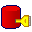

# jyaime
  <nospam+jeanmarie.gouy@gmail.com>

## <a href='./components/cFilterRow/readme.md'> cFilterRow</a>
 :warning: Compatibility not known

cFilterRow is based on tFilterRow.

It adds two fields "errorCode", and "errorMessage" in the reject link which indicate why the line has been rejected.

## <a href='./components/cIndexedFilesInput/readme.md'> cIndexedFilesInput</a>
 :warning: Compatibility not known

cIndexedFilesInput allows you to access to some specific lines in very big files, by a key and in a random way.

To use it :
- You have to create an index on your big files with component cIndexFile.
- You give a array name in component properties in order to read the index.
- You send a key to the component (in globalMap), and start the component with an iterate link, and you will get a flow of lines corresponding to the key, until the next key or until the end of the file.

## <a href='./components/cIndexFile/readme.md'> cIndexFile</a>
 :warning: Compatibility not known

cIndexFile allows you to index very big files in order to access them after, in a random way.
The purpose of this component is to access to pieces of data in very very big files. (which can't be mounted in memory)

To use it :
- You give a regexp expression with a "group" used to match a key (ie "^PIECESTART(....KEY.....)0100.*" indexed key is between () )
- You give a array name in component properties in order to store index 
- You can use several components cIndexFile to index multiple files, and store indexes in a common array.

Then with component cIndexedFilesInput, you just have to ask for a "key", and it will give you the part corresponding to this key in the file.

## <a href='./components/cOracleCommit/readme.md'> cOracleCommit</a>
 :warning: Compatibility not known

cOracleCommit is based on tOracleCommit

It just allows to select cOracleConnection in "Existing connections"

## <a href='./components/cOracleConnection/readme.md'> cOracleConnection</a>
 :warning: Compatibility not known

cOracleConnection is based on tOracleConnection

It adds support for tnsnames.ora files :
You install oracle client in [ORACLE_HOME] and this component will use tnsname.ora to connect to oracle database.

Tested under Unix (Linux & HP-UX) and Windows

## <a href='./components/cOracleOutput/readme.md'> cOracleOutput</a>
 :warning: Compatibility not known

cOracleOutput is based on tOracleOutput

It just allows to select cOracleConnection in "Existing connections"

## <a href='./components/cOracleRow/readme.md'> cOracleRow</a>
 :warning: Compatibility not known

cOracleRow is based on tOracleRow

It just allows to select cOracleConnection in "Existing connections"

