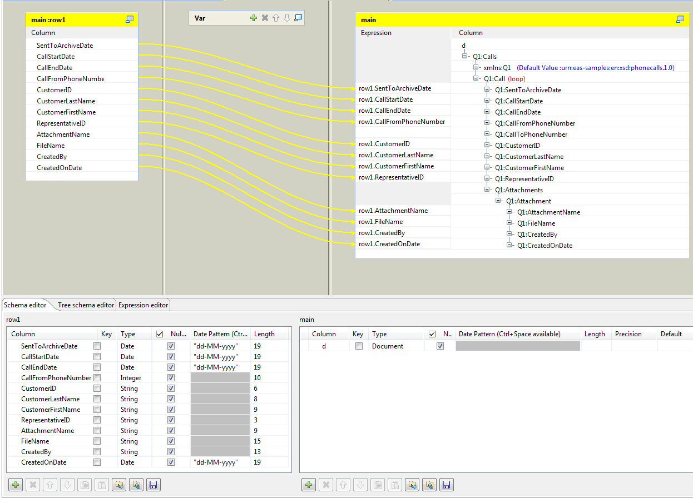
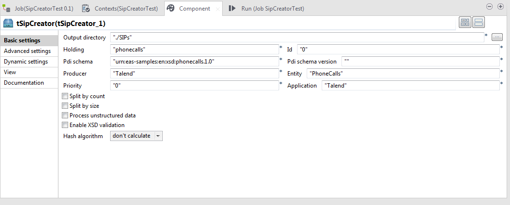

## tSipCreator

### Overview
This component generates SIP packages for ingestion to EMC InfoArchive.
This component is universal, meaning it can work with any data source, provided by Talend Open Studio. 
Component has one input connection and no output connections. The input connection must have only one column with Document type and any name. 
This document must be valid eas_pdi.xml with any AIU count inside. 
These documents can be formed, for example, in tXMLMap or tFileInputXML. 
You can provide any count of document in the input connection - component merges/splits them if needed. 
### Details
- eas_pdi.xml generation
- eas_sip.xml generation
- unstructured data processing: for using it, user must specify XPath query for finding file names in eas_pdi.xml
- splitting SIPs by AIU count
- splitting SIPs by unstructured content size
- XML validation with XSD schema
- eas_pdi.xml hash calculating
### Images

### Install Instructions
Please copy the package to the components folder of Talend Studio. Component is located in InfoArchive folder and has name tSipCreator.

#### Release Notes

##### 1.0.0 - 2016-05-24 14:48:04
tSipCreator is a Talend Open Studio output component, that lets you generate Submission Information Packages (SIPs) to be ingested into InfoArchive.
### Compatible
 -