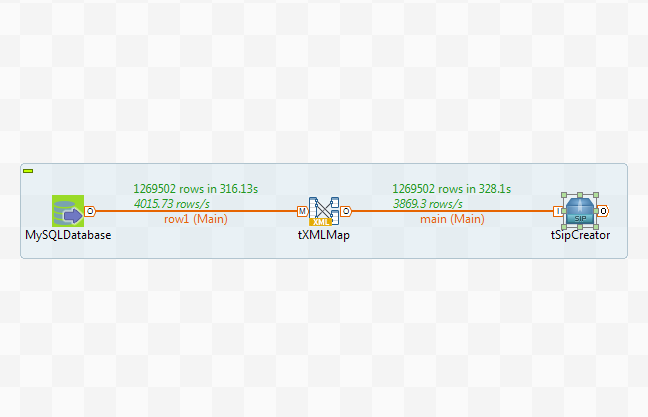

# khandk
  <nospam+kriss.handova@gmail.com>

## <a href='./components/tSipCreator/readme.md'> tSipCreator</a>
 :warning: Compatibility not known

This component generates SIP packages for ingestion to EMC InfoArchive.
This component is universal, meaning it can work with any data source, provided by Talend Open Studio. 
Component has one input connection and no output connections. The input connection must have only one column with Document type and any name. 
This document must be valid eas_pdi.xml with any AIU count inside. 
These documents can be formed, for example, in tXMLMap or tFileInputXML. 
You can provide any count of document in the input connection - component merges/splits them if needed. 

