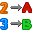

# mjackisch
  <nospam+mtj@japrv.de>

## <a href='./components/tSetContextVariable/readme.md'> tSetContextVariable</a>
 :warning: Compatibility not known

tSetContextVariable can be used to set or modify a context variable inside a job, very much like tSetGlobalVar.

