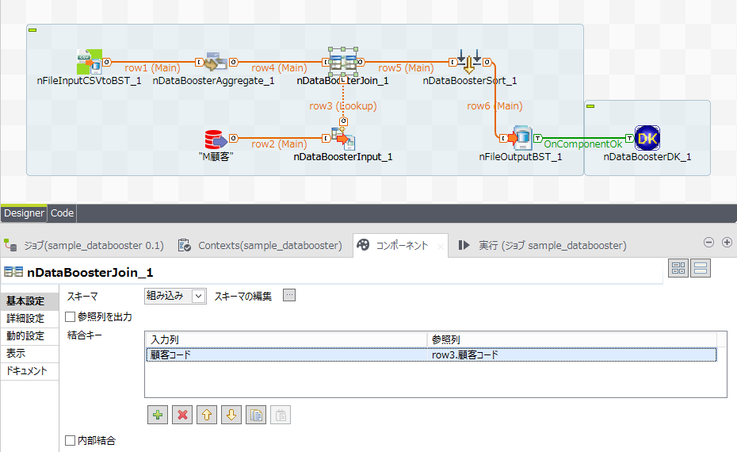

# nao-aizawa
  <nospam+nao-aizawa@xr.jp.nec.com>

## <a href='./components/nDataBoosterHighSpeedTransform/readme.md'> nDataBoosterHighSpeedTransform</a>
 :warning: Compatibility not known

It has been registered multiple components.
These component process general transformation at high speed, but it's necessary to buy and install "InfoFrame DataBooster" made by NEC company.

NOTICE:JAPANESE ONLY
InfoFrame DataBooster : http://jpn.nec.com/infoframe/databooster/

The offered main components are as follows.
・DataBoosterAggregate
・DataBoosterFilterRow
・DataBoosterInput
・DataBoosterJoin
・DataBoosterOutput
・DataBoosterPivot
・DataBoosterSort
・DataBoosterUnion
・DataBoosterUnpivot

