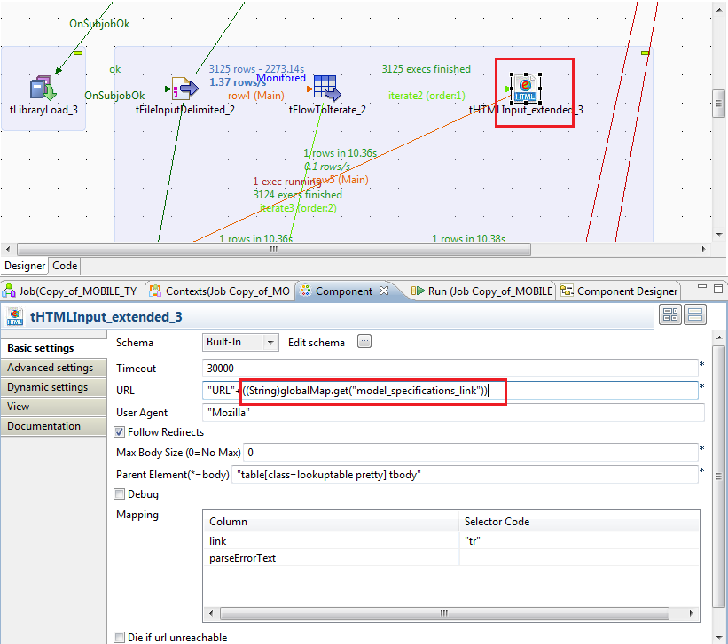
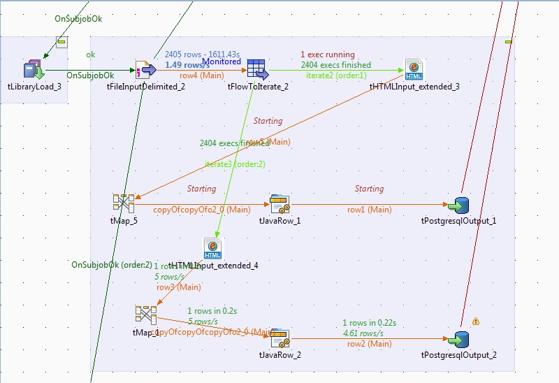

## tHTMLInput_extended

### Overview
HTML parsing, selecting elements, retrying over fail. New checkbox 'Die if URL unreachable' and new text field 'Times to retry'.
### Details
Benefits:
Get Result in Tabular(Table) format.
Full support to most of Jsoup selectors.

Features
Provides output in Tabular format.
You can customise selectors.
Element can be added, deleted, edited through UI table.
Text Extraction.
Element/Tag extraction.
Link Extraction.
Continue over fail (new)
Die over fail (new)
Retry over fail (new)

### Images

### Install Instructions
Copy to your additional component folder and Push component via the Component Designer.

#### Release Notes

##### 1 - 2015-07-02 14:00:26

### Compatible
 -  5.4 (obsolete)
 -   5.5 (obsolete)
 -   5.6 (obsolete)
 -   6.0 (obsolete)
 -   6.1 (obsolete)
 -   6.2 (obsolete)