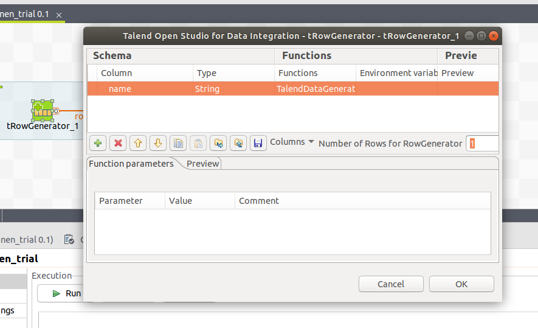
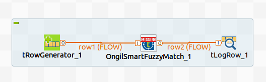
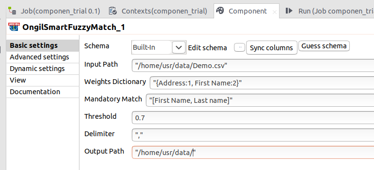

## Ongil Fuzzy Match

### Overview
Ongil Fuzzy Match allows you to find duplicates in your given data by checking in multiple columns and combining the results together,thus finding duplicate rows in the data instead of just duplicate column values

## Usage

Add a tRowGenerator, the OngilSmartFuzzyMatch component and a tLogRow component to the job, and connect them.
Double click the tRowGenerator and add one column of any type.
Set the number of rows to 1. 
Click ok to propagate the schema to OngilSmartFuzzyMatch and tLogRow components.
Run the job.

## Parameters


### Input Path:
Absolute path of the input csv or excel file. [Other file formats cannot be processed currently.]

### Weights Dictionary:
A dictionary with column names as keys and their weights (positive numbers indicating relative importance) as values.  Example:
\t\t\t“{first_name:10, last_name:5, middle_name:0.5}”
Note: no quotations (“ or ‘) required inside the dictionary. The weights for all columns will be normalized before use. In this case, the weights will be 1, 0.5 and 0.05 respectively.

### Threshold:
A value between 0 and 1. Records are identified as duplicates if their similarity scores are greater than this number. We recommend that you try the default value of 0.7 before fine-tuning this parameter for better results

### Mandatory Match:
A list of column names containing those columns in which only exact matches must be considered as duplicates.  Example:
“[first_name, last_name]”
Note: no quotations (“ or ‘) required inside the array. 

### Delimiter:\t
Delimiter used in the input csv/excel file.

### Output Path:\t
Absolute path of the directory in which output files must be downloaded.
### Details
To illustrate,  consider a data integration job where contact details data from multiple sources have been combined.  The ‘Address’ field in the integrated file could have

```
“TB ELECTRONICS (ENTERPRISE 1)PTE. LTD.1 KONG MO KIO ELECTRONICS PARK ROAD#01-01 TB ENGINEERING HUB567710 SINGAPORE ”
 \t\t\t\t\t\tand 
\t\t“TB Electronics (Enterprise 1) PTE L#01-01 TB Engineering Hub1 Kong Mo Kio Electronics Park Road56771 SINGAPORE”
```

in two different records. It is clear that these two entries point to the same address, but how can this be detected? 
OngilSmartFuzzyMatch component will identify that these two entries are possible duplicates, and group the corresponding records under one cluster. Moreover, a similarity score will also be provided to show how similar the values are - with 1 indicating an exact match and 0 indicating no similarity. Mutliple fields can be selected to identify similar rows. For instance, in addition to the ‘address’ field, a ‘first name’ field can also be added, and OngilSmartFuzzyMatch will consider values in both fields to identify similar rows. 
The results will presented in two files - “clean.xlsx” which will contain all unique records (records which have no similarity with other records), and “duplicates.xlsx” which will contain all similar/duplicate records grouped into clusters (reference by cluster_id). All records in one cluster will be similar to each other.
### Images
<a href='./screenshots/v_1.0.0__3.jpg'></a>
<a href='./screenshots/v_1.0.0__2.jpg'></a>
<a href='./screenshots/v_1.0.0__1.jpg'></a>


### Resources
 * <a href=https://smartcheck.ongil.io>Website</a>

#### Release Notes

##### 1.0.0 - 2019-08-12 06:04:43

### Compatible
 -