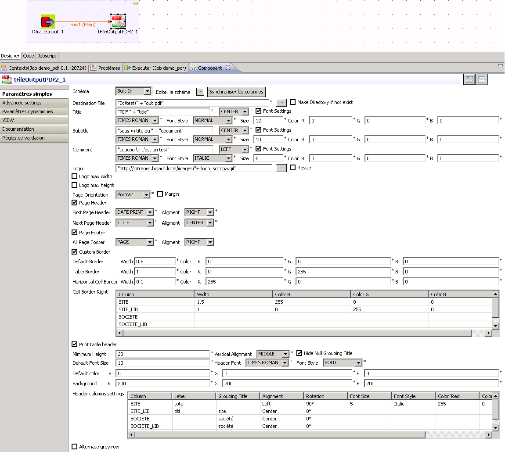
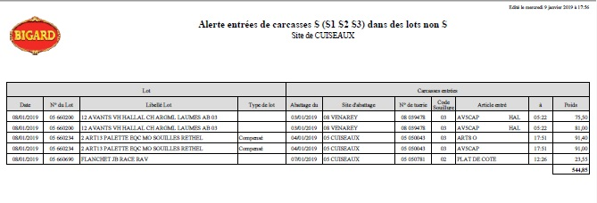

## tOutputPDF2

### Overview
Based on the excellent cahsohtoa's fFileOutputPDF compoment, it brings many options to generate real professional quality report : 

It allows you to:
- Define the size of the columns.
- The names of the columns.
- The font's alignment, style, size and color of each body or header column.
- Manage the last line as a result line
- Manage headers and footer.
- Show your company logo
- And many other options!
### Images

#### Release Notes

##### 1.3 - 2019-01-10 07:35:59
This component will allow you to export your Talend feeds in a PDF file.
Based on the excellent cahsohtoa's tFileOutputPDF compoment, it brings many options to generate real professional quality report.

It allows you to:
- Define the size of the columns.
- The names of the columns.
- The alignment, style, size and color of each column.
- Manage the last line as a result line
- Manage headers and footer.
- Show your company logo
- And many other options!

Release 1.1 : 
- Add Border customise
- Add Title, Subtitle and comment Alignment
- Option reorganization

Release 1.2 : 
- Logo Resize
- Header Rotation

Release 1.3 :
- Logo Signature
### Compatible
 -  5.3 (obsolete)
 -  7.0 (retired)