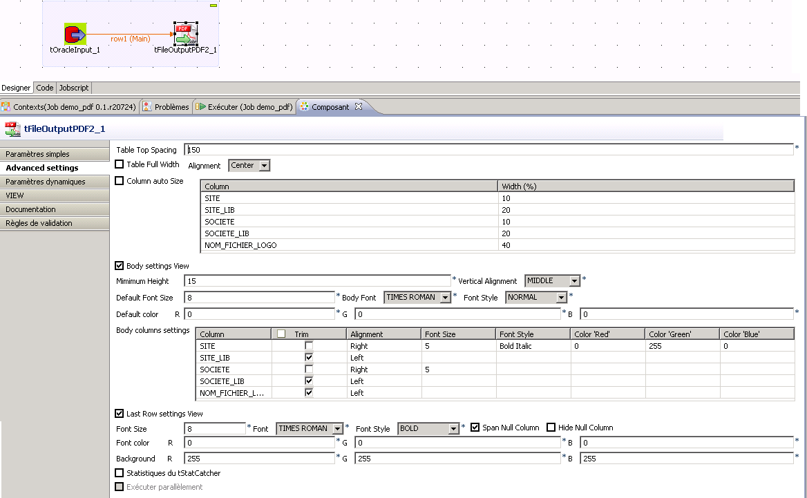

# patrick moire
  <nospam+patrick.moire@socopa.fr>

## <a href='./components/tOutputPDF2/readme.md'> tOutputPDF2</a>
 :white_check_mark: Compatible with Talend 7.x / 8.x 

Based on the excellent cahsohtoa's fFileOutputPDF compoment, it brings many options to generate real professional quality report : 

It allows you to:
- Define the size of the columns.
- The names of the columns.
- The font's alignment, style, size and color of each body or header column.
- Manage the last line as a result line
- Manage headers and footer.
- Show your company logo
- And many other options!

