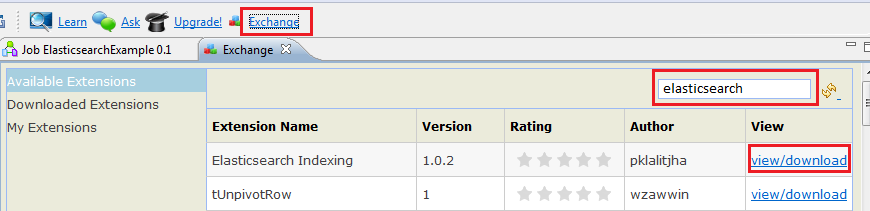
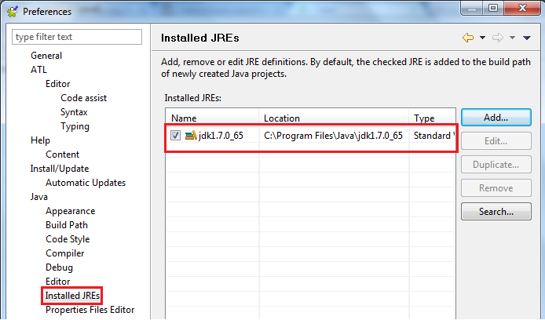
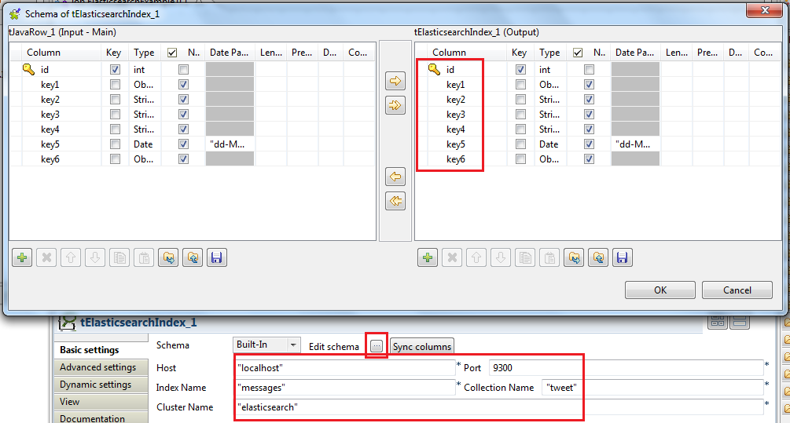

## Elasticsearch Indexing

### Overview
Data ingesting in Elasticsearch cluster. Combined with tMustache to do complex transformation of data into nested JSON.
### Details
http://spring-webservice-2-step-by-step.blogspot.in/2014/01/talend-elasticsearch-indexing-tutorial.html
### Images

### Install Instructions
The API had cahnged method signatures and classes. To detect version using es-build.properties.

Before adding component in Job add dependent jars in Modules section, so it can detect version.

Also, load ES v2.x jars separately, using tLibraryLoad or routine lib.

See 2.x update at http://spring-webservice-2-step-by-step.blogspot.in/2014/01/talend-elasticsearch-indexing-tutorial.html
### Resources
 * <a href=http://spring-webservice-2-step-by-step.blogspot.in/2014/01/talend-elasticsearch-indexing-tutorial.html>Tutorial</a>

#### Release Notes

##### 1.0.0 - 2013-12-26 16:34:18
Elasticsearch indexing
##### 1.0.1 - 2014-01-27 09:47:19
Added support for directly indexing JSON string. Sample JSON String:
{\\\\\\"id\\\\\\":\\\\\\"54\\\\\\",\\\\\\"key1\\\\\\":{\\\\\\"key3\\\\\\":{\\\\\\"key4\\\\\\":\\\\\\"Kou4DF\\\\\\",\\\\\\"key1\\\\\\":\\\\\\"[Ljava.lang.String;@24b5197d\\\\\\",\\\\\\"child1\\\\\\":{\\\\\\"key2\\\\\\":\\\\\\"4lbixr\\\\\\",\\\\\\"grandChild1\\\\\\":{\\\\\\"key3\\\\\\":\\\\\\"gLULMH\\\\\\",\\\\\\"key5\\\\\\":\\\\\\"27-01-2014\\\\\\"}}}}}

Its a good idea to check generated JSON document before writing to Elasticsearch. You can look this by logging, using tLogRow and then replacing this component with tElasticSearch component.

Also, if writing JSON document output schema MUST have only one field of type String and MUST not marked as key.

You need to create JSON String from row output using any template in tJavaRow or tWriteJSONField. Mustache template also can be used using component:
http://www.talendforge.org/exchange/index.php?eid=1089&product=tos&action=view

http://spring-webservice-2-step-by-step.blogspot.in/2014/01/mustache-template-in-talend-etl.html
##### 1.0.2 - 2014-07-23 05:11:37
Removed dependent jars (lucene-core and elasticsearch). Add them from your Elasticsearch distribution
##### 1.0.3 - 2014-07-29 17:46:13
This version has added support for configuring cluster name.
##### 1.0.4 - 2015-11-16 02:57:16
Added support for Elasticsearch v2.x
### Compatible
 -  1.1 (obsolete)
 -   2.0 (obsolete)
 -   2.1 (obsolete)
 -   2.2 (obsolete)
 -   2.3 (obsolete)
 -   2.4 (obsolete)
 -   3.0 (obsolete)
 -   3.1 (obsolete)
 -   3.2 (obsolete)
 -   4.0 (obsolete)
 -   4.1 (obsolete)
 -   4.2 (obsolete)
 -   5.0 (obsolete)
 -   5.1 (obsolete)
 -   5.2 (obsolete)
 -   5.3 (obsolete)
 -   5.4 (obsolete)
 -   5.5 (obsolete)
 -   5.6 (obsolete)
 -   1.2 (obsolete)
 -   6.0 (obsolete)
 -   6.1 (obsolete)