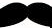

## tMustache

### Overview
This component is for using Mustache template in Talend flow. This takes Mustache template (content as String) as argument  and uses rows as parameters for template execution.

This applies template on data in rows and outputs template output and all data in row, to continue the flow. Template can be any valid Mustache template, so it can transform rows into HTML, JSON or any other format.

Column names in schema must be same as variables in template.

Mustache template for producing JSON:
{
"id":{{id}},
"key":"{{key1}}",
"child":{
"key":"{{key2}}",
"grandchild":"{{key3}}",
"array":[{{id}},"{{key4}}","{{key5}}"]
}
}
And, schema has id, key1, key2, key3, key4 and key5 columns, all randomly generated.

This produced JSON as:
{\t"id":96,\t"key":"ZvEWMb",\t"child":{\t"key":"eXIwbJ",\t"grandchild":"7DvrDc",\t"array":[96,"Kukaxs","Ox1sWo"]\t}}

Can write complex Mustache template for complicated output.

Sample usecase can be:
1. Elegant email body.
2. Rich HTML/JSON or other textual format output.
.....
See sample jobs and and tutorial for more detail.
### Images

#### Release Notes

##### 1.0.1 - 2014-10-13 11:53:49
 
##### 1.0.2 - 2014-11-10 09:17:48
Minor bug fixes.
### Compatible
 -  1.1 (obsolete)
 -   2.1 (obsolete)
 -   2.2 (obsolete)
 -   2.3 (obsolete)
 -   2.4 (obsolete)
 -   3.0 (obsolete)
 -   3.1 (obsolete)
 -   3.2 (obsolete)
 -   4.0 (obsolete)
 -   4.1 (obsolete)
 -   4.2 (obsolete)
 -   5.0 (obsolete)
 -   5.1 (obsolete)
 -   5.2 (obsolete)
 -   5.3 (obsolete)
 -   5.4 (obsolete)
 -   5.5 (obsolete)
 -   5.6 (obsolete)
 -   6.0 (obsolete)
 -   6.1 (obsolete)
 -   6.2 (obsolete)