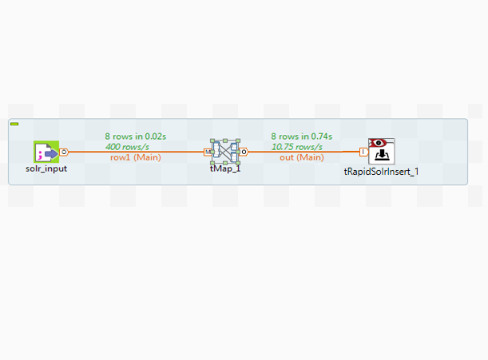
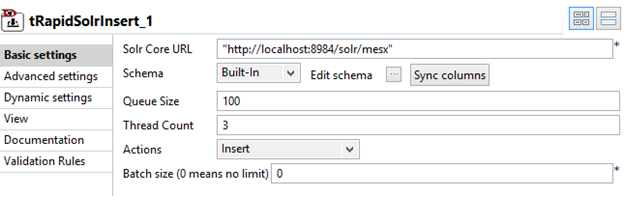
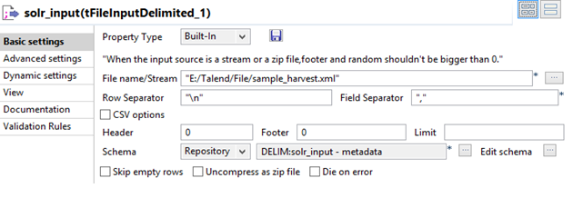

## Talend Solr High Speed Insert Plugin

### Overview
Function : To add new documents to solr index.

Purpose\t: tRapidSolrInsert help to add  new documents to solr index using concurrent APIs

Important Terminology
- Schema : A schema is a row description, i.e. it defines the number of fields to be processed and passed on to the next component. The schema is either Built-in or stored remotely in the Repository. 
\tFollowing click events are supported:
\t\t•\tClick Edit Schema to make changes to the schema. If the current schema is of the Repository type, three options are available:
\t\t•\tView schema: choose this option to view the schema only.
\t\t•\tChange to built-in property: choose this option to change the schema to Built-in for local changes.
\t\t•\tUpdate repository connection: choose this option to change the schema stored in the repository and decide whether to propagate the changes to all the Jobs upon completion. If you just want to propagate the changes to the current Job, you can select No upon completion and choose this schema metadata again in the Repository Content window.
\t\t•\tBuilt-in: The schema will be created and stored locally for this component only. 
\t\tRepository: The schema already exists and is stored in the Repository, hence can be reused in various projects and Job flowcharts. 

- Queue Size : Number of docs in one queue\t\t
- Action : Insert, Delete, Delete before Insert
- Thread Count : Number of threads to running while indexing on solr
- Advanced settings : tStatCatcher Statistics : Select this check box to collect the log data at component level. 

Usage : This component can be used as intermediate step in a data flow.
Limitation\t: n/a

### Details
- Designed and Developed by T/DG Team for faster data transfer between Solr and other data sources. Four Different Talend components:
Insert, Read, Update, Delete
- 30% faster in terms of performance than currently available Solr Component in Talend Exchange
- Built on latest release of Apache Solr, utilizes Concurrent APIs of Solr
- Can be consumed through Talend Open Studio Component Palette 

### Images

### Install Instructions
1.\tDrop the following components: tFileInputDelimited, tMap, tRapidSolrInsert from the Palette to the design workspace.
2.\tConnect the components using Row main connections.
3.\tOn the   tFileInputDelimited Component (Input) view, set the file path to the file to be create list Object. All the input data are shown in image below.
4.\tThe input file schema.
5.\tConnect the flow line to all component, Save Job and press F6 to execute it and data ingestion is done at solr Core URL. 

More details are available in README.docx file in the component zip
### Resources
 * <a href=http://www.thedigitalgroup.com>The Digital Group</a>
 * <a href=www.3rdisearch.com/retina>Retina APIs (Consumer)</a>

#### Release Notes

##### 0.1 - 2016-01-08 13:07:15

### Compatible
 -  5.0 (obsolete)
 -   5.1 (obsolete)
 -   5.2 (obsolete)
 -   5.3 (obsolete)
 -   5.4 (obsolete)
 -   5.5 (obsolete)
 -   5.6 (obsolete)
 -   6.0 (obsolete)
 -   6.1 (obsolete)
 -   6.2 (obsolete)