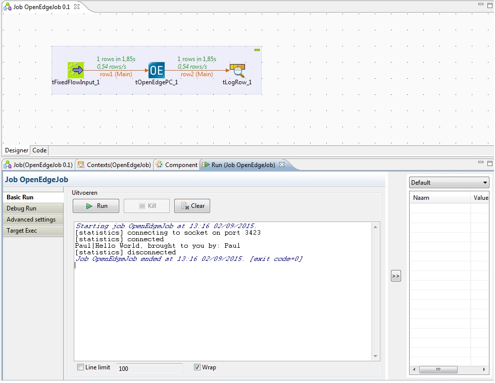

## tOpenEdgePC

### Overview
Will enable you to expose OpenEdge businesslogic running on an appserver and use it within your Data Integration environment.

tOpenEdgePC is not supported, endorsed by or affiliated with Progress Software in any way. Do not contact Progress Software with questions or remarks. Instead open an issue in the issue tracker.

"OpenEdge" is a trademark of Progress Software.

For more details visit the Wiki page at https://github.com/rjptegelaar/tOpenEdgePC/wiki
### Details
Reuse your existing business logic by exposing it through Talend Data Integration.
### Images

### Install Instructions
Visit the Wiki page for configuration information.
### Resources
 * <a href=https://github.com/rjptegelaar/tOpenEdgePC>Product Source</a>
 * <a href=https://github.com/rjptegelaar/tOpenEdgePC/wiki>Product Wiki</a>

#### Release Notes

##### 1.0.4 - 2015-09-03 18:40:11
OpenEdge procedure call component for Talend DataIntegration. Can be used to integratie openedge businesslogic using an appserver.

tOpenEdgePC is not supported, endorsed by or affiliated with Progress Software in any way. Do not contact Progress Software with questions or remarks. Instead open an issue in the issue tracker.

"OpenEdge" is a trademark of Progress Software.
### Compatible
 -  5.6 (obsolete)
 -   6.0 (obsolete)
 -   6.1 (obsolete)
 -   6.2 (obsolete)
 -   6.3 (obsolete)
 -   6.4 (obsolete)
 -  6.5 (retired)
 -  7.0 (retired)