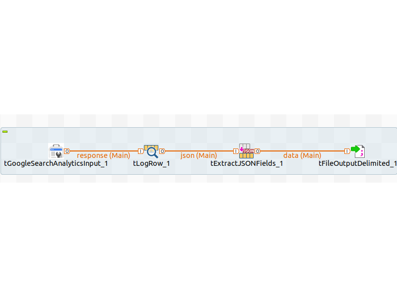

## tGoogleSearchAnalytics

### Overview
Add response String field to main row schema and extact their json fields.
### Details
This component helps you to handle google service account authentication and do the specific API request.
### Images

### Install Instructions
Run:

$ java -jar thediar-talendcomp-googlesearchanalytics-0.0.1-SNAPSHOT.car studio-deploy /path/to/my/studio

### Resources
 * <a href=https://github.com/jrosell/tGoogleSearchAnalytics>Github</a>

#### Release Notes

##### 0.0.1 - NULL
0.0.1
### Compatible
 - 7.1 (retired)
 - 7.2