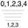
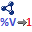
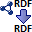

This repository hold the content of exchange.talend.com as a public archive.

The export was taken on May 20th.

If you have any inquiries you can reach out on: exchange-migration (at) talend.com 

New components / content will be handled via community.talend.com

# Data Integration Component
 * <a href='./archive/The_Loeki/components/abvConcat/readme.md'> abvConcat</a> by <a href='./archive/The_Loeki/readme.md'>The_Loeki</a> :warning: Compatibility not known - 2013-03-27 :arrow_heading_down: 29
 * <a href='./archive/The_Loeki/components/abvDependencySortRow/readme.md'> abvDependencySortRow</a> by <a href='./archive/The_Loeki/readme.md'>The_Loeki</a> :warning: Compatibility not known - 2013-03-27 :arrow_heading_down: 59
 * <a href='./archive/Onepoint Ltd/components/Aerospike Delete/readme.md'> Aerospike Delete</a> by <a href='./archive/Onepoint Ltd/readme.md'>Onepoint Ltd</a> :warning: Compatibility not known - 2016-05-05 :arrow_heading_down: 5
 * <a href='./archive/Onepoint Ltd/components/Aerospike Input/readme.md'> Aerospike Input</a> by <a href='./archive/Onepoint Ltd/readme.md'>Onepoint Ltd</a> :warning: Compatibility not known - 2016-05-05 :arrow_heading_down: 5
 * <a href='./archive/Onepoint Ltd/components/Aerospike Output/readme.md'> Aerospike Output</a> by <a href='./archive/Onepoint Ltd/readme.md'>Onepoint Ltd</a> :warning: Compatibility not known - 2016-05-05 :arrow_heading_down: 5
 * <a href='./archive/freddup59/components/agELTInformixInput/readme.md'> agELTInformixInput</a> by <a href='./archive/freddup59/readme.md'>freddup59</a> :warning: Compatibility not known - 2009-11-25 :arrow_heading_down: 160
 * <a href='./archive/freddup59/components/agELTInformixMap/readme.md'> agELTInformixMap</a> by <a href='./archive/freddup59/readme.md'>freddup59</a> :warning: Compatibility not known - 2009-11-25 :arrow_heading_down: 139
 * <a href='./archive/freddup59/components/agELTInformixOutput/readme.md'> agELTInformixOutput</a> by <a href='./archive/freddup59/readme.md'>freddup59</a> :warning: Compatibility not known - 2009-11-25 :arrow_heading_down: 68
 * <a href='./archive/Kooin-Shin/components/AmazonSMS/readme.md'> AmazonSMS</a> by <a href='./archive/Kooin-Shin/readme.md'>Kooin-Shin</a> :white_check_mark: Compatible with Talend 7.x / 8.x  - 2018-10-17 :arrow_heading_down: 35
 * <a href='./archive/pascalcz/components/AnonymizerCaesar/readme.md'> AnonymizerCaesar</a> by <a href='./archive/pascalcz/readme.md'>pascalcz</a> :warning: Compatibility not known - 2014-10-02 :arrow_heading_down: 20
 * <a href='./archive/pascalcz/components/AnonymizerSetDefaultAdvanced/readme.md'> AnonymizerSetDefaultAdvanced</a> by <a href='./archive/pascalcz/readme.md'>pascalcz</a> :warning: Compatibility not known - 2014-10-02 :arrow_heading_down: 31
 * <a href='./archive/pascalcz/components/AnonymizerSetDefaultSimple/readme.md'> AnonymizerSetDefaultSimple</a> by <a href='./archive/pascalcz/readme.md'>pascalcz</a> :warning: Compatibility not known - 2014-10-02 :arrow_heading_down: 26
 * <a href='./archive/Onepoint Ltd/components/Azure Service Bus Endpoint/readme.md'> Azure Service Bus Endpoint</a> by <a href='./archive/Onepoint Ltd/readme.md'>Onepoint Ltd</a> :white_check_mark: Compatible with Talend 7.x / 8.x  - 1970-01-01 :arrow_heading_down: 6
 * <a href='./archive/Onepoint Ltd/components/Azure Service Bus Output/readme.md'> Azure Service Bus Output</a> by <a href='./archive/Onepoint Ltd/readme.md'>Onepoint Ltd</a> :white_check_mark: Compatible with Talend 7.x / 8.x  - 2022-04-08 :arrow_heading_down: 16
 * <a href='./archive/bilelcharradi/components/bc_rowToJson/readme.md'> bc_rowToJson</a> by <a href='./archive/bilelcharradi/readme.md'>bilelcharradi</a> :warning: Compatibility not known - 2016-09-15 :arrow_heading_down: 22
 * <a href='./archive/bcourtine/components/bcFileListExt/readme.md'> bcFileListExt</a> by <a href='./archive/bcourtine/readme.md'>bcourtine</a> :warning: Compatibility not known - 2010-06-18 :arrow_heading_down: 236
 * <a href='./archive/bcourtine/components/bcFileOutputOOSpreadsheet/readme.md'> bcFileOutputOOSpreadsheet</a> by <a href='./archive/bcourtine/readme.md'>bcourtine</a> :warning: Compatibility not known - 2010-01-18 :arrow_heading_down: 389
 * <a href='./archive/bcourtine/components/bcFileOutputSQL/readme.md'> bcFileOutputSQL</a> by <a href='./archive/bcourtine/readme.md'>bcourtine</a> :warning: Compatibility not known - 2011-03-15 :arrow_heading_down: 174
 * <a href='./archive/bcourtine/components/bcFileProperties/readme.md'> bcFileProperties</a> by <a href='./archive/bcourtine/readme.md'>bcourtine</a> :warning: Compatibility not known - 2012-05-22 :arrow_heading_down: 97
 * <a href='./archive/bcourtine/components/bcLDAPAttributesInput/readme.md'> bcLDAPAttributesInput</a> by <a href='./archive/bcourtine/readme.md'>bcourtine</a> :warning: Compatibility not known - 2010-02-26 :arrow_heading_down: 135
 * <a href='./archive/bcourtine/components/bcLDAPInputExt/readme.md'> bcLDAPInputExt</a> by <a href='./archive/bcourtine/readme.md'>bcourtine</a> :warning: Compatibility not known - 2010-02-17 :arrow_heading_down: 350
 * <a href='./archive/bcourtine/components/bcLDAPOutputExt/readme.md'> bcLDAPOutputExt</a> by <a href='./archive/bcourtine/readme.md'>bcourtine</a> :warning: Compatibility not known - 2010-02-17 :arrow_heading_down: 272
 * <a href='./archive/smb/components/bcLogback/readme.md'> bcLogback</a> by <a href='./archive/smb/readme.md'>smb</a> :warning: Compatibility not known - 2015-02-16 :arrow_heading_down: 130
 * <a href='./archive/bcourtine/components/bcLogback/readme.md'> bcLogback</a> by <a href='./archive/bcourtine/readme.md'>bcourtine</a> :warning: Compatibility not known - 2012-11-26 :arrow_heading_down: 243
 * <a href='./archive/smb/components/bcLogbackCatch/readme.md'> bcLogbackCatch</a> by <a href='./archive/smb/readme.md'>smb</a> :warning: Compatibility not known - 2015-02-16 :arrow_heading_down: 34
 * <a href='./archive/bcourtine/components/bcLogbackCatch/readme.md'> bcLogbackCatch</a> by <a href='./archive/bcourtine/readme.md'>bcourtine</a> :warning: Compatibility not known - 2012-11-26 :arrow_heading_down: 131
 * <a href='./archive/bcourtine/components/bcLogbackConfig/readme.md'> bcLogbackConfig</a> by <a href='./archive/bcourtine/readme.md'>bcourtine</a> :warning: Compatibility not known - 2012-11-26 :arrow_heading_down: 144
 * <a href='./archive/bcourtine/components/bcOAIIdentifiersInput/readme.md'> bcOAIIdentifiersInput</a> by <a href='./archive/bcourtine/readme.md'>bcourtine</a> :warning: Compatibility not known - 2010-12-01 :arrow_heading_down: 59
 * <a href='./archive/bcourtine/components/bcOAIIdentifyInput/readme.md'> bcOAIIdentifyInput</a> by <a href='./archive/bcourtine/readme.md'>bcourtine</a> :warning: Compatibility not known - 2010-12-01 :arrow_heading_down: 56
 * <a href='./archive/bcourtine/components/bcOAIMetadatasInput/readme.md'> bcOAIMetadatasInput</a> by <a href='./archive/bcourtine/readme.md'>bcourtine</a> :warning: Compatibility not known - 2010-12-01 :arrow_heading_down: 51
 * <a href='./archive/bcourtine/components/bcOAIRecordInput/readme.md'> bcOAIRecordInput</a> by <a href='./archive/bcourtine/readme.md'>bcourtine</a> :warning: Compatibility not known - 2010-12-01 :arrow_heading_down: 47
 * <a href='./archive/bcourtine/components/bcOAIRecordsInput/readme.md'> bcOAIRecordsInput</a> by <a href='./archive/bcourtine/readme.md'>bcourtine</a> :warning: Compatibility not known - 2010-12-01 :arrow_heading_down: 65
 * <a href='./archive/bcourtine/components/bcOAISetsInput/readme.md'> bcOAISetsInput</a> by <a href='./archive/bcourtine/readme.md'>bcourtine</a> :warning: Compatibility not known - 2010-12-01 :arrow_heading_down: 68
 * <a href='./archive/bcourtine/components/bcResourceInputProperties/readme.md'> bcResourceInputProperties</a> by <a href='./archive/bcourtine/readme.md'>bcourtine</a> :warning: Compatibility not known - 2010-04-12 :arrow_heading_down: 93
 * <a href='./archive/wbvreeuwijk/components/bvrCountryConversion/readme.md'> bvrCountryConversion</a> by <a href='./archive/wbvreeuwijk/readme.md'>wbvreeuwijk</a> :warning: Compatibility not known - 2010-02-08 :arrow_heading_down: 278
 * <a href='./archive/wbvreeuwijk/components/bvrRunAnt/readme.md'> bvrRunAnt</a> by <a href='./archive/wbvreeuwijk/readme.md'>wbvreeuwijk</a> :warning: Compatibility not known - 2009-12-04 :arrow_heading_down: 114
 * <a href='./archive/wbvreeuwijk/components/bvrVATNumberCheck/readme.md'> bvrVATNumberCheck</a> by <a href='./archive/wbvreeuwijk/readme.md'>wbvreeuwijk</a> :warning: Compatibility not known - 2010-08-24 :arrow_heading_down: 159
 * <a href='./archive/jyaime/components/cFilterRow/readme.md'> cFilterRow</a> by <a href='./archive/jyaime/readme.md'>jyaime</a> :warning: Compatibility not known - 2009-08-27 :arrow_heading_down: 26
 * <a href='./archive/jyaime/components/cFilterRow/readme.md'> cFilterRow</a> by <a href='./archive/jyaime/readme.md'>jyaime</a> :warning: Compatibility not known - 2009-08-27 :arrow_heading_down: 249
 * <a href='./archive/jyaime/components/cIndexedFilesInput/readme.md'> cIndexedFilesInput</a> by <a href='./archive/jyaime/readme.md'>jyaime</a> :warning: Compatibility not known - 2009-10-15 :arrow_heading_down: 179
 * <a href='./archive/jyaime/components/cIndexFile/readme.md'> cIndexFile</a> by <a href='./archive/jyaime/readme.md'>jyaime</a> :warning: Compatibility not known - 2009-09-11 :arrow_heading_down: 165
 * <a href='./archive/jyaime/components/cOracleCommit/readme.md'> cOracleCommit</a> by <a href='./archive/jyaime/readme.md'>jyaime</a> :warning: Compatibility not known - 2009-08-27 :arrow_heading_down: 148
 * <a href='./archive/jyaime/components/cOracleConnection/readme.md'> cOracleConnection</a> by <a href='./archive/jyaime/readme.md'>jyaime</a> :warning: Compatibility not known - 2009-08-27 :arrow_heading_down: 203
 * <a href='./archive/jyaime/components/cOracleOutput/readme.md'> cOracleOutput</a> by <a href='./archive/jyaime/readme.md'>jyaime</a> :warning: Compatibility not known - 2009-08-27 :arrow_heading_down: 118
 * <a href='./archive/jyaime/components/cOracleRow/readme.md'> cOracleRow</a> by <a href='./archive/jyaime/readme.md'>jyaime</a> :warning: Compatibility not known - 2009-08-27 :arrow_heading_down: 94
 * <a href='./archive/emenuet/components/cRemoveHeader/readme.md'> cRemoveHeader</a> by <a href='./archive/emenuet/readme.md'>emenuet</a> :warning: Compatibility not known - 2013-12-12 :arrow_heading_down: 64
 * <a href='./archive/jlamiel/components/Data Publica/readme.md'> Data Publica</a> by <a href='./archive/jlamiel/readme.md'>jlamiel</a> :warning: Compatibility not known - 2012-04-10 :arrow_heading_down: 59
 * <a href='./archive/Hari_R/components/ElasticLog/readme.md'> ElasticLog</a> by <a href='./archive/Hari_R/readme.md'>Hari_R</a> :warning: Compatibility not known - 2017-09-18 :arrow_heading_down: 65
 * <a href='./archive/pklalitjha/components/Elasticsearch Indexing/readme.md'> Elasticsearch Indexing</a> by <a href='./archive/pklalitjha/readme.md'>pklalitjha</a> :warning: Compatibility not known - 2015-11-16 :arrow_heading_down: 402
 * <a href='./archive/hugo/components/ExcelReports/readme.md'> ExcelReports</a> by <a href='./archive/hugo/readme.md'>hugo</a> :warning: Compatibility not known - 2009-02-08 :arrow_heading_down: 2420
 * <a href='./archive/saburo/components/Facebook Application Insights Component/readme.md'> Facebook Application Insights Component</a> by <a href='./archive/saburo/readme.md'>saburo</a> :warning: Compatibility not known - 2011-09-01 :arrow_heading_down: 484
 * <a href='./archive/gadzlend/components/gaAccount/readme.md'> gaAccount</a> by <a href='./archive/gadzlend/readme.md'>gadzlend</a> :warning: Compatibility not known - 2009-09-04 :arrow_heading_down: 158
 * <a href='./archive/gadzlend/components/gaAccountInfo/readme.md'> gaAccountInfo</a> by <a href='./archive/gadzlend/readme.md'>gadzlend</a> :warning: Compatibility not known - 2009-08-31 :arrow_heading_down: 87
 * <a href='./archive/gadzlend/components/gaAccountList/readme.md'> gaAccountList</a> by <a href='./archive/gadzlend/readme.md'>gadzlend</a> :warning: Compatibility not known - 2009-09-04 :arrow_heading_down: 96
 * <a href='./archive/gadzlend/components/gaAccountStatus/readme.md'> gaAccountStatus</a> by <a href='./archive/gadzlend/readme.md'>gadzlend</a> :warning: Compatibility not known - 2009-08-31 :arrow_heading_down: 48
 * <a href='./archive/gadzlend/components/gaEmailList/readme.md'> gaEmailList</a> by <a href='./archive/gadzlend/readme.md'>gadzlend</a> :warning: Compatibility not known - 2009-08-31 :arrow_heading_down: 73
 * <a href='./archive/gadzlend/components/gaEmailListListRecipient/readme.md'> gaEmailListListRecipient</a> by <a href='./archive/gadzlend/readme.md'>gadzlend</a> :warning: Compatibility not known - 2009-08-30 :arrow_heading_down: 62
 * <a href='./archive/gadzlend/components/gaEmailListListRecipient/readme.md'> gaEmailListListRecipient</a> by <a href='./archive/gadzlend/readme.md'>gadzlend</a> :warning: Compatibility not known - 2009-08-30 :arrow_heading_down: 53
 * <a href='./archive/gadzlend/components/gaGroup/readme.md'> gaGroup</a> by <a href='./archive/gadzlend/readme.md'>gadzlend</a> :warning: Compatibility not known - 2009-08-31 :arrow_heading_down: 62
 * <a href='./archive/gadzlend/components/gaGroupRecipient/readme.md'> gaGroupRecipient</a> by <a href='./archive/gadzlend/readme.md'>gadzlend</a> :warning: Compatibility not known - 2009-08-30 :arrow_heading_down: 52
 * <a href='./archive/gadzlend/components/gaGroupRecipient/readme.md'> gaGroupRecipient</a> by <a href='./archive/gadzlend/readme.md'>gadzlend</a> :warning: Compatibility not known - 2009-08-30 :arrow_heading_down: 25
 * <a href='./archive/ascrus/components/GETL (Groovy ETL library)/readme.md'> GETL (Groovy ETL library)</a> by <a href='./archive/ascrus/readme.md'>ascrus</a> :warning: Compatibility not known - 2013-09-24 :arrow_heading_down: 62
 * <a href='./archive/jiping/components/Hadoop Patch/readme.md'> Hadoop Patch</a> by <a href='./archive/jiping/readme.md'>jiping</a> :warning: Compatibility not known - 2014-09-20 :arrow_heading_down: 52
 * <a href='./archive/Dwanny/components/HDFS Delete File/readme.md'> HDFS Delete File</a> by <a href='./archive/Dwanny/readme.md'>Dwanny</a> :warning: Compatibility not known - 2012-09-28 :arrow_heading_down: 53
 * <a href='./archive/fbelleau/components/HGNC 2 Bio2RDF/readme.md'> HGNC 2 Bio2RDF</a> by <a href='./archive/fbelleau/readme.md'>fbelleau</a> :warning: Compatibility not known - 2012-04-25 :arrow_heading_down: 48
 * <a href='./archive/wbvreeuwijk/components/hiAbbreviationAndDivision/readme.md'> hiAbbreviationAndDivision</a> by <a href='./archive/wbvreeuwijk/readme.md'>wbvreeuwijk</a> :warning: Compatibility not known - 2009-11-19 :arrow_heading_down: 86
 * <a href='./archive/wbvreeuwijk/components/hiAddressBEFRGBStandardization/readme.md'> hiAddressBEFRGBStandardization</a> by <a href='./archive/wbvreeuwijk/readme.md'>wbvreeuwijk</a> :warning: Compatibility not known - 2009-11-20 :arrow_heading_down: 104
 * <a href='./archive/wbvreeuwijk/components/hiAddressBEFRGBStandardization/readme.md'> hiAddressBEFRGBStandardization</a> by <a href='./archive/wbvreeuwijk/readme.md'>wbvreeuwijk</a> :warning: Compatibility not known - 2009-11-20 :arrow_heading_down: 29
 * <a href='./archive/wbvreeuwijk/components/hiAddressNLDERapidAddressing/readme.md'> hiAddressNLDERapidAddressing</a> by <a href='./archive/wbvreeuwijk/readme.md'>wbvreeuwijk</a> :warning: Compatibility not known - 2009-11-20 :arrow_heading_down: 99
 * <a href='./archive/wbvreeuwijk/components/hiAddressNLDEStandardization/readme.md'> hiAddressNLDEStandardization</a> by <a href='./archive/wbvreeuwijk/readme.md'>wbvreeuwijk</a> :warning: Compatibility not known - 2009-11-20 :arrow_heading_down: 82
 * <a href='./archive/wbvreeuwijk/components/hiAddressStandardization/readme.md'> hiAddressStandardization</a> by <a href='./archive/wbvreeuwijk/readme.md'>wbvreeuwijk</a> :warning: Compatibility not known - 2010-01-06 :arrow_heading_down: 162
 * <a href='./archive/wbvreeuwijk/components/hiAddressWW/readme.md'> hiAddressWW</a> by <a href='./archive/wbvreeuwijk/readme.md'>wbvreeuwijk</a> :warning: Compatibility not known - 2009-11-20 :arrow_heading_down: 94
 * <a href='./archive/wbvreeuwijk/components/hiBussinessDetailsV3/readme.md'> hiBussinessDetailsV3</a> by <a href='./archive/wbvreeuwijk/readme.md'>wbvreeuwijk</a> :warning: Compatibility not known - 2009-12-01 :arrow_heading_down: 74
 * <a href='./archive/wbvreeuwijk/components/hiBussinessSearch/readme.md'> hiBussinessSearch</a> by <a href='./archive/wbvreeuwijk/readme.md'>wbvreeuwijk</a> :warning: Compatibility not known - 2009-12-01 :arrow_heading_down: 69
 * <a href='./archive/wbvreeuwijk/components/hiCapitalization/readme.md'> hiCapitalization</a> by <a href='./archive/wbvreeuwijk/readme.md'>wbvreeuwijk</a> :warning: Compatibility not known - 2009-12-01 :arrow_heading_down: 97
 * <a href='./archive/wbvreeuwijk/components/hiDedup/readme.md'> hiDedup</a> by <a href='./archive/wbvreeuwijk/readme.md'>wbvreeuwijk</a> :warning: Compatibility not known - 2010-01-26 :arrow_heading_down: 77
 * <a href='./archive/wbvreeuwijk/components/hiEmail/readme.md'> hiEmail</a> by <a href='./archive/wbvreeuwijk/readme.md'>wbvreeuwijk</a> :warning: Compatibility not known - 2009-12-03 :arrow_heading_down: 139
 * <a href='./archive/wbvreeuwijk/components/hiFormatConversion/readme.md'> hiFormatConversion</a> by <a href='./archive/wbvreeuwijk/readme.md'>wbvreeuwijk</a> :warning: Compatibility not known - 2009-12-03 :arrow_heading_down: 74
 * <a href='./archive/wbvreeuwijk/components/hiIdentifyExec/readme.md'> hiIdentifyExec</a> by <a href='./archive/wbvreeuwijk/readme.md'>wbvreeuwijk</a> :warning: Compatibility not known - 2009-12-01 :arrow_heading_down: 87
 * <a href='./archive/wbvreeuwijk/components/hiMergeExec/readme.md'> hiMergeExec</a> by <a href='./archive/wbvreeuwijk/readme.md'>wbvreeuwijk</a> :warning: Compatibility not known - 2009-12-02 :arrow_heading_down: 88
 * <a href='./archive/wbvreeuwijk/components/hiNameProcessing/readme.md'> hiNameProcessing</a> by <a href='./archive/wbvreeuwijk/readme.md'>wbvreeuwijk</a> :warning: Compatibility not known - 2010-08-24 :arrow_heading_down: 174
 * <a href='./archive/wbvreeuwijk/components/hiSearch/readme.md'> hiSearch</a> by <a href='./archive/wbvreeuwijk/readme.md'>wbvreeuwijk</a> :warning: Compatibility not known - 2009-12-03 :arrow_heading_down: 97
 * <a href='./archive/wbvreeuwijk/components/hiSynchronize/readme.md'> hiSynchronize</a> by <a href='./archive/wbvreeuwijk/readme.md'>wbvreeuwijk</a> :warning: Compatibility not known - 2009-12-03 :arrow_heading_down: 80
 * <a href='./archive/wbvreeuwijk/components/hiTransform/readme.md'> hiTransform</a> by <a href='./archive/wbvreeuwijk/readme.md'>wbvreeuwijk</a> :warning: Compatibility not known - 2009-12-03 :arrow_heading_down: 101
 * <a href='./archive/wbvreeuwijk/components/hiTransliterate/readme.md'> hiTransliterate</a> by <a href='./archive/wbvreeuwijk/readme.md'>wbvreeuwijk</a> :warning: Compatibility not known - 2009-12-03 :arrow_heading_down: 83
 * <a href='./archive/wbvreeuwijk/components/hiValidateName/readme.md'> hiValidateName</a> by <a href='./archive/wbvreeuwijk/readme.md'>wbvreeuwijk</a> :warning: Compatibility not known - 2009-12-03 :arrow_heading_down: 104
 * <a href='./archive/rskraba/components/Hortonwork-2.3-custom-distribution/readme.md'> Hortonwork-2.3-custom-distribution</a> by <a href='./archive/rskraba/readme.md'>rskraba</a> :warning: Compatibility not known - 2015-08-16 :arrow_heading_down: 75
 * <a href='./archive/Kooin-Shin/components/Http Components/readme.md'> Http Components</a> by <a href='./archive/Kooin-Shin/readme.md'>Kooin-Shin</a> :white_check_mark: Compatible with Talend 7.x / 8.x  - 2019-03-12 :arrow_heading_down: 58
 * <a href='./archive/Jan Lolling/components/JasperServerFile components/readme.md'> JasperServerFile components</a> by <a href='./archive/Jan Lolling/readme.md'>Jan Lolling</a> :white_check_mark: Compatible with Talend 7.x / 8.x  - 2020-05-10 :arrow_heading_down: 35
 * <a href='./archive/kchalane/components/JavaPictureResize/readme.md'> JavaPictureResize</a> by <a href='./archive/kchalane/readme.md'>kchalane</a> :warning: Compatibility not known - 2009-12-23 :arrow_heading_down: 145
 * <a href='./archive/Kooin-Shin/components/Kafka Bunch/readme.md'> Kafka Bunch</a> by <a href='./archive/Kooin-Shin/readme.md'>Kooin-Shin</a> :white_check_mark: Compatible with Talend 7.x / 8.x  - 2020-07-06 :arrow_heading_down: 135
 * <a href='./archive/Onepoint Ltd/components/Kudu Input/readme.md'> Kudu Input</a> by <a href='./archive/Onepoint Ltd/readme.md'>Onepoint Ltd</a> :warning: Compatibility not known - 2016-11-01 :arrow_heading_down: 82
 * <a href='./archive/Onepoint Ltd/components/Kudu Output/readme.md'> Kudu Output</a> by <a href='./archive/Onepoint Ltd/readme.md'>Onepoint Ltd</a> :warning: Compatibility not known - 2016-11-01 :arrow_heading_down: 92
 * <a href='./archive/MohitRinky/components/Latest Excel Reports/readme.md'> Latest Excel Reports</a> by <a href='./archive/MohitRinky/readme.md'>MohitRinky</a> :warning: Compatibility not known - 2015-03-25 :arrow_heading_down: 294
 * <a href='./archive/Rom1MB/components/Mail IO/readme.md'> Mail IO</a> by <a href='./archive/Rom1MB/readme.md'>Rom1MB</a> :white_check_mark: Compatible with Talend 7.x / 8.x  - 2019-08-19 :arrow_heading_down: 77
 * <a href='./archive/mgainhao/components/mConvertEmptytoNull/readme.md'> mConvertEmptytoNull</a> by <a href='./archive/mgainhao/readme.md'>mgainhao</a> :warning: Compatibility not known - 2013-11-27 :arrow_heading_down: 69
 * <a href='./archive/camsellem/components/Microsoft Azure Blob Storage/readme.md'> Microsoft Azure Blob Storage</a> by <a href='./archive/camsellem/readme.md'>camsellem</a> :warning: Compatibility not known - 2014-02-11 :arrow_heading_down: 88
 * <a href='./archive/EMMANUEL FDEZ/components/Modified version of tOracleOutput with DBMS LOG ERROR REJECT LIMIT UNLIMITED/readme.md'> Modified version of tOracleOutput with DBMS LOG ERROR REJECT LIMIT UNLIMITED</a> by <a href='./archive/EMMANUEL FDEZ/readme.md'>EMMANUEL FDEZ</a> :warning: Compatibility not known - 2017-02-14 :arrow_heading_down: 15
 * <a href='./archive/javah/components/Mongo_263/readme.md'> Mongo_263</a> by <a href='./archive/javah/readme.md'>javah</a> :warning: Compatibility not known - 2013-03-07 :arrow_heading_down: 311
 * <a href='./archive/mgainhao/components/mParameters/readme.md'> mParameters</a> by <a href='./archive/mgainhao/readme.md'>mgainhao</a> :warning: Compatibility not known - 2010-01-05 :arrow_heading_down: 276
 * <a href='./archive/Duvan Segura Camelo/components/MSSQL ELT Query Output/readme.md'> MSSQL ELT Query Output</a> by <a href='./archive/Duvan Segura Camelo/readme.md'>Duvan Segura Camelo</a> :white_check_mark: Compatible with Talend 7.x / 8.x  - 2019-08-02 :arrow_heading_down: 14
 * <a href='./archive/nao-aizawa/components/nDataBoosterHighSpeedTransform/readme.md'> nDataBoosterHighSpeedTransform</a> by <a href='./archive/nao-aizawa/readme.md'>nao-aizawa</a> :warning: Compatibility not known - 2016-08-18 :arrow_heading_down: 27
 * <a href='./archive/ravin143/components/Notes/readme.md'> Notes</a> by <a href='./archive/ravin143/readme.md'>ravin143</a> :warning: Compatibility not known - 2013-03-20 :arrow_heading_down: 59
 * <a href='./archive/OSSCube UK/components/oDecomposeHTMLfield/readme.md'> oDecomposeHTMLfield</a> by <a href='./archive/OSSCube UK/readme.md'>OSSCube UK</a> :warning: Compatibility not known - 2015-04-14 :arrow_heading_down: 57
 * <a href='./archive/OSSCube UK/components/oExtractHTMLField/readme.md'> oExtractHTMLField</a> by <a href='./archive/OSSCube UK/readme.md'>OSSCube UK</a> :warning: Compatibility not known - 2015-04-14 :arrow_heading_down: 89
 * <a href='./archive/ongilpvtltd/components/Ongil Fuzzy Match/readme.md'> Ongil Fuzzy Match</a> by <a href='./archive/ongilpvtltd/readme.md'>ongilpvtltd</a> :warning: Compatibility not known - 2019-08-12 :arrow_heading_down: 39
 * <a href='./archive/PayZen/components/pCreateMailOffer/readme.md'> pCreateMailOffer</a> by <a href='./archive/PayZen/readme.md'>PayZen</a> :warning: Compatibility not known - 2011-07-25 :arrow_heading_down: 54
 * <a href='./archive/PayZen/components/pCreatePayment/readme.md'> pCreatePayment</a> by <a href='./archive/PayZen/readme.md'>PayZen</a> :warning: Compatibility not known - 2011-06-23 :arrow_heading_down: 47
 * <a href='./archive/kirby1971/components/PDFTextStream/readme.md'> PDFTextStream</a> by <a href='./archive/kirby1971/readme.md'>kirby1971</a> :warning: Compatibility not known - 2014-10-08 :arrow_heading_down: 316
 * <a href='./archive/PayZen/components/pUpdateMailOffer/readme.md'> pUpdateMailOffer</a> by <a href='./archive/PayZen/readme.md'>PayZen</a> :warning: Compatibility not known - 2011-07-26 :arrow_heading_down: 21
 * <a href='./archive/Talend/components/Qubole Distribution (Spark 2.0.2 - Hadoop 2)/readme.md'> Qubole Distribution (Spark 2.0.2 - Hadoop 2)</a> by <a href='./archive/Talend/readme.md'>Talend</a> :white_check_mark: Compatible with Talend 7.x / 8.x  - 2018-05-22 :arrow_heading_down: 51
 * <a href='./archive/choupe/components/S3 Component/readme.md'> S3 Component</a> by <a href='./archive/choupe/readme.md'>choupe</a> :warning: Compatibility not known - 2011-12-11 :arrow_heading_down: 577
 * <a href='./archive/boobooboo/components/S3 Component/readme.md'> S3 Component</a> by <a href='./archive/boobooboo/readme.md'>boobooboo</a> :warning: Compatibility not known - 2012-01-20 :arrow_heading_down: 102
 * <a href='./archive/glara/components/samba copy/readme.md'> samba copy</a> by <a href='./archive/glara/readme.md'>glara</a> :warning: Compatibility not known - 2014-01-27 :arrow_heading_down: 87
 * <a href='./archive/gustavo.garcia/components/StartTransaction/readme.md'> StartTransaction</a> by <a href='./archive/gustavo.garcia/readme.md'>gustavo.garcia</a> :warning: Compatibility not known - 2015-02-11 :arrow_heading_down: 51
 * <a href='./archive/gorotman/components/tAccessColumnList/readme.md'> tAccessColumnList</a> by <a href='./archive/gorotman/readme.md'>gorotman</a> :warning: Compatibility not known - 2017-04-05 :arrow_heading_down: 14
 * <a href='./archive/gorotman/components/tAccessTableList/readme.md'> tAccessTableList</a> by <a href='./archive/gorotman/readme.md'>gorotman</a> :warning: Compatibility not known - 2017-04-07 :arrow_heading_down: 15
 * <a href='./archive/Kooin-Shin/components/tActiveMQConsumer/readme.md'> tActiveMQConsumer</a> by <a href='./archive/Kooin-Shin/readme.md'>Kooin-Shin</a> :white_check_mark: Compatible with Talend 7.x / 8.x  - 2019-05-02 :arrow_heading_down: 22
 * <a href='./archive/Kooin-Shin/components/tActiveMQProducer/readme.md'> tActiveMQProducer</a> by <a href='./archive/Kooin-Shin/readme.md'>Kooin-Shin</a> :white_check_mark: Compatible with Talend 7.x / 8.x  - 2019-05-02 :arrow_heading_down: 19
 * <a href='./archive/boulayj/components/tAdvancedCMISInput/readme.md'> tAdvancedCMISInput</a> by <a href='./archive/boulayj/readme.md'>boulayj</a> :warning: Compatibility not known - 2013-04-26 :arrow_heading_down: 234
 * <a href='./archive/boulayj/components/tAdvancedCMISOutput/readme.md'> tAdvancedCMISOutput</a> by <a href='./archive/boulayj/readme.md'>boulayj</a> :warning: Compatibility not known - 2013-04-26 :arrow_heading_down: 232
 * <a href='./archive/tdgadmin/components/Talend Solr High Speed Insert Plugin/readme.md'> Talend Solr High Speed Insert Plugin</a> by <a href='./archive/tdgadmin/readme.md'>tdgadmin</a> :warning: Compatibility not known - 2016-01-08 :arrow_heading_down: 176
 * <a href='./archive/tdgadmin/components/Talend Solr High Speed Query Plugin/readme.md'> Talend Solr High Speed Query Plugin</a> by <a href='./archive/tdgadmin/readme.md'>tdgadmin</a> :warning: Compatibility not known - 2016-01-20 :arrow_heading_down: 160
 * <a href='./archive/tdgadmin/components/Talend Solr High Speed Update Component/readme.md'> Talend Solr High Speed Update Component</a> by <a href='./archive/tdgadmin/readme.md'>tdgadmin</a> :warning: Compatibility not known - 2016-01-20 :arrow_heading_down: 145
 * <a href='./archive/uszubair/components/tAmazonEMRClusterDetails/readme.md'> tAmazonEMRClusterDetails</a> by <a href='./archive/uszubair/readme.md'>uszubair</a> :warning: Compatibility not known - 2017-02-01 :arrow_heading_down: 10
 * <a href='./archive/rdubois/components/tAmazonRDSInput/readme.md'> tAmazonRDSInput</a> by <a href='./archive/rdubois/readme.md'>rdubois</a> :warning: Compatibility not known - 2011-04-06 :arrow_heading_down: 153
 * <a href='./archive/rdubois/components/tAmazonRDSOutput/readme.md'> tAmazonRDSOutput</a> by <a href='./archive/rdubois/readme.md'>rdubois</a> :warning: Compatibility not known - 2011-04-06 :arrow_heading_down: 201
 * <a href='./archive/rdubois/components/tAmazonRDSRow/readme.md'> tAmazonRDSRow</a> by <a href='./archive/rdubois/readme.md'>rdubois</a> :warning: Compatibility not known - 2011-04-06 :arrow_heading_down: 83
 * <a href='./archive/paul_tegelaar/components/tAnalyzeWiretap/readme.md'> tAnalyzeWiretap</a> by <a href='./archive/paul_tegelaar/readme.md'>paul_tegelaar</a> :warning: Compatibility not known - 2012-11-13 :arrow_heading_down: 22
 * <a href='./archive/JohnGarrettMartin/components/tApplyDynamicMapping/readme.md'> tApplyDynamicMapping</a> by <a href='./archive/JohnGarrettMartin/readme.md'>JohnGarrettMartin</a> :warning: Compatibility not known - 2016-02-25 :arrow_heading_down: 157
 * <a href='./archive/ascrus/components/tASCUnGZIP/readme.md'> tASCUnGZIP</a> by <a href='./archive/ascrus/readme.md'>ascrus</a> :warning: Compatibility not known - 2013-01-18 :arrow_heading_down: 68
 * <a href='./archive/ascrus/components/tASCVerticaClose/readme.md'> tASCVerticaClose</a> by <a href='./archive/ascrus/readme.md'>ascrus</a> :warning: Compatibility not known - 2013-01-18 :arrow_heading_down: 6
 * <a href='./archive/ascrus/components/tASCVerticaCommit/readme.md'> tASCVerticaCommit</a> by <a href='./archive/ascrus/readme.md'>ascrus</a> :warning: Compatibility not known - 2013-01-18 :arrow_heading_down: 17
 * <a href='./archive/ascrus/components/tASCVerticaConnection/readme.md'> tASCVerticaConnection</a> by <a href='./archive/ascrus/readme.md'>ascrus</a> :warning: Compatibility not known - 2013-01-18 :arrow_heading_down: 23
 * <a href='./archive/ascrus/components/tASCVerticaCreateTable/readme.md'> tASCVerticaCreateTable</a> by <a href='./archive/ascrus/readme.md'>ascrus</a> :warning: Compatibility not known - 2013-01-18 :arrow_heading_down: 21
 * <a href='./archive/ascrus/components/tASCVerticaFileOut/readme.md'> tASCVerticaFileOut</a> by <a href='./archive/ascrus/readme.md'>ascrus</a> :warning: Compatibility not known - 2013-02-07 :arrow_heading_down: 45
 * <a href='./archive/ascrus/components/tASCVerticaInput/readme.md'> tASCVerticaInput</a> by <a href='./archive/ascrus/readme.md'>ascrus</a> :warning: Compatibility not known - 2013-01-18 :arrow_heading_down: 23
 * <a href='./archive/ascrus/components/tASCVerticaLoad/readme.md'> tASCVerticaLoad</a> by <a href='./archive/ascrus/readme.md'>ascrus</a> :warning: Compatibility not known - 2013-01-18 :arrow_heading_down: 14
 * <a href='./archive/ascrus/components/tASCVerticaOutput/readme.md'> tASCVerticaOutput</a> by <a href='./archive/ascrus/readme.md'>ascrus</a> :warning: Compatibility not known - 2013-01-18 :arrow_heading_down: 18
 * <a href='./archive/ascrus/components/tASCVerticaProc/readme.md'> tASCVerticaProc</a> by <a href='./archive/ascrus/readme.md'>ascrus</a> :warning: Compatibility not known - 2013-01-18 :arrow_heading_down: 17
 * <a href='./archive/ascrus/components/tASCVerticaRollback/readme.md'> tASCVerticaRollback</a> by <a href='./archive/ascrus/readme.md'>ascrus</a> :warning: Compatibility not known - 2013-01-18 :arrow_heading_down: 16
 * <a href='./archive/ascrus/components/tASCVerticaRow/readme.md'> tASCVerticaRow</a> by <a href='./archive/ascrus/readme.md'>ascrus</a> :warning: Compatibility not known - 2013-01-18 :arrow_heading_down: 11
 * <a href='./archive/ascrus/components/tASCVerticaTableBulkLoad/readme.md'> tASCVerticaTableBulkLoad</a> by <a href='./archive/ascrus/readme.md'>ascrus</a> :warning: Compatibility not known - 2013-01-18 :arrow_heading_down: 33
 * <a href='./archive/cantoine/components/tAsterDataNClusterLoader/readme.md'> tAsterDataNClusterLoader</a> by <a href='./archive/cantoine/readme.md'>cantoine</a> :warning: Compatibility not known - 2012-05-03 :arrow_heading_down: 32
 * <a href='./archive/uszubair/components/tAzureLakeStoreDelete/readme.md'> tAzureLakeStoreDelete</a> by <a href='./archive/uszubair/readme.md'>uszubair</a> :warning: Compatibility not known - 2017-11-07 :arrow_heading_down: 16
 * <a href='./archive/uszubair/components/tAzureLakeStoreGet/readme.md'> tAzureLakeStoreGet</a> by <a href='./archive/uszubair/readme.md'>uszubair</a> :warning: Compatibility not known - 2017-11-07 :arrow_heading_down: 31
 * <a href='./archive/uszubair/components/tAzureLakeStorePut/readme.md'> tAzureLakeStorePut</a> by <a href='./archive/uszubair/readme.md'>uszubair</a> :warning: Compatibility not known - 2017-09-28 :arrow_heading_down: 41
 * <a href='./archive/bennatigiuliano/components/tBase64/readme.md'> tBase64</a> by <a href='./archive/bennatigiuliano/readme.md'>bennatigiuliano</a> :warning: Compatibility not known - 2012-02-24 :arrow_heading_down: 480
 * <a href='./archive/sguft/components/tBatch/readme.md'> tBatch</a> by <a href='./archive/sguft/readme.md'>sguft</a> :warning: Compatibility not known - 2012-08-07 :arrow_heading_down: 188
 * <a href='./archive/mhirt/components/tBigQueryBulkExec/readme.md'> tBigQueryBulkExec</a> by <a href='./archive/mhirt/readme.md'>mhirt</a> :warning: Compatibility not known - 2012-07-27 :arrow_heading_down: 88
 * <a href='./archive/mhirt/components/tBigQueryInput/readme.md'> tBigQueryInput</a> by <a href='./archive/mhirt/readme.md'>mhirt</a> :warning: Compatibility not known - 2012-07-27 :arrow_heading_down: 148
 * <a href='./archive/mhirt/components/tBigQueryOutput/readme.md'> tBigQueryOutput</a> by <a href='./archive/mhirt/readme.md'>mhirt</a> :warning: Compatibility not known - 2012-07-27 :arrow_heading_down: 116
 * <a href='./archive/mhirt/components/tBigQueryOutputBulk/readme.md'> tBigQueryOutputBulk</a> by <a href='./archive/mhirt/readme.md'>mhirt</a> :warning: Compatibility not known - 2012-07-27 :arrow_heading_down: 91
 * <a href='./archive/fbelleau/components/tBio2RDFTRequest/readme.md'> tBio2RDFTRequest</a> by <a href='./archive/fbelleau/readme.md'>fbelleau</a> :warning: Compatibility not known - 2014-02-12 :arrow_heading_down: 33
 * <a href='./archive/tfriebel/components/tBling/readme.md'> tBling</a> by <a href='./archive/tfriebel/readme.md'>tfriebel</a> :warning: Compatibility not known - 2009-02-10 :arrow_heading_down: 286
 * <a href='./archive/bennatigiuliano/components/tBluetoothOutput/readme.md'> tBluetoothOutput</a> by <a href='./archive/bennatigiuliano/readme.md'>bennatigiuliano</a> :warning: Compatibility not known - 2011-11-30 :arrow_heading_down: 45
 * <a href='./archive/bennatigiuliano/components/tBluetoothSearch/readme.md'> tBluetoothSearch</a> by <a href='./archive/bennatigiuliano/readme.md'>bennatigiuliano</a> :warning: Compatibility not known - 2011-11-30 :arrow_heading_down: 41
 * <a href='./archive/fjochaud/components/tBonita6Close/readme.md'> tBonita6Close</a> by <a href='./archive/fjochaud/readme.md'>fjochaud</a> :warning: Compatibility not known - 2014-02-07 :arrow_heading_down: 24
 * <a href='./archive/fjochaud/components/tBonita6Connection/readme.md'> tBonita6Connection</a> by <a href='./archive/fjochaud/readme.md'>fjochaud</a> :warning: Compatibility not known - 2014-02-07 :arrow_heading_down: 21
 * <a href='./archive/fjochaud/components/tBonita6CreateUser/readme.md'> tBonita6CreateUser</a> by <a href='./archive/fjochaud/readme.md'>fjochaud</a> :warning: Compatibility not known - 2014-02-07 :arrow_heading_down: 18
 * <a href='./archive/fjochaud/components/tBonita6DeleteUser/readme.md'> tBonita6DeleteUser</a> by <a href='./archive/fjochaud/readme.md'>fjochaud</a> :warning: Compatibility not known - 2014-02-07 :arrow_heading_down: 17
 * <a href='./archive/emenuet/components/tBreakRow/readme.md'> tBreakRow</a> by <a href='./archive/emenuet/readme.md'>emenuet</a> :warning: Compatibility not known - 2010-07-16 :arrow_heading_down: 557
 * <a href='./archive/jandry/components/tBufferBatchOutput/readme.md'> tBufferBatchOutput</a> by <a href='./archive/jandry/readme.md'>jandry</a> :warning: Compatibility not known - 2013-07-25 :arrow_heading_down: 55
 * <a href='./archive/bcourtine/components/tBufferCopyInput/readme.md'> tBufferCopyInput</a> by <a href='./archive/bcourtine/readme.md'>bcourtine</a> :warning: Compatibility not known - 2009-05-08 :arrow_heading_down: 495
 * <a href='./archive/bcourtine/components/tBufferOutput/readme.md'> tBufferOutput</a> by <a href='./archive/bcourtine/readme.md'>bcourtine</a> :warning: Compatibility not known - 2009-05-07 :arrow_heading_down: 368
 * <a href='./archive/markuseichinger/components/tCacheInput/readme.md'> tCacheInput</a> by <a href='./archive/markuseichinger/readme.md'>markuseichinger</a> :warning: Compatibility not known - 2013-07-24 :arrow_heading_down: 86
 * <a href='./archive/saburo/components/tCacheInput/readme.md'> tCacheInput</a> by <a href='./archive/saburo/readme.md'>saburo</a> :warning: Compatibility not known - 2012-01-31 :arrow_heading_down: 387
 * <a href='./archive/saburo/components/tCacheOutput/readme.md'> tCacheOutput</a> by <a href='./archive/saburo/readme.md'>saburo</a> :warning: Compatibility not known - 2012-01-31 :arrow_heading_down: 420
 * <a href='./archive/vfloresr/components/tCacheOutput/readme.md'> tCacheOutput</a> by <a href='./archive/vfloresr/readme.md'>vfloresr</a> :warning: Compatibility not known - 2012-06-02 :arrow_heading_down: 107
 * <a href='./archive/jlolling/components/tCalendar/readme.md'> tCalendar</a> by <a href='./archive/jlolling/readme.md'>jlolling</a> :white_check_mark: Compatible with Talend 7.x / 8.x  - 2014-09-17 :arrow_heading_down: 484
 * <a href='./archive/Jan Lolling/components/tCamunda-Components/readme.md'> tCamunda-Components</a> by <a href='./archive/Jan Lolling/readme.md'>Jan Lolling</a> :white_check_mark: Compatible with Talend 7.x / 8.x  - 2019-10-28 :arrow_heading_down: 14
 * <a href='./archive/Jan Lolling/components/tCamundaDMN/readme.md'> tCamundaDMN</a> by <a href='./archive/Jan Lolling/readme.md'>Jan Lolling</a> :white_check_mark: Compatible with Talend 7.x / 8.x  - 2021-05-04 :arrow_heading_down: 8
 * <a href='./archive/cantoine/components/tCassandraOutput/readme.md'> tCassandraOutput</a> by <a href='./archive/cantoine/readme.md'>cantoine</a> :warning: Compatibility not known - 2011-06-08 :arrow_heading_down: 489
 * <a href='./archive/Cloudbee/components/tCBActiveCampaignInput/readme.md'> tCBActiveCampaignInput</a> by <a href='./archive/Cloudbee/readme.md'>Cloudbee</a> :warning: Compatibility not known - 2015-04-10 :arrow_heading_down: 4
 * <a href='./archive/Cloudbee/components/tCBActiveCampaignOutput/readme.md'> tCBActiveCampaignOutput</a> by <a href='./archive/Cloudbee/readme.md'>Cloudbee</a> :warning: Compatibility not known - 2015-04-10 :arrow_heading_down: 5
 * <a href='./archive/Cloudbee/components/tCBBigCommerceInput/readme.md'> tCBBigCommerceInput</a> by <a href='./archive/Cloudbee/readme.md'>Cloudbee</a> :warning: Compatibility not known - 2015-04-10 :arrow_heading_down: 4
 * <a href='./archive/Cloudbee/components/tCBBigCommerceOutput/readme.md'> tCBBigCommerceOutput</a> by <a href='./archive/Cloudbee/readme.md'>Cloudbee</a> :warning: Compatibility not known - 2015-04-10 :arrow_heading_down: 2
 * <a href='./archive/Cloudbee/components/tCBBrainTreeInput/readme.md'> tCBBrainTreeInput</a> by <a href='./archive/Cloudbee/readme.md'>Cloudbee</a> :warning: Compatibility not known - 2015-04-12 :arrow_heading_down: 2
 * <a href='./archive/Cloudbee/components/tCBBrainTreeOutput/readme.md'> tCBBrainTreeOutput</a> by <a href='./archive/Cloudbee/readme.md'>Cloudbee</a> :warning: Compatibility not known - 2015-04-12 :arrow_heading_down: 0
 * <a href='./archive/Cloudbee/components/tCBDeskInput/readme.md'> tCBDeskInput</a> by <a href='./archive/Cloudbee/readme.md'>Cloudbee</a> :warning: Compatibility not known - 2015-04-12 :arrow_heading_down: 2
 * <a href='./archive/Cloudbee/components/tCBDeskOutput/readme.md'> tCBDeskOutput</a> by <a href='./archive/Cloudbee/readme.md'>Cloudbee</a> :warning: Compatibility not known - 2015-04-12 :arrow_heading_down: 1
 * <a href='./archive/Cloudbee/components/tCBErplyInput/readme.md'> tCBErplyInput</a> by <a href='./archive/Cloudbee/readme.md'>Cloudbee</a> :warning: Compatibility not known - 2015-04-12 :arrow_heading_down: 1
 * <a href='./archive/Cloudbee/components/tCBErplyOutput/readme.md'> tCBErplyOutput</a> by <a href='./archive/Cloudbee/readme.md'>Cloudbee</a> :warning: Compatibility not known - 2015-04-12 :arrow_heading_down: 2
 * <a href='./archive/Cloudbee/components/tCBFreshBooksInput/readme.md'> tCBFreshBooksInput</a> by <a href='./archive/Cloudbee/readme.md'>Cloudbee</a> :warning: Compatibility not known - 2015-04-12 :arrow_heading_down: 1
 * <a href='./archive/Cloudbee/components/tCBFreshBooksOutput/readme.md'> tCBFreshBooksOutput</a> by <a href='./archive/Cloudbee/readme.md'>Cloudbee</a> :warning: Compatibility not known - 2015-04-12 :arrow_heading_down: 2
 * <a href='./archive/Cloudbee/components/tCBHighRiseConnection/readme.md'> tCBHighRiseConnection</a> by <a href='./archive/Cloudbee/readme.md'>Cloudbee</a> :warning: Compatibility not known - 2015-04-12 :arrow_heading_down: 2
 * <a href='./archive/Cloudbee/components/tCBHighRiseInput/readme.md'> tCBHighRiseInput</a> by <a href='./archive/Cloudbee/readme.md'>Cloudbee</a> :warning: Compatibility not known - 2015-04-12 :arrow_heading_down: 2
 * <a href='./archive/Cloudbee/components/tCBHighRiseOutput/readme.md'> tCBHighRiseOutput</a> by <a href='./archive/Cloudbee/readme.md'>Cloudbee</a> :warning: Compatibility not known - 2015-04-12 :arrow_heading_down: 1
 * <a href='./archive/Cloudbee/components/tCBIntuitQuickBooksConnection/readme.md'> tCBIntuitQuickBooksConnection</a> by <a href='./archive/Cloudbee/readme.md'>Cloudbee</a> :warning: Compatibility not known - 2015-04-12 :arrow_heading_down: 16
 * <a href='./archive/Cloudbee/components/tCBIntuitQuickBooksInput/readme.md'> tCBIntuitQuickBooksInput</a> by <a href='./archive/Cloudbee/readme.md'>Cloudbee</a> :warning: Compatibility not known - 2015-04-12 :arrow_heading_down: 17
 * <a href='./archive/Cloudbee/components/tCBIntuitQuickBooksOutput/readme.md'> tCBIntuitQuickBooksOutput</a> by <a href='./archive/Cloudbee/readme.md'>Cloudbee</a> :warning: Compatibility not known - 2015-04-12 :arrow_heading_down: 20
 * <a href='./archive/Cloudbee/components/tCBMagentoInput/readme.md'> tCBMagentoInput</a> by <a href='./archive/Cloudbee/readme.md'>Cloudbee</a> :warning: Compatibility not known - 2015-04-12 :arrow_heading_down: 63
 * <a href='./archive/Cloudbee/components/tCBMagentoOutput/readme.md'> tCBMagentoOutput</a> by <a href='./archive/Cloudbee/readme.md'>Cloudbee</a> :warning: Compatibility not known - 2015-04-12 :arrow_heading_down: 53
 * <a href='./archive/Cloudbee/components/tCBMailChimpOutput/readme.md'> tCBMailChimpOutput</a> by <a href='./archive/Cloudbee/readme.md'>Cloudbee</a> :warning: Compatibility not known - 2015-04-12 :arrow_heading_down: 17
 * <a href='./archive/Cloudbee/components/tCBPipeDriveInput/readme.md'> tCBPipeDriveInput</a> by <a href='./archive/Cloudbee/readme.md'>Cloudbee</a> :warning: Compatibility not known - 2015-04-12 :arrow_heading_down: 8
 * <a href='./archive/Cloudbee/components/tCBPipeDriveOutput/readme.md'> tCBPipeDriveOutput</a> by <a href='./archive/Cloudbee/readme.md'>Cloudbee</a> :warning: Compatibility not known - 2015-04-12 :arrow_heading_down: 2
 * <a href='./archive/Cloudbee/components/tCBSaasuInput/readme.md'> tCBSaasuInput</a> by <a href='./archive/Cloudbee/readme.md'>Cloudbee</a> :warning: Compatibility not known - 2015-04-12 :arrow_heading_down: 0
 * <a href='./archive/Cloudbee/components/tCBSaasuOutput/readme.md'> tCBSaasuOutput</a> by <a href='./archive/Cloudbee/readme.md'>Cloudbee</a> :warning: Compatibility not known - 2015-04-12 :arrow_heading_down: 0
 * <a href='./archive/Cloudbee/components/tCBShopifyInput/readme.md'> tCBShopifyInput</a> by <a href='./archive/Cloudbee/readme.md'>Cloudbee</a> :warning: Compatibility not known - 2015-04-12 :arrow_heading_down: 25
 * <a href='./archive/Cloudbee/components/tCBShopifyOutput/readme.md'> tCBShopifyOutput</a> by <a href='./archive/Cloudbee/readme.md'>Cloudbee</a> :warning: Compatibility not known - 2015-04-12 :arrow_heading_down: 11
 * <a href='./archive/Cloudbee/components/tCBSugarCRMConnection/readme.md'> tCBSugarCRMConnection</a> by <a href='./archive/Cloudbee/readme.md'>Cloudbee</a> :warning: Compatibility not known - 2015-04-05 :arrow_heading_down: 46
 * <a href='./archive/Cloudbee/components/tCBSugarCRMInput/readme.md'> tCBSugarCRMInput</a> by <a href='./archive/Cloudbee/readme.md'>Cloudbee</a> :warning: Compatibility not known - 2015-03-25 :arrow_heading_down: 30
 * <a href='./archive/Cloudbee/components/tCBSugarCRMOutput/readme.md'> tCBSugarCRMOutput</a> by <a href='./archive/Cloudbee/readme.md'>Cloudbee</a> :warning: Compatibility not known - 2015-04-04 :arrow_heading_down: 29
 * <a href='./archive/Cloudbee/components/tCBTogglInput/readme.md'> tCBTogglInput</a> by <a href='./archive/Cloudbee/readme.md'>Cloudbee</a> :warning: Compatibility not known - 2015-04-16 :arrow_heading_down: 4
 * <a href='./archive/Cloudbee/components/tCBTogglOutput/readme.md'> tCBTogglOutput</a> by <a href='./archive/Cloudbee/readme.md'>Cloudbee</a> :warning: Compatibility not known - 2015-04-12 :arrow_heading_down: 0
 * <a href='./archive/Cloudbee/components/tCBXeroInput/readme.md'> tCBXeroInput</a> by <a href='./archive/Cloudbee/readme.md'>Cloudbee</a> :warning: Compatibility not known - 2015-04-16 :arrow_heading_down: 15
 * <a href='./archive/Cloudbee/components/tCBXeroOutput/readme.md'> tCBXeroOutput</a> by <a href='./archive/Cloudbee/readme.md'>Cloudbee</a> :warning: Compatibility not known - 2015-04-12 :arrow_heading_down: 5
 * <a href='./archive/Cloudbee/components/tCBZohoCRMInput/readme.md'> tCBZohoCRMInput</a> by <a href='./archive/Cloudbee/readme.md'>Cloudbee</a> :warning: Compatibility not known - 2015-04-16 :arrow_heading_down: 41
 * <a href='./archive/Cloudbee/components/tCBZohoCRMOutput/readme.md'> tCBZohoCRMOutput</a> by <a href='./archive/Cloudbee/readme.md'>Cloudbee</a> :warning: Compatibility not known - 2015-04-12 :arrow_heading_down: 19
 * <a href='./archive/tal00000/components/tCheckpoint/readme.md'> tCheckpoint</a> by <a href='./archive/tal00000/readme.md'>tal00000</a> :warning: Compatibility not known - 2014-06-05 :arrow_heading_down: 621
 * <a href='./archive/bennatigiuliano/components/tChromeDriver/readme.md'> tChromeDriver</a> by <a href='./archive/bennatigiuliano/readme.md'>bennatigiuliano</a> :white_check_mark: Compatible with Talend 7.x / 8.x  - 2019-11-26 :arrow_heading_down: 40
 * <a href='./archive/bennatigiuliano/components/tChromeWebElement/readme.md'> tChromeWebElement</a> by <a href='./archive/bennatigiuliano/readme.md'>bennatigiuliano</a> :white_check_mark: Compatible with Talend 7.x / 8.x  - 2021-12-28 :arrow_heading_down: 23
 * <a href='./archive/parthur/components/tCleansePlus/readme.md'> tCleansePlus</a> by <a href='./archive/parthur/readme.md'>parthur</a> :warning: Compatibility not known - 2011-09-27 :arrow_heading_down: 88
 * <a href='./archive/clickbank/components/tClickBankOrders/readme.md'> tClickBankOrders</a> by <a href='./archive/clickbank/readme.md'>clickbank</a> :warning: Compatibility not known - 2010-08-24 :arrow_heading_down: 148
 * <a href='./archive/clickbank/components/tClickBankOrders/readme.md'> tClickBankOrders</a> by <a href='./archive/clickbank/readme.md'>clickbank</a> :warning: Compatibility not known - 2010-08-24 :arrow_heading_down: 36
 * <a href='./archive/clickbank/components/tClickBankShipping/readme.md'> tClickBankShipping</a> by <a href='./archive/clickbank/readme.md'>clickbank</a> :warning: Compatibility not known - 2010-08-25 :arrow_heading_down: 43
 * <a href='./archive/clickbank/components/tClickBankTickets/readme.md'> tClickBankTickets</a> by <a href='./archive/clickbank/readme.md'>clickbank</a> :warning: Compatibility not known - 2010-08-24 :arrow_heading_down: 56
 * <a href='./archive/mlange/components/tClosureRow/readme.md'> tClosureRow</a> by <a href='./archive/mlange/readme.md'>mlange</a> :warning: Compatibility not known - 2013-01-07 :arrow_heading_down: 47
 * <a href='./archive/gclaussn/components/tCmisInput/readme.md'> tCmisInput</a> by <a href='./archive/gclaussn/readme.md'>gclaussn</a> :warning: Compatibility not known - 2012-03-13 :arrow_heading_down: 117
 * <a href='./archive/bilel.charradi/components/tCodeGenerator/readme.md'> tCodeGenerator</a> by <a href='./archive/bilel.charradi/readme.md'>bilel.charradi</a> :warning: Compatibility not known - 2016-10-02 :arrow_heading_down: 61
 * <a href='./archive/Gloax29/components/tComboBox/readme.md'> tComboBox</a> by <a href='./archive/Gloax29/readme.md'>Gloax29</a> :warning: Compatibility not known - 2017-04-24 :arrow_heading_down: 53
 * <a href='./archive/bennatigiuliano/components/tComboBoxDyn/readme.md'> tComboBoxDyn</a> by <a href='./archive/bennatigiuliano/readme.md'>bennatigiuliano</a> :warning: Compatibility not known - 2018-02-15 :arrow_heading_down: 16
 * <a href='./archive/jsm/components/tCompierePOInput/readme.md'> tCompierePOInput</a> by <a href='./archive/jsm/readme.md'>jsm</a> :warning: Compatibility not known - 2012-10-29 :arrow_heading_down: 39
 * <a href='./archive/rrichter/components/tConnectionPool/readme.md'> tConnectionPool</a> by <a href='./archive/rrichter/readme.md'>rrichter</a> :warning: Compatibility not known - 2015-03-22 :arrow_heading_down: 121
 * <a href='./archive/Jan Lolling/components/tContexrInput/readme.md'> tContexrInput</a> by <a href='./archive/Jan Lolling/readme.md'>Jan Lolling</a> :white_check_mark: Compatible with Talend 7.x / 8.x  - 2021-11-16 :arrow_heading_down: 32
 * <a href='./archive/Easy-BI/components/tContextJasypt/readme.md'> tContextJasypt</a> by <a href='./archive/Easy-BI/readme.md'>Easy-BI</a> :white_check_mark: Compatible with Talend 7.x / 8.x  - 2018-11-13 :arrow_heading_down: 47
 * <a href='./archive/ceppo1996/components/tConvertJSON2XML/readme.md'> tConvertJSON2XML</a> by <a href='./archive/ceppo1996/readme.md'>ceppo1996</a> :warning: Compatibility not known - 2013-08-21 :arrow_heading_down: 200
 * <a href='./archive/wwang/components/tConvertJSON2XML/readme.md'> tConvertJSON2XML</a> by <a href='./archive/wwang/readme.md'>wwang</a> :warning: Compatibility not known - 2012-11-09 :arrow_heading_down: 286
 * <a href='./archive/dsietz/components/tConvertXMLToJSON/readme.md'> tConvertXMLToJSON</a> by <a href='./archive/dsietz/readme.md'>dsietz</a> :warning: Compatibility not known - 2017-10-10 :arrow_heading_down: 262
 * <a href='./archive/Jan Lolling/components/tCronInput/readme.md'> tCronInput</a> by <a href='./archive/Jan Lolling/readme.md'>Jan Lolling</a> :white_check_mark: Compatible with Talend 7.x / 8.x  - 2020-10-08 :arrow_heading_down: 51
 * <a href='./archive/albintbaby/components/tCrowdUserDelete/readme.md'> tCrowdUserDelete</a> by <a href='./archive/albintbaby/readme.md'>albintbaby</a> :warning: Compatibility not known - 2016-11-30 :arrow_heading_down: 2
 * <a href='./archive/albintbaby/components/tCrowdUserInput/readme.md'> tCrowdUserInput</a> by <a href='./archive/albintbaby/readme.md'>albintbaby</a> :warning: Compatibility not known - 2016-11-30 :arrow_heading_down: 3
 * <a href='./archive/albintbaby/components/tCrowdUserOutput/readme.md'> tCrowdUserOutput</a> by <a href='./archive/albintbaby/readme.md'>albintbaby</a> :warning: Compatibility not known - 2016-11-30 :arrow_heading_down: 2
 * <a href='./archive/albintbaby/components/tCrowdUserSearch/readme.md'> tCrowdUserSearch</a> by <a href='./archive/albintbaby/readme.md'>albintbaby</a> :warning: Compatibility not known - 2016-11-30 :arrow_heading_down: 2
 * <a href='./archive/albintbaby/components/tCrowdUserUpdate/readme.md'> tCrowdUserUpdate</a> by <a href='./archive/albintbaby/readme.md'>albintbaby</a> :warning: Compatibility not known - 2016-11-30 :arrow_heading_down: 2
 * <a href='./archive/dsietz/components/tCSVString/readme.md'> tCSVString</a> by <a href='./archive/dsietz/readme.md'>dsietz</a> :warning: Compatibility not known - 2017-10-10 :arrow_heading_down: 21
 * <a href='./archive/mairabay/components/tCSVtoTSV/readme.md'> tCSVtoTSV</a> by <a href='./archive/mairabay/readme.md'>mairabay</a> :warning: Compatibility not known - 2016-10-12 :arrow_heading_down: 19
 * <a href='./archive/mgainhao/components/tDataPublicaConnection/readme.md'> tDataPublicaConnection</a> by <a href='./archive/mgainhao/readme.md'>mgainhao</a> :warning: Compatibility not known - 2010-09-14 :arrow_heading_down: 43
 * <a href='./archive/mgainhao/components/tDataPublicaFileContribution/readme.md'> tDataPublicaFileContribution</a> by <a href='./archive/mgainhao/readme.md'>mgainhao</a> :warning: Compatibility not known - 2010-09-13 :arrow_heading_down: 33
 * <a href='./archive/Rilhia Solutions Limited/components/tDataRowToContext/readme.md'> tDataRowToContext</a> by <a href='./archive/Rilhia Solutions Limited/readme.md'>Rilhia Solutions Limited</a> :warning: Compatibility not known - 2015-06-07 :arrow_heading_down: 105
 * <a href='./archive/Jan Lolling/components/tDB2TableTransfer/readme.md'> tDB2TableTransfer</a> by <a href='./archive/Jan Lolling/readme.md'>Jan Lolling</a> :white_check_mark: Compatible with Talend 7.x / 8.x  - 2021-12-09 :arrow_heading_down: 7
 * <a href='./archive/jlolling/components/tDB2TableTransfer/readme.md'> tDB2TableTransfer</a> by <a href='./archive/jlolling/readme.md'>jlolling</a> :white_check_mark: Compatible with Talend 7.x / 8.x  - 2014-08-27 :arrow_heading_down: 68
 * <a href='./archive/jlolling/components/tDB2TemporalMergeELT+tDB2TemporalDeleteELT/readme.md'> tDB2TemporalMergeELT+tDB2TemporalDeleteELT</a> by <a href='./archive/jlolling/readme.md'>jlolling</a> :white_check_mark: Compatible with Talend 7.x / 8.x  - 2015-02-25 :arrow_heading_down: 37
 * <a href='./archive/chrystal/components/tDbfInput/readme.md'> tDbfInput</a> by <a href='./archive/chrystal/readme.md'>chrystal</a> :warning: Compatibility not known - 2014-12-29 :arrow_heading_down: 398
 * <a href='./archive/bugshunter/components/tDBFInput/readme.md'> tDBFInput</a> by <a href='./archive/bugshunter/readme.md'>bugshunter</a> :warning: Compatibility not known - 2016-01-23 :arrow_heading_down: 483
 * <a href='./archive/creiter/components/tDBFInput/readme.md'> tDBFInput</a> by <a href='./archive/creiter/readme.md'>creiter</a> :warning: Compatibility not known - 2011-12-13 :arrow_heading_down: 748
 * <a href='./archive/dsietz/components/tDBResultsToJSON/readme.md'> tDBResultsToJSON</a> by <a href='./archive/dsietz/readme.md'>dsietz</a> :warning: Compatibility not known - 2017-10-10 :arrow_heading_down: 142
 * <a href='./archive/Dwanny/components/tDecryptColumn/readme.md'> tDecryptColumn</a> by <a href='./archive/Dwanny/readme.md'>Dwanny</a> :warning: Compatibility not known - 2012-12-17 :arrow_heading_down: 399
 * <a href='./archive/amallek/components/tDeplaceMail/readme.md'> tDeplaceMail</a> by <a href='./archive/amallek/readme.md'>amallek</a> :warning: Compatibility not known - 2014-06-05 :arrow_heading_down: 48
 * <a href='./archive/amallek/components/tDeplaceMail/readme.md'> tDeplaceMail</a> by <a href='./archive/amallek/readme.md'>amallek</a> :warning: Compatibility not known - 2014-06-05 :arrow_heading_down: 9
 * <a href='./archive/fbelleau/components/tDereferenceURI/readme.md'> tDereferenceURI</a> by <a href='./archive/fbelleau/readme.md'>fbelleau</a> :warning: Compatibility not known - 2014-02-12 :arrow_heading_down: 12
 * <a href='./archive/tal00000/components/tDimDate/readme.md'> tDimDate</a> by <a href='./archive/tal00000/readme.md'>tal00000</a> :warning: Compatibility not known - 2014-06-08 :arrow_heading_down: 148
 * <a href='./archive/fbelleau/components/tEBIRequest/readme.md'> tEBIRequest</a> by <a href='./archive/fbelleau/readme.md'>fbelleau</a> :warning: Compatibility not known - 2014-02-12 :arrow_heading_down: 13
 * <a href='./archive/Jan Lolling/components/tElasticSearch-Components/readme.md'> tElasticSearch-Components</a> by <a href='./archive/Jan Lolling/readme.md'>Jan Lolling</a> :white_check_mark: Compatible with Talend 7.x / 8.x  - 2021-12-14 :arrow_heading_down: 59
 * <a href='./archive/gcat/components/tElasticsearchIndex/readme.md'> tElasticsearchIndex</a> by <a href='./archive/gcat/readme.md'>gcat</a> :warning: Compatibility not known - 2015-01-16 :arrow_heading_down: 471
 * <a href='./archive/EL MANSOURI/components/tELTOracleOutputSEQ/readme.md'> tELTOracleOutputSEQ</a> by <a href='./archive/EL MANSOURI/readme.md'>EL MANSOURI</a> :warning: Compatibility not known - 2016-11-14 :arrow_heading_down: 10
 * <a href='./archive/Dwanny/components/tEncryptColumn/readme.md'> tEncryptColumn</a> by <a href='./archive/Dwanny/readme.md'>Dwanny</a> :warning: Compatibility not known - 2012-12-12 :arrow_heading_down: 429
 * <a href='./archive/jgomez2509/components/test_oracleSP/readme.md'> test_oracleSP</a> by <a href='./archive/jgomez2509/readme.md'>jgomez2509</a> :warning: Compatibility not known - 2013-01-30 :arrow_heading_down: 399
 * <a href='./archive/cimt ag/components/tEXASCDELT/readme.md'> tEXASCDELT</a> by <a href='./archive/cimt ag/readme.md'>cimt ag</a> :warning: Compatibility not known - 2017-08-07 :arrow_heading_down: 18
 * <a href='./archive/Jan Lolling @ cimt AG/components/tEXATableTransfer/readme.md'> tEXATableTransfer</a> by <a href='./archive/Jan Lolling @ cimt AG/readme.md'>Jan Lolling @ cimt AG</a> :white_check_mark: Compatible with Talend 7.x / 8.x  - 2016-11-26 :arrow_heading_down: 13
 * <a href='./archive/Jan Lolling/components/tEXATableTransfer/readme.md'> tEXATableTransfer</a> by <a href='./archive/Jan Lolling/readme.md'>Jan Lolling</a> :white_check_mark: Compatible with Talend 7.x / 8.x  - 2021-12-09 :arrow_heading_down: 7
 * <a href='./archive/jpcb/components/tExecutors/readme.md'> tExecutors</a> by <a href='./archive/jpcb/readme.md'>jpcb</a> :warning: Compatibility not known - 2016-09-05 :arrow_heading_down: 126
 * <a href='./archive/MaheshMP/components/tExtractKeyValue/readme.md'> tExtractKeyValue</a> by <a href='./archive/MaheshMP/readme.md'>MaheshMP</a> :warning: Compatibility not known - 2013-10-27 :arrow_heading_down: 132
 * <a href='./archive/kzone/components/tExtractPortfolio/readme.md'> tExtractPortfolio</a> by <a href='./archive/kzone/readme.md'>kzone</a> :warning: Compatibility not known - 2011-04-23 :arrow_heading_down: 118
 * <a href='./archive/kzone/components/tExtractPortfolio/readme.md'> tExtractPortfolio</a> by <a href='./archive/kzone/readme.md'>kzone</a> :warning: Compatibility not known - 2011-04-23 :arrow_heading_down: 21
 * <a href='./archive/MSSA/components/tFileChooser/readme.md'> tFileChooser</a> by <a href='./archive/MSSA/readme.md'>MSSA</a> :warning: Compatibility not known - 2009-06-21 :arrow_heading_down: 651
 * <a href='./archive/kzone/components/tFileCopyExt/readme.md'> tFileCopyExt</a> by <a href='./archive/kzone/readme.md'>kzone</a> :warning: Compatibility not known - 2009-09-29 :arrow_heading_down: 138
 * <a href='./archive/bcourtine/components/tFileDigester/readme.md'> tFileDigester</a> by <a href='./archive/bcourtine/readme.md'>bcourtine</a> :warning: Compatibility not known - 2009-05-06 :arrow_heading_down: 508
 * <a href='./archive/jholman/components/tFileEncryptPGP/readme.md'> tFileEncryptPGP</a> by <a href='./archive/jholman/readme.md'>jholman</a> :warning: Compatibility not known - 2009-10-09 :arrow_heading_down: 1039
 * <a href='./archive/Jan Lolling @ cimt AG/components/tFileExcel-Components/readme.md'> tFileExcel-Components</a> by <a href='./archive/Jan Lolling @ cimt AG/readme.md'>Jan Lolling @ cimt AG</a> :warning: Compatibility not known - 2017-03-13 :arrow_heading_down: 649
 * <a href='./archive/Jan Lolling/components/tFileExcel-Components/readme.md'> tFileExcel-Components</a> by <a href='./archive/Jan Lolling/readme.md'>Jan Lolling</a> :white_check_mark: Compatible with Talend 7.x / 8.x  - 2022-05-23 :arrow_heading_down: 743
 * <a href='./archive/jlolling/components/tFileExcel-Components/readme.md'> tFileExcel-Components</a> by <a href='./archive/jlolling/readme.md'>jlolling</a> :warning: Compatibility not known - 2015-03-04 :arrow_heading_down: 101
 * <a href='./archive/Steven_Crawford/components/tFileFetchEnhanced/readme.md'> tFileFetchEnhanced</a> by <a href='./archive/Steven_Crawford/readme.md'>Steven_Crawford</a> :warning: Compatibility not known - 2014-11-20 :arrow_heading_down: 145
 * <a href='./archive/rbaldwin/components/tFileHttpPost/readme.md'> tFileHttpPost</a> by <a href='./archive/rbaldwin/readme.md'>rbaldwin</a> :warning: Compatibility not known - 2009-09-03 :arrow_heading_down: 364
 * <a href='./archive/bennatigiuliano/components/tFileImageCompare/readme.md'> tFileImageCompare</a> by <a href='./archive/bennatigiuliano/readme.md'>bennatigiuliano</a> :warning: Compatibility not known - 2017-02-09 :arrow_heading_down: 30
 * <a href='./archive/bennatigiuliano/components/tFileImageMask/readme.md'> tFileImageMask</a> by <a href='./archive/bennatigiuliano/readme.md'>bennatigiuliano</a> :white_check_mark: Compatible with Talend 7.x / 8.x  - 1970-01-01 :arrow_heading_down: 1
 * <a href='./archive/marcbat/components/tFileInputAuthJson/readme.md'> tFileInputAuthJson</a> by <a href='./archive/marcbat/readme.md'>marcbat</a> :warning: Compatibility not known - 2012-04-20 :arrow_heading_down: 92
 * <a href='./archive/nestoru/components/tFileInputCSVFilter/readme.md'> tFileInputCSVFilter</a> by <a href='./archive/nestoru/readme.md'>nestoru</a> :warning: Compatibility not known - 2012-11-08 :arrow_heading_down: 76
 * <a href='./archive/Talend/components/tFileInputEBCDIC/readme.md'> tFileInputEBCDIC</a> by <a href='./archive/Talend/readme.md'>Talend</a> :warning: Compatibility not known - 2015-07-27 :arrow_heading_down: 270
 * <a href='./archive/bennatigiuliano/components/tFileInputItem/readme.md'> tFileInputItem</a> by <a href='./archive/bennatigiuliano/readme.md'>bennatigiuliano</a> :warning: Compatibility not known - 2015-08-27 :arrow_heading_down: 11
 * <a href='./archive/MaheshMP/components/tFileInputKeyValue/readme.md'> tFileInputKeyValue</a> by <a href='./archive/MaheshMP/readme.md'>MaheshMP</a> :warning: Compatibility not known - 2013-10-27 :arrow_heading_down: 83
 * <a href='./archive/bennatigiuliano/components/tFileInputOdb/readme.md'> tFileInputOdb</a> by <a href='./archive/bennatigiuliano/readme.md'>bennatigiuliano</a> :warning: Compatibility not known - 2011-09-12 :arrow_heading_down: 128
 * <a href='./archive/bennatigiuliano/components/tFileInputOds/readme.md'> tFileInputOds</a> by <a href='./archive/bennatigiuliano/readme.md'>bennatigiuliano</a> :white_check_mark: Compatible with Talend 7.x / 8.x  - 2018-06-27 :arrow_heading_down: 55
 * <a href='./archive/MASeb/components/tFileInputPropertiesExtended/readme.md'> tFileInputPropertiesExtended</a> by <a href='./archive/MASeb/readme.md'>MASeb</a> :warning: Compatibility not known - 2009-07-24 :arrow_heading_down: 162
 * <a href='./archive/bennatigiuliano/components/tFileInputQrcode/readme.md'> tFileInputQrcode</a> by <a href='./archive/bennatigiuliano/readme.md'>bennatigiuliano</a> :warning: Compatibility not known - 2011-12-03 :arrow_heading_down: 101
 * <a href='./archive/Jan Lolling/components/tFileInputTextFlat/readme.md'> tFileInputTextFlat</a> by <a href='./archive/Jan Lolling/readme.md'>Jan Lolling</a> :white_check_mark: Compatible with Talend 7.x / 8.x  - 2019-12-15 :arrow_heading_down: 211
 * <a href='./archive/jlolling/components/tFileInputTextFlat/readme.md'> tFileInputTextFlat</a> by <a href='./archive/jlolling/readme.md'>jlolling</a> :warning: Compatibility not known - 2014-12-27 :arrow_heading_down: 87
 * <a href='./archive/Jan Lolling @ cimt AG/components/tFileInputTextFlat/readme.md'> tFileInputTextFlat</a> by <a href='./archive/Jan Lolling @ cimt AG/readme.md'>Jan Lolling @ cimt AG</a> :white_check_mark: Compatible with Talend 7.x / 8.x  - 2016-06-11 :arrow_heading_down: 524
 * <a href='./archive/wliu/components/tFileInputVTDXML/readme.md'> tFileInputVTDXML</a> by <a href='./archive/wliu/readme.md'>wliu</a> :warning: Compatibility not known - 2011-01-20 :arrow_heading_down: 356
 * <a href='./archive/akenworthy/components/tfileOutput/readme.md'> tfileOutput</a> by <a href='./archive/akenworthy/readme.md'>akenworthy</a> :warning: Compatibility not known - 2011-12-17 :arrow_heading_down: 295
 * <a href='./archive/bennatigiuliano/components/tFileOutputBarCode/readme.md'> tFileOutputBarCode</a> by <a href='./archive/bennatigiuliano/readme.md'>bennatigiuliano</a> :white_check_mark: Compatible with Talend 7.x / 8.x  - 1970-01-01 :arrow_heading_down: 20
 * <a href='./archive/Alezis/components/tFileOutputDelimitedEx/readme.md'> tFileOutputDelimitedEx</a> by <a href='./archive/Alezis/readme.md'>Alezis</a> :warning: Compatibility not known - 2011-08-15 :arrow_heading_down: 97
 * <a href='./archive/irahman/components/tFileOutputDelimitedSplit/readme.md'> tFileOutputDelimitedSplit</a> by <a href='./archive/irahman/readme.md'>irahman</a> :warning: Compatibility not known - 2011-04-27 :arrow_heading_down: 177
 * <a href='./archive/lgotze/components/tFileOutputDelimSplitRowBytes/readme.md'> tFileOutputDelimSplitRowBytes</a> by <a href='./archive/lgotze/readme.md'>lgotze</a> :white_check_mark: Compatible with Talend 7.x / 8.x  - 2019-05-07 :arrow_heading_down: 33
 * <a href='./archive/Talend/components/tFileOutputEBCDIC/readme.md'> tFileOutputEBCDIC</a> by <a href='./archive/Talend/readme.md'>Talend</a> :warning: Compatibility not known - 2015-07-27 :arrow_heading_down: 92
 * <a href='./archive/PG-Innovation/components/tFileOutputGML/readme.md'> tFileOutputGML</a> by <a href='./archive/PG-Innovation/readme.md'>PG-Innovation</a> :warning: Compatibility not known - 2012-10-03 :arrow_heading_down: 59
 * <a href='./archive/tfriebel/components/tFileOutputJSON/readme.md'> tFileOutputJSON</a> by <a href='./archive/tfriebel/readme.md'>tfriebel</a> :warning: Compatibility not known - 2009-01-08 :arrow_heading_down: 324
 * <a href='./archive/Fxp/components/tFileOutputMonoCol/readme.md'> tFileOutputMonoCol</a> by <a href='./archive/Fxp/readme.md'>Fxp</a> :warning: Compatibility not known - 2010-05-26 :arrow_heading_down: 70
 * <a href='./archive/bennatigiuliano/components/tFileOutputOCR/readme.md'> tFileOutputOCR</a> by <a href='./archive/bennatigiuliano/readme.md'>bennatigiuliano</a> :warning: Compatibility not known - 2012-07-16 :arrow_heading_down: 123
 * <a href='./archive/bennatigiuliano/components/tFileOutputOdb/readme.md'> tFileOutputOdb</a> by <a href='./archive/bennatigiuliano/readme.md'>bennatigiuliano</a> :warning: Compatibility not known - 2014-10-17 :arrow_heading_down: 34
 * <a href='./archive/bennatigiuliano/components/tFileOutputOds/readme.md'> tFileOutputOds</a> by <a href='./archive/bennatigiuliano/readme.md'>bennatigiuliano</a> :warning: Compatibility not known - 2015-12-15 :arrow_heading_down: 48
 * <a href='./archive/bennatigiuliano/components/tFileOutputOdt/readme.md'> tFileOutputOdt</a> by <a href='./archive/bennatigiuliano/readme.md'>bennatigiuliano</a> :warning: Compatibility not known - 2015-12-14 :arrow_heading_down: 20
 * <a href='./archive/fyoula/components/tFileOutputPDF/readme.md'> tFileOutputPDF</a> by <a href='./archive/fyoula/readme.md'>fyoula</a> :warning: Compatibility not known - 2014-04-05 :arrow_heading_down: 545
 * <a href='./archive/cahsohtoa/components/tFileOutputPDF/readme.md'> tFileOutputPDF</a> by <a href='./archive/cahsohtoa/readme.md'>cahsohtoa</a> :warning: Compatibility not known - 2009-05-11 :arrow_heading_down: 5210
 * <a href='./archive/ceppo1996/components/tFileOutputPDF/readme.md'> tFileOutputPDF</a> by <a href='./archive/ceppo1996/readme.md'>ceppo1996</a> :warning: Compatibility not known - 2013-08-21 :arrow_heading_down: 1995
 * <a href='./archive/sebastien.jaussaud/components/tFileOutputPDFMetadata/readme.md'> tFileOutputPDFMetadata</a> by <a href='./archive/sebastien.jaussaud/readme.md'>sebastien.jaussaud</a> :warning: Compatibility not known - 2010-05-15 :arrow_heading_down: 276
 * <a href='./archive/bennatigiuliano/components/tFileOutputQrcode/readme.md'> tFileOutputQrcode</a> by <a href='./archive/bennatigiuliano/readme.md'>bennatigiuliano</a> :warning: Compatibility not known - 2011-12-05 :arrow_heading_down: 166
 * <a href='./archive/bennatigiuliano/components/tFileOutputRepl/readme.md'> tFileOutputRepl</a> by <a href='./archive/bennatigiuliano/readme.md'>bennatigiuliano</a> :white_check_mark: Compatible with Talend 7.x / 8.x  - 2020-11-13 :arrow_heading_down: 15
 * <a href='./archive/eguerin/components/tFileRename/readme.md'> tFileRename</a> by <a href='./archive/eguerin/readme.md'>eguerin</a> :warning: Compatibility not known - 2008-06-16 :arrow_heading_down: 641
 * <a href='./archive/bennatigiuliano/components/tFileSplit/readme.md'> tFileSplit</a> by <a href='./archive/bennatigiuliano/readme.md'>bennatigiuliano</a> :warning: Compatibility not known - 2014-06-27 :arrow_heading_down: 111
 * <a href='./archive/bennatigiuliano/components/tFilterColumnsParam/readme.md'> tFilterColumnsParam</a> by <a href='./archive/bennatigiuliano/readme.md'>bennatigiuliano</a> :warning: Compatibility not known - 2015-09-08 :arrow_heading_down: 85
 * <a href='./archive/bennatigiuliano/components/tFireFoxDriver/readme.md'> tFireFoxDriver</a> by <a href='./archive/bennatigiuliano/readme.md'>bennatigiuliano</a> :white_check_mark: Compatible with Talend 7.x / 8.x  - 2018-12-06 :arrow_heading_down: 46
 * <a href='./archive/bennatigiuliano/components/tFireFoxWebElement/readme.md'> tFireFoxWebElement</a> by <a href='./archive/bennatigiuliano/readme.md'>bennatigiuliano</a> :warning: Compatibility not known - 2018-04-06 :arrow_heading_down: 32
 * <a href='./archive/ManfredF/components/tFlowToSapRfcTable/readme.md'> tFlowToSapRfcTable</a> by <a href='./archive/ManfredF/readme.md'>ManfredF</a> :warning: Compatibility not known - 2013-01-04 :arrow_heading_down: 409
 * <a href='./archive/gorotman/components/tFolderCreate/readme.md'> tFolderCreate</a> by <a href='./archive/gorotman/readme.md'>gorotman</a> :warning: Compatibility not known - 2013-10-01 :arrow_heading_down: 116
 * <a href='./archive/bugshunter/components/tFootballData/readme.md'> tFootballData</a> by <a href='./archive/bugshunter/readme.md'>bugshunter</a> :warning: Compatibility not known - 2016-10-09 :arrow_heading_down: 38
 * <a href='./archive/Jan Lolling @ cimt AG/components/tFTPClose/readme.md'> tFTPClose</a> by <a href='./archive/Jan Lolling @ cimt AG/readme.md'>Jan Lolling @ cimt AG</a> :warning: Compatibility not known - 2015-12-02 :arrow_heading_down: 273
 * <a href='./archive/jlolling/components/tFTPClose/readme.md'> tFTPClose</a> by <a href='./archive/jlolling/readme.md'>jlolling</a> :warning: Compatibility not known - 2014-06-29 :arrow_heading_down: 145
 * <a href='./archive/leoncioacevedo/components/tFTPCloseConnection/readme.md'> tFTPCloseConnection</a> by <a href='./archive/leoncioacevedo/readme.md'>leoncioacevedo</a> :warning: Compatibility not known - 2013-07-10 :arrow_heading_down: 78
 * <a href='./archive/david  kosiorek/components/tFtpConnection/readme.md'> tFtpConnection</a> by <a href='./archive/david  kosiorek/readme.md'>david  kosiorek</a> :white_check_mark: Compatible with Talend 7.x / 8.x  - 1970-01-01 :arrow_heading_down: 3
 * <a href='./archive/LogicaLuxembourg/components/tFTPCreateDirectory/readme.md'> tFTPCreateDirectory</a> by <a href='./archive/LogicaLuxembourg/readme.md'>LogicaLuxembourg</a> :warning: Compatibility not known - 2012-07-20 :arrow_heading_down: 35
 * <a href='./archive/LogicaLuxembourg/components/tFTPCreateDirectory/readme.md'> tFTPCreateDirectory</a> by <a href='./archive/LogicaLuxembourg/readme.md'>LogicaLuxembourg</a> :warning: Compatibility not known - 2012-07-20 :arrow_heading_down: 568
 * <a href='./archive/Lucian DRAGOMIR/components/tFTPDirectoryExist/readme.md'> tFTPDirectoryExist</a> by <a href='./archive/Lucian DRAGOMIR/readme.md'>Lucian DRAGOMIR</a> :warning: Compatibility not known - 2016-01-01 :arrow_heading_down: 63
 * <a href='./archive/eguerin/components/tFTPGetFile/readme.md'> tFTPGetFile</a> by <a href='./archive/eguerin/readme.md'>eguerin</a> :warning: Compatibility not known - 2008-06-16 :arrow_heading_down: 381
 * <a href='./archive/bennatigiuliano/components/tFTPJes/readme.md'> tFTPJes</a> by <a href='./archive/bennatigiuliano/readme.md'>bennatigiuliano</a> :warning: Compatibility not known - 2017-05-15 :arrow_heading_down: 4
 * <a href='./archive/eguerin/components/tFTPList/readme.md'> tFTPList</a> by <a href='./archive/eguerin/readme.md'>eguerin</a> :warning: Compatibility not known - 2008-06-16 :arrow_heading_down: 368
 * <a href='./archive/LogicaLuxembourg/components/tFTPMoveFile/readme.md'> tFTPMoveFile</a> by <a href='./archive/LogicaLuxembourg/readme.md'>LogicaLuxembourg</a> :warning: Compatibility not known - 2012-07-20 :arrow_heading_down: 219
 * <a href='./archive/rzubairov/components/tFullFileInputRow/readme.md'> tFullFileInputRow</a> by <a href='./archive/rzubairov/readme.md'>rzubairov</a> :warning: Compatibility not known - 2010-06-28 :arrow_heading_down: 113
 * <a href='./archive/bennatigiuliano/components/tGanttChart/readme.md'> tGanttChart</a> by <a href='./archive/bennatigiuliano/readme.md'>bennatigiuliano</a> :white_check_mark: Compatible with Talend 7.x / 8.x  - 2018-06-21 :arrow_heading_down: 33
 * <a href='./archive/tal00000/components/tGenPerson/readme.md'> tGenPerson</a> by <a href='./archive/tal00000/readme.md'>tal00000</a> :warning: Compatibility not known - 2014-06-09 :arrow_heading_down: 40
 * <a href='./archive/emenuet/components/tGetEnvVarInput/readme.md'> tGetEnvVarInput</a> by <a href='./archive/emenuet/readme.md'>emenuet</a> :warning: Compatibility not known - 2010-04-29 :arrow_heading_down: 236
 * <a href='./archive/brandon_stubbs93/components/tGGCGetPostcode/readme.md'> tGGCGetPostcode</a> by <a href='./archive/brandon_stubbs93/readme.md'>brandon_stubbs93</a> :warning: Compatibility not known - 2013-03-04 :arrow_heading_down: 66
 * <a href='./archive/haplm/components/tGooddataPut/readme.md'> tGooddataPut</a> by <a href='./archive/haplm/readme.md'>haplm</a> :warning: Compatibility not known - 2010-01-21 :arrow_heading_down: 64
 * <a href='./archive/txaggie00/components/tGoogleAddressVerificationRow/readme.md'> tGoogleAddressVerificationRow</a> by <a href='./archive/txaggie00/readme.md'>txaggie00</a> :warning: Compatibility not known - 2014-03-31 :arrow_heading_down: 298
 * <a href='./archive/Jan Lolling/components/tGoogleAdWordsReport/readme.md'> tGoogleAdWordsReport</a> by <a href='./archive/Jan Lolling/readme.md'>Jan Lolling</a> :white_check_mark: Compatible with Talend 7.x / 8.x  - 2019-10-27 :arrow_heading_down: 79
 * <a href='./archive/Jan Lolling @ cimt AG/components/tGoogleAdWordsReport/readme.md'> tGoogleAdWordsReport</a> by <a href='./archive/Jan Lolling @ cimt AG/readme.md'>Jan Lolling @ cimt AG</a> :warning: Compatibility not known - 2017-03-07 :arrow_heading_down: 45
 * <a href='./archive/Jan Lolling/components/tGoogleAnalytics4Input/readme.md'> tGoogleAnalytics4Input</a> by <a href='./archive/Jan Lolling/readme.md'>Jan Lolling</a> :white_check_mark: Compatible with Talend 7.x / 8.x  - 2022-08-17 :arrow_heading_down: 34
 * <a href='./archive/Jan Lolling/components/tGoogleAnalytics4Management/readme.md'> tGoogleAnalytics4Management</a> by <a href='./archive/Jan Lolling/readme.md'>Jan Lolling</a> :white_check_mark: Compatible with Talend 7.x / 8.x  - 2022-11-10 :arrow_heading_down: 9
 * <a href='./archive/Jan Lolling/components/tGoogleAnalyticsInput/readme.md'> tGoogleAnalyticsInput</a> by <a href='./archive/Jan Lolling/readme.md'>Jan Lolling</a> :white_check_mark: Compatible with Talend 7.x / 8.x  - 2021-12-14 :arrow_heading_down: 202
 * <a href='./archive/Jan Lolling @ cimt AG/components/tGoogleAnalyticsInput/readme.md'> tGoogleAnalyticsInput</a> by <a href='./archive/Jan Lolling @ cimt AG/readme.md'>Jan Lolling @ cimt AG</a> :warning: Compatibility not known - 2017-01-28 :arrow_heading_down: 169
 * <a href='./archive/eguerin/components/tGoogleAnalyticsInput/readme.md'> tGoogleAnalyticsInput</a> by <a href='./archive/eguerin/readme.md'>eguerin</a> :warning: Compatibility not known - 2011-04-20 :arrow_heading_down: 923
 * <a href='./archive/Jan Lolling/components/tGoogleAnalyticsManagement/readme.md'> tGoogleAnalyticsManagement</a> by <a href='./archive/Jan Lolling/readme.md'>Jan Lolling</a> :white_check_mark: Compatible with Talend 7.x / 8.x  - 2019-09-25 :arrow_heading_down: 98
 * <a href='./archive/Jan Lolling @ cimt AG/components/tGoogleAnalyticsManagement/readme.md'> tGoogleAnalyticsManagement</a> by <a href='./archive/Jan Lolling @ cimt AG/readme.md'>Jan Lolling @ cimt AG</a> :white_check_mark: Compatible with Talend 7.x / 8.x  - 2016-04-24 :arrow_heading_down: 208
 * <a href='./archive/jlolling/components/tGoogleAnalyticsManagement/readme.md'> tGoogleAnalyticsManagement</a> by <a href='./archive/jlolling/readme.md'>jlolling</a> :warning: Compatibility not known - 2015-01-24 :arrow_heading_down: 57
 * <a href='./archive/jlolling/components/tGoogleAnalyticsMCFInput/readme.md'> tGoogleAnalyticsMCFInput</a> by <a href='./archive/jlolling/readme.md'>jlolling</a> :warning: Compatibility not known - 2014-09-19 :arrow_heading_down: 72
 * <a href='./archive/Jan Lolling @ cimt AG/components/tGoogleAnalyticsMCFInput/readme.md'> tGoogleAnalyticsMCFInput</a> by <a href='./archive/Jan Lolling @ cimt AG/readme.md'>Jan Lolling @ cimt AG</a> :white_check_mark: Compatible with Talend 7.x / 8.x  - 2015-12-18 :arrow_heading_down: 95
 * <a href='./archive/Jan Lolling @ cimt AG/components/tGoogleAnalyticsRealtimeInput/readme.md'> tGoogleAnalyticsRealtimeInput</a> by <a href='./archive/Jan Lolling @ cimt AG/readme.md'>Jan Lolling @ cimt AG</a> :white_check_mark: Compatible with Talend 7.x / 8.x  - 2016-02-08 :arrow_heading_down: 221
 * <a href='./archive/Jan Lolling/components/tGoogleAnalyticsUnsampledReports/readme.md'> tGoogleAnalyticsUnsampledReports</a> by <a href='./archive/Jan Lolling/readme.md'>Jan Lolling</a> :warning: Compatibility not known - 2015-04-28 :arrow_heading_down: 24
 * <a href='./archive/jlolling/components/tGoogleAnalyticsUnsampledReports/readme.md'> tGoogleAnalyticsUnsampledReports</a> by <a href='./archive/jlolling/readme.md'>jlolling</a> :warning: Compatibility not known - 2015-01-18 :arrow_heading_down: 27
 * <a href='./archive/Jan Lolling @ cimt AG/components/tGoogleAnalyticsUnsampledReports/readme.md'> tGoogleAnalyticsUnsampledReports</a> by <a href='./archive/Jan Lolling @ cimt AG/readme.md'>Jan Lolling @ cimt AG</a> :white_check_mark: Compatible with Talend 7.x / 8.x  - 2015-12-18 :arrow_heading_down: 161
 * <a href='./archive/Jan Lolling @ cimt AG/components/tGoogleAnalyticsUploads/readme.md'> tGoogleAnalyticsUploads</a> by <a href='./archive/Jan Lolling @ cimt AG/readme.md'>Jan Lolling @ cimt AG</a> :white_check_mark: Compatible with Talend 7.x / 8.x  - 2015-12-18 :arrow_heading_down: 79
 * <a href='./archive/Jan Lolling/components/tGoogleAnalyticsUploads/readme.md'> tGoogleAnalyticsUploads</a> by <a href='./archive/Jan Lolling/readme.md'>Jan Lolling</a> :warning: Compatibility not known - 2015-06-28 :arrow_heading_down: 23
 * <a href='./archive/Onepoint Ltd/components/tGoogleAPIConnection/readme.md'> tGoogleAPIConnection</a> by <a href='./archive/Onepoint Ltd/readme.md'>Onepoint Ltd</a> :warning: Compatibility not known - 2016-09-19 :arrow_heading_down: 199
 * <a href='./archive/piougy/components/tGoogleDirections/readme.md'> tGoogleDirections</a> by <a href='./archive/piougy/readme.md'>piougy</a> :warning: Compatibility not known - 2009-09-14 :arrow_heading_down: 255
 * <a href='./archive/Jan Lolling/components/tGoogleDrive/readme.md'> tGoogleDrive</a> by <a href='./archive/Jan Lolling/readme.md'>Jan Lolling</a> :white_check_mark: Compatible with Talend 7.x / 8.x  - 2021-12-14 :arrow_heading_down: 65
 * <a href='./archive/jlolling/components/tGoogleDrive/readme.md'> tGoogleDrive</a> by <a href='./archive/jlolling/readme.md'>jlolling</a> :warning: Compatibility not known - 2015-01-08 :arrow_heading_down: 100
 * <a href='./archive/Jan Lolling @ cimt AG/components/tGoogleDrive/readme.md'> tGoogleDrive</a> by <a href='./archive/Jan Lolling @ cimt AG/readme.md'>Jan Lolling @ cimt AG</a> :warning: Compatibility not known - 2015-12-18 :arrow_heading_down: 157
 * <a href='./archive/Onepoint Ltd/components/tGoogleDrivePutPlus/readme.md'> tGoogleDrivePutPlus</a> by <a href='./archive/Onepoint Ltd/readme.md'>Onepoint Ltd</a> :warning: Compatibility not known - 2016-11-01 :arrow_heading_down: 48
 * <a href='./archive/cahsohtoa/components/tGoogleGeocoder/readme.md'> tGoogleGeocoder</a> by <a href='./archive/cahsohtoa/readme.md'>cahsohtoa</a> :warning: Compatibility not known - 2010-03-02 :arrow_heading_down: 232
 * <a href='./archive/jac12498/components/tGoogleGeocoder/readme.md'> tGoogleGeocoder</a> by <a href='./archive/jac12498/readme.md'>jac12498</a> :warning: Compatibility not known - 2010-04-23 :arrow_heading_down: 823
 * <a href='./archive/valcol/components/tGoogleMapDirection/readme.md'> tGoogleMapDirection</a> by <a href='./archive/valcol/readme.md'>valcol</a> :warning: Compatibility not known - 2015-03-31 :arrow_heading_down: 90
 * <a href='./archive/perget1/components/tGoogleMapLookup/readme.md'> tGoogleMapLookup</a> by <a href='./archive/perget1/readme.md'>perget1</a> :warning: Compatibility not known - 2010-09-27 :arrow_heading_down: 1198
 * <a href='./archive/rigobertocp/components/tGoogleMapLookup/readme.md'> tGoogleMapLookup</a> by <a href='./archive/rigobertocp/readme.md'>rigobertocp</a> :warning: Compatibility not known - 2013-07-30 :arrow_heading_down: 1216
 * <a href='./archive/Onepoint Ltd/components/tGooglePubSubInput/readme.md'> tGooglePubSubInput</a> by <a href='./archive/Onepoint Ltd/readme.md'>Onepoint Ltd</a> :warning: Compatibility not known - 2016-09-19 :arrow_heading_down: 89
 * <a href='./archive/Onepoint Ltd/components/tGooglePubsubOutput/readme.md'> tGooglePubsubOutput</a> by <a href='./archive/Onepoint Ltd/readme.md'>Onepoint Ltd</a> :warning: Compatibility not known - 2016-09-19 :arrow_heading_down: 87
 * <a href='./archive/thediar/components/tGoogleSearchAnalytics/readme.md'> tGoogleSearchAnalytics</a> by <a href='./archive/thediar/readme.md'>thediar</a> :white_check_mark: Compatible with Talend 7.x / 8.x  - 1970-01-01 :arrow_heading_down: 12
 * <a href='./archive/Jan Lolling/components/tGoogleSheet components/readme.md'> tGoogleSheet components</a> by <a href='./archive/Jan Lolling/readme.md'>Jan Lolling</a> :white_check_mark: Compatible with Talend 7.x / 8.x  - 2021-01-28 :arrow_heading_down: 169
 * <a href='./archive/Jan Lolling @ cimt AG/components/tGoogleSheet components/readme.md'> tGoogleSheet components</a> by <a href='./archive/Jan Lolling @ cimt AG/readme.md'>Jan Lolling @ cimt AG</a> :warning: Compatibility not known - 2017-02-26 :arrow_heading_down: 57
 * <a href='./archive/fbelleau/components/tGORequest/readme.md'> tGORequest</a> by <a href='./archive/fbelleau/readme.md'>fbelleau</a> :warning: Compatibility not known - 2014-02-12 :arrow_heading_down: 11
 * <a href='./archive/Ashok Panda/components/tGreenplumTableList/readme.md'> tGreenplumTableList</a> by <a href='./archive/Ashok Panda/readme.md'>Ashok Panda</a> :warning: Compatibility not known - 2016-02-25 :arrow_heading_down: 6
 * <a href='./archive/dbh/components/tGroovy (updated)/readme.md'> tGroovy (updated)</a> by <a href='./archive/dbh/readme.md'>dbh</a> :warning: Compatibility not known - 2016-03-17 :arrow_heading_down: 21
 * <a href='./archive/igonzals/components/tGSpreadsheetInput/readme.md'> tGSpreadsheetInput</a> by <a href='./archive/igonzals/readme.md'>igonzals</a> :warning: Compatibility not known - 2014-12-03 :arrow_heading_down: 178
 * <a href='./archive/tfriebel/components/tGSpreadsheetInput/readme.md'> tGSpreadsheetInput</a> by <a href='./archive/tfriebel/readme.md'>tfriebel</a> :warning: Compatibility not known - 2009-02-20 :arrow_heading_down: 870
 * <a href='./archive/Kooin-Shin/components/tGTranslator/readme.md'> tGTranslator</a> by <a href='./archive/Kooin-Shin/readme.md'>Kooin-Shin</a> :white_check_mark: Compatible with Talend 7.x / 8.x  - 2019-09-05 :arrow_heading_down: 44
 * <a href='./archive/Steven_Crawford/components/tGzipCompress/readme.md'> tGzipCompress</a> by <a href='./archive/Steven_Crawford/readme.md'>Steven_Crawford</a> :warning: Compatibility not known - 2015-02-23 :arrow_heading_down: 27
 * <a href='./archive/cimt ag/components/tHashRow/readme.md'> tHashRow</a> by <a href='./archive/cimt ag/readme.md'>cimt ag</a> :white_check_mark: Compatible with Talend 7.x / 8.x  - 2022-05-16 :arrow_heading_down: 54
 * <a href='./archive/bennatigiuliano/components/tHeatMapChart/readme.md'> tHeatMapChart</a> by <a href='./archive/bennatigiuliano/readme.md'>bennatigiuliano</a> :warning: Compatibility not known - 2015-12-24 :arrow_heading_down: 27
 * <a href='./archive/DwETL/components/tHTMLInput/readme.md'> tHTMLInput</a> by <a href='./archive/DwETL/readme.md'>DwETL</a> :warning: Compatibility not known - 2015-07-20 :arrow_heading_down: 1195
 * <a href='./archive/nicksona/components/tHTMLInput_extended/readme.md'> tHTMLInput_extended</a> by <a href='./archive/nicksona/readme.md'>nicksona</a> :warning: Compatibility not known - 2015-07-02 :arrow_heading_down: 241
 * <a href='./archive/tal00000/components/tHTMLParse/readme.md'> tHTMLParse</a> by <a href='./archive/tal00000/readme.md'>tal00000</a> :warning: Compatibility not known - 2014-08-26 :arrow_heading_down: 541
 * <a href='./archive/eguerin/components/tHTTPBot/readme.md'> tHTTPBot</a> by <a href='./archive/eguerin/readme.md'>eguerin</a> :warning: Compatibility not known - 2010-05-10 :arrow_heading_down: 788
 * <a href='./archive/DerfelCadarn/components/tHTTPExtract/readme.md'> tHTTPExtract</a> by <a href='./archive/DerfelCadarn/readme.md'>DerfelCadarn</a> :warning: Compatibility not known - 2017-07-24 :arrow_heading_down: 312
 * <a href='./archive/marcusproest/components/tHttpRequestEx/readme.md'> tHttpRequestEx</a> by <a href='./archive/marcusproest/readme.md'>marcusproest</a> :warning: Compatibility not known - 2017-12-04 :arrow_heading_down: 96
 * <a href='./archive/mlange/components/tHTTPTableInput/readme.md'> tHTTPTableInput</a> by <a href='./archive/mlange/readme.md'>mlange</a> :warning: Compatibility not known - 2010-01-04 :arrow_heading_down: 1733
 * <a href='./archive/dthonon/components/tHTTPTableInput/readme.md'> tHTTPTableInput</a> by <a href='./archive/dthonon/readme.md'>dthonon</a> :warning: Compatibility not known - 2009-05-29 :arrow_heading_down: 446
 * <a href='./archive/objectivity/components/tIGOutput/readme.md'> tIGOutput</a> by <a href='./archive/objectivity/readme.md'>objectivity</a> :warning: Compatibility not known - 2014-05-16 :arrow_heading_down: 15
 * <a href='./archive/Himanshu Sharma/components/tImage2CSV/readme.md'> tImage2CSV</a> by <a href='./archive/Himanshu Sharma/readme.md'>Himanshu Sharma</a> :white_check_mark: Compatible with Talend 7.x / 8.x  - 2020-04-26 :arrow_heading_down: 58
 * <a href='./archive/bennatigiuliano/components/tImageToPDF/readme.md'> tImageToPDF</a> by <a href='./archive/bennatigiuliano/readme.md'>bennatigiuliano</a> :white_check_mark: Compatible with Talend 7.x / 8.x  - 2021-06-14 :arrow_heading_down: 55
 * <a href='./archive/gfalk/components/tInfobrightOutput/readme.md'> tInfobrightOutput</a> by <a href='./archive/gfalk/readme.md'>gfalk</a> :warning: Compatibility not known - 2010-11-08 :arrow_heading_down: 272
 * <a href='./archive/bcourtine/components/tInformixCommit/readme.md'> tInformixCommit</a> by <a href='./archive/bcourtine/readme.md'>bcourtine</a> :warning: Compatibility not known - 2009-05-06 :arrow_heading_down: 180
 * <a href='./archive/bcourtine/components/tInformixConnection/readme.md'> tInformixConnection</a> by <a href='./archive/bcourtine/readme.md'>bcourtine</a> :warning: Compatibility not known - 2009-05-06 :arrow_heading_down: 175
 * <a href='./archive/bcourtine/components/tInformixInput/readme.md'> tInformixInput</a> by <a href='./archive/bcourtine/readme.md'>bcourtine</a> :warning: Compatibility not known - 2009-05-06 :arrow_heading_down: 177
 * <a href='./archive/bcourtine/components/tInformixOutput/readme.md'> tInformixOutput</a> by <a href='./archive/bcourtine/readme.md'>bcourtine</a> :warning: Compatibility not known - 2009-05-06 :arrow_heading_down: 147
 * <a href='./archive/bcourtine/components/tInformixRollback/readme.md'> tInformixRollback</a> by <a href='./archive/bcourtine/readme.md'>bcourtine</a> :warning: Compatibility not known - 2009-05-06 :arrow_heading_down: 171
 * <a href='./archive/bcourtine/components/tInformixRow/readme.md'> tInformixRow</a> by <a href='./archive/bcourtine/readme.md'>bcourtine</a> :warning: Compatibility not known - 2009-05-06 :arrow_heading_down: 124
 * <a href='./archive/bcourtine/components/tInformixSP/readme.md'> tInformixSP</a> by <a href='./archive/bcourtine/readme.md'>bcourtine</a> :warning: Compatibility not known - 2009-05-06 :arrow_heading_down: 129
 * <a href='./archive/kiingsow/components/tInitLog4J/readme.md'> tInitLog4J</a> by <a href='./archive/kiingsow/readme.md'>kiingsow</a> :warning: Compatibility not known - 2014-09-24 :arrow_heading_down: 2182
 * <a href='./archive/bcourtine/components/tInitLog4J/readme.md'> tInitLog4J</a> by <a href='./archive/bcourtine/readme.md'>bcourtine</a> :warning: Compatibility not known - 2010-09-13 :arrow_heading_down: 1974
 * <a href='./archive/smaaath/components/tInitLog4J/readme.md'> tInitLog4J</a> by <a href='./archive/smaaath/readme.md'>smaaath</a> :warning: Compatibility not known - 2012-07-30 :arrow_heading_down: 38
 * <a href='./archive/bennatigiuliano/components/tInputField/readme.md'> tInputField</a> by <a href='./archive/bennatigiuliano/readme.md'>bennatigiuliano</a> :white_check_mark: Compatible with Talend 7.x / 8.x  - 2022-06-17 :arrow_heading_down: 12
 * <a href='./archive/Talend_i-Ways/components/tIWSalesforceOutput/readme.md'> tIWSalesforceOutput</a> by <a href='./archive/Talend_i-Ways/readme.md'>Talend_i-Ways</a> :warning: Compatibility not known - 2012-10-26 :arrow_heading_down: 59
 * <a href='./archive/btence/components/tJasperOutputExchange/readme.md'> tJasperOutputExchange</a> by <a href='./archive/btence/readme.md'>btence</a> :warning: Compatibility not known - 2010-01-20 :arrow_heading_down: 307
 * <a href='./archive/Jan Lolling/components/tJasperReportExec/readme.md'> tJasperReportExec</a> by <a href='./archive/Jan Lolling/readme.md'>Jan Lolling</a> :white_check_mark: Compatible with Talend 7.x / 8.x  - 2022-08-18 :arrow_heading_down: 55
 * <a href='./archive/jlolling/components/tJasperReportExec/readme.md'> tJasperReportExec</a> by <a href='./archive/jlolling/readme.md'>jlolling</a> :warning: Compatibility not known - 2014-06-29 :arrow_heading_down: 166
 * <a href='./archive/Jan Lolling @ cimt AG/components/tJasperReportExec/readme.md'> tJasperReportExec</a> by <a href='./archive/Jan Lolling @ cimt AG/readme.md'>Jan Lolling @ cimt AG</a> :warning: Compatibility not known - 2016-02-22 :arrow_heading_down: 185
 * <a href='./archive/autierg/components/tJasperServerExec/readme.md'> tJasperServerExec</a> by <a href='./archive/autierg/readme.md'>autierg</a> :warning: Compatibility not known - 2011-10-03 :arrow_heading_down: 623
 * <a href='./archive/Jan Lolling @ cimt AG/components/tJasperServerReportStarter/readme.md'> tJasperServerReportStarter</a> by <a href='./archive/Jan Lolling @ cimt AG/readme.md'>Jan Lolling @ cimt AG</a> :white_check_mark: Compatible with Talend 7.x / 8.x  - 2016-12-01 :arrow_heading_down: 74
 * <a href='./archive/jlolling/components/tJasperServerReportStarter/readme.md'> tJasperServerReportStarter</a> by <a href='./archive/jlolling/readme.md'>jlolling</a> :warning: Compatibility not known - 2014-06-29 :arrow_heading_down: 90
 * <a href='./archive/roboaks1/components/tJavaMapsInput/readme.md'> tJavaMapsInput</a> by <a href='./archive/roboaks1/readme.md'>roboaks1</a> :warning: Compatibility not known - 2013-02-07 :arrow_heading_down: 97
 * <a href='./archive/kzone/components/tJDBCColumnList_extend/readme.md'> tJDBCColumnList_extend</a> by <a href='./archive/kzone/readme.md'>kzone</a> :warning: Compatibility not known - 2009-08-27 :arrow_heading_down: 80
 * <a href='./archive/Paul Tegelaar/components/tJDBCUniqRow/readme.md'> tJDBCUniqRow</a> by <a href='./archive/Paul Tegelaar/readme.md'>Paul Tegelaar</a> :white_check_mark: Compatible with Talend 7.x / 8.x  - 2018-12-31 :arrow_heading_down: 14
 * <a href='./archive/Jan Lolling/components/tJobInstance_component_collection/readme.md'> tJobInstance_component_collection</a> by <a href='./archive/Jan Lolling/readme.md'>Jan Lolling</a> :white_check_mark: Compatible with Talend 7.x / 8.x  - 2021-12-06 :arrow_heading_down: 151
 * <a href='./archive/jlolling/components/tJobInstance_component_collection/readme.md'> tJobInstance_component_collection</a> by <a href='./archive/jlolling/readme.md'>jlolling</a> :warning: Compatibility not known - 2015-01-14 :arrow_heading_down: 74
 * <a href='./archive/Jan Lolling @ cimt AG/components/tJobInstance_component_collection/readme.md'> tJobInstance_component_collection</a> by <a href='./archive/Jan Lolling @ cimt AG/readme.md'>Jan Lolling @ cimt AG</a> :warning: Compatibility not known - 2016-04-18 :arrow_heading_down: 190
 * <a href='./archive/Kooin-Shin/components/tJobMonitor/readme.md'> tJobMonitor</a> by <a href='./archive/Kooin-Shin/readme.md'>Kooin-Shin</a> :white_check_mark: Compatible with Talend 7.x / 8.x  - 2019-04-15 :arrow_heading_down: 90
 * <a href='./archive/Jan Lolling/components/tJSONDoc* components/readme.md'> tJSONDoc* components</a> by <a href='./archive/Jan Lolling/readme.md'>Jan Lolling</a> :white_check_mark: Compatible with Talend 7.x / 8.x  - 2021-10-05 :arrow_heading_down: 482
 * <a href='./archive/Jan Lolling/components/tJsonNormalize/readme.md'> tJsonNormalize</a> by <a href='./archive/Jan Lolling/readme.md'>Jan Lolling</a> :white_check_mark: Compatible with Talend 7.x / 8.x  - 2015-04-21 :arrow_heading_down: 933
 * <a href='./archive/jlolling/components/tJsonNormalize/readme.md'> tJsonNormalize</a> by <a href='./archive/jlolling/readme.md'>jlolling</a> :warning: Compatibility not known - 2014-06-29 :arrow_heading_down: 214
 * <a href='./archive/MSSA/components/tjTableShow/readme.md'> tjTableShow</a> by <a href='./archive/MSSA/readme.md'>MSSA</a> :warning: Compatibility not known - 2010-11-12 :arrow_heading_down: 219
 * <a href='./archive/creiter/components/tJTableShow/readme.md'> tJTableShow</a> by <a href='./archive/creiter/readme.md'>creiter</a> :warning: Compatibility not known - 2011-12-13 :arrow_heading_down: 5
 * <a href='./archive/Kooin-Shin/components/tKafkaBulkInput/readme.md'> tKafkaBulkInput</a> by <a href='./archive/Kooin-Shin/readme.md'>Kooin-Shin</a> :white_check_mark: Compatible with Talend 7.x / 8.x  - 2020-05-08 :arrow_heading_down: 73
 * <a href='./archive/bennatigiuliano/components/tKeyboard/readme.md'> tKeyboard</a> by <a href='./archive/bennatigiuliano/readme.md'>bennatigiuliano</a> :warning: Compatibility not known - 2016-09-13 :arrow_heading_down: 32
 * <a href='./archive/sborion/components/tLDAPAdOutput/readme.md'> tLDAPAdOutput</a> by <a href='./archive/sborion/readme.md'>sborion</a> :warning: Compatibility not known - 2012-01-23 :arrow_heading_down: 59
 * <a href='./archive/mat2121/components/tLDAPInputScopeLevel/readme.md'> tLDAPInputScopeLevel</a> by <a href='./archive/mat2121/readme.md'>mat2121</a> :warning: Compatibility not known - 2011-05-30 :arrow_heading_down: 102
 * <a href='./archive/sborion/components/tLDAPPreparAuthAD/readme.md'> tLDAPPreparAuthAD</a> by <a href='./archive/sborion/readme.md'>sborion</a> :warning: Compatibility not known - 2012-01-23 :arrow_heading_down: 74
 * <a href='./archive/yassine12you/components/tLDAPSearch/readme.md'> tLDAPSearch</a> by <a href='./archive/yassine12you/readme.md'>yassine12you</a> :warning: Compatibility not known - 2013-05-08 :arrow_heading_down: 114
 * <a href='./archive/parthur/components/tLimitRows/readme.md'> tLimitRows</a> by <a href='./archive/parthur/readme.md'>parthur</a> :warning: Compatibility not known - 2011-09-22 :arrow_heading_down: 297
 * <a href='./archive/Jan Lolling/components/tLOBDownload/readme.md'> tLOBDownload</a> by <a href='./archive/Jan Lolling/readme.md'>Jan Lolling</a> :white_check_mark: Compatible with Talend 7.x / 8.x  - 2020-08-19 :arrow_heading_down: 220
 * <a href='./archive/jlolling/components/tLOBDownload/readme.md'> tLOBDownload</a> by <a href='./archive/jlolling/readme.md'>jlolling</a> :white_check_mark: Compatible with Talend 7.x / 8.x  - 2014-06-30 :arrow_heading_down: 538
 * <a href='./archive/bcourtine/components/tLog4J/readme.md'> tLog4J</a> by <a href='./archive/bcourtine/readme.md'>bcourtine</a> :warning: Compatibility not known - 2011-07-09 :arrow_heading_down: 2972
 * <a href='./archive/bcourtine/components/tLog4JCatch/readme.md'> tLog4JCatch</a> by <a href='./archive/bcourtine/readme.md'>bcourtine</a> :warning: Compatibility not known - 2010-09-13 :arrow_heading_down: 1446
 * <a href='./archive/kiingsow/components/tLog4JCatch/readme.md'> tLog4JCatch</a> by <a href='./archive/kiingsow/readme.md'>kiingsow</a> :warning: Compatibility not known - 2014-09-24 :arrow_heading_down: 1585
 * <a href='./archive/fmulero/components/tLog4jRow/readme.md'> tLog4jRow</a> by <a href='./archive/fmulero/readme.md'>fmulero</a> :warning: Compatibility not known - 2016-02-16 :arrow_heading_down: 210
 * <a href='./archive/bugshunter/components/tLogGrid/readme.md'> tLogGrid</a> by <a href='./archive/bugshunter/readme.md'>bugshunter</a> :warning: Compatibility not known - 2016-10-15 :arrow_heading_down: 117
 * <a href='./archive/camsellem/components/tLuceneInput/readme.md'> tLuceneInput</a> by <a href='./archive/camsellem/readme.md'>camsellem</a> :warning: Compatibility not known - 2012-02-20 :arrow_heading_down: 160
 * <a href='./archive/camsellem/components/tLuceneOutput/readme.md'> tLuceneOutput</a> by <a href='./archive/camsellem/readme.md'>camsellem</a> :warning: Compatibility not known - 2012-02-20 :arrow_heading_down: 123
 * <a href='./archive/emenuet/components/tLuceneRow/readme.md'> tLuceneRow</a> by <a href='./archive/emenuet/readme.md'>emenuet</a> :warning: Compatibility not known - 2012-01-24 :arrow_heading_down: 60
 * <a href='./archive/altic/components/tMagentoInput/readme.md'> tMagentoInput</a> by <a href='./archive/altic/readme.md'>altic</a> :warning: Compatibility not known - 2013-07-01 :arrow_heading_down: 87
 * <a href='./archive/altic/components/tMagentoOutput/readme.md'> tMagentoOutput</a> by <a href='./archive/altic/readme.md'>altic</a> :warning: Compatibility not known - 2013-07-01 :arrow_heading_down: 73
 * <a href='./archive/altic/components/tMagentoSession/readme.md'> tMagentoSession</a> by <a href='./archive/altic/readme.md'>altic</a> :warning: Compatibility not known - 2013-07-01 :arrow_heading_down: 74
 * <a href='./archive/vgalopin/components/tMask/readme.md'> tMask</a> by <a href='./archive/vgalopin/readme.md'>vgalopin</a> :warning: Compatibility not known - 2014-10-02 :arrow_heading_down: 154
 * <a href='./archive/tcook/components/tMD5Sum/readme.md'> tMD5Sum</a> by <a href='./archive/tcook/readme.md'>tcook</a> :warning: Compatibility not known - 2009-07-24 :arrow_heading_down: 509
 * <a href='./archive/tal00000/components/tMemoryMonitor/readme.md'> tMemoryMonitor</a> by <a href='./archive/tal00000/readme.md'>tal00000</a> :warning: Compatibility not known - 2014-08-21 :arrow_heading_down: 611
 * <a href='./archive/KGB Internet Solutions/components/tMicrosoftAzureHubInput/readme.md'> tMicrosoftAzureHubInput</a> by <a href='./archive/KGB Internet Solutions/readme.md'>KGB Internet Solutions</a> :warning: Compatibility not known - 2017-10-31 :arrow_heading_down: 8
 * <a href='./archive/KGB Internet Solutions/components/tMicrosoftAzureHubOutput/readme.md'> tMicrosoftAzureHubOutput</a> by <a href='./archive/KGB Internet Solutions/readme.md'>KGB Internet Solutions</a> :warning: Compatibility not known - 2017-10-31 :arrow_heading_down: 9
 * <a href='./archive/KGB Internet Solutions/components/tMicrosoftAzureMQInput/readme.md'> tMicrosoftAzureMQInput</a> by <a href='./archive/KGB Internet Solutions/readme.md'>KGB Internet Solutions</a> :warning: Compatibility not known - 2017-10-31 :arrow_heading_down: 26
 * <a href='./archive/KGB Internet Solutions/components/tMicrosoftAzureMQOutput/readme.md'> tMicrosoftAzureMQOutput</a> by <a href='./archive/KGB Internet Solutions/readme.md'>KGB Internet Solutions</a> :warning: Compatibility not known - 2017-10-31 :arrow_heading_down: 23
 * <a href='./archive/madamovic/components/tmMysqlOutput/readme.md'> tmMysqlOutput</a> by <a href='./archive/madamovic/readme.md'>madamovic</a> :warning: Compatibility not known - 2009-05-06 :arrow_heading_down: 78
 * <a href='./archive/vgalopin/components/tMomBrowse/readme.md'> tMomBrowse</a> by <a href='./archive/vgalopin/readme.md'>vgalopin</a> :warning: Compatibility not known - 2011-10-14 :arrow_heading_down: 51
 * <a href='./archive/cf357/components/tMongoDBConnection/readme.md'> tMongoDBConnection</a> by <a href='./archive/cf357/readme.md'>cf357</a> :warning: Compatibility not known - 2010-04-15 :arrow_heading_down: 2102
 * <a href='./archive/cf357/components/tMongoDBInput/readme.md'> tMongoDBInput</a> by <a href='./archive/cf357/readme.md'>cf357</a> :warning: Compatibility not known - 2010-04-15 :arrow_heading_down: 2074
 * <a href='./archive/cf357/components/tMongoDBOutput/readme.md'> tMongoDBOutput</a> by <a href='./archive/cf357/readme.md'>cf357</a> :warning: Compatibility not known - 2010-04-15 :arrow_heading_down: 1941
 * <a href='./archive/bennatigiuliano/components/tMouseClick/readme.md'> tMouseClick</a> by <a href='./archive/bennatigiuliano/readme.md'>bennatigiuliano</a> :warning: Compatibility not known - 2017-04-21 :arrow_heading_down: 38
 * <a href='./archive/TomasAlmeida/components/tMsgFileBox/readme.md'> tMsgFileBox</a> by <a href='./archive/TomasAlmeida/readme.md'>TomasAlmeida</a> :warning: Compatibility not known - 2010-07-21 :arrow_heading_down: 284
 * <a href='./archive/gorotman/components/tMSSqlSCDAdvanced/readme.md'> tMSSqlSCDAdvanced</a> by <a href='./archive/gorotman/readme.md'>gorotman</a> :warning: Compatibility not known - 2014-05-08 :arrow_heading_down: 117
 * <a href='./archive/pklalitjha/components/tMustache/readme.md'> tMustache</a> by <a href='./archive/pklalitjha/readme.md'>pklalitjha</a> :warning: Compatibility not known - 2014-11-10 :arrow_heading_down: 282
 * <a href='./archive/gcat/components/tMustache/readme.md'> tMustache</a> by <a href='./archive/gcat/readme.md'>gcat</a> :warning: Compatibility not known - 2015-01-16 :arrow_heading_down: 124
 * <a href='./archive/Jan Lolling/components/tMustacheOutput/readme.md'> tMustacheOutput</a> by <a href='./archive/Jan Lolling/readme.md'>Jan Lolling</a> :white_check_mark: Compatible with Talend 7.x / 8.x  - 2019-05-26 :arrow_heading_down: 25
 * <a href='./archive/Jan Lolling @ cimt AG/components/tMysqlConnectionPool/readme.md'> tMysqlConnectionPool</a> by <a href='./archive/Jan Lolling @ cimt AG/readme.md'>Jan Lolling @ cimt AG</a> :white_check_mark: Compatible with Talend 7.x / 8.x  - 2016-06-13 :arrow_heading_down: 43
 * <a href='./archive/Jan Lolling/components/tMysqlConnectionPool/readme.md'> tMysqlConnectionPool</a> by <a href='./archive/Jan Lolling/readme.md'>Jan Lolling</a> :white_check_mark: Compatible with Talend 7.x / 8.x  - 2021-12-14 :arrow_heading_down: 7
 * <a href='./archive/jlolling/components/tMysqlTableTransfer/readme.md'> tMysqlTableTransfer</a> by <a href='./archive/jlolling/readme.md'>jlolling</a> :warning: Compatibility not known - 2014-08-27 :arrow_heading_down: 84
 * <a href='./archive/Jan Lolling @ cimt AG/components/tMysqlTableTransfer/readme.md'> tMysqlTableTransfer</a> by <a href='./archive/Jan Lolling @ cimt AG/readme.md'>Jan Lolling @ cimt AG</a> :white_check_mark: Compatible with Talend 7.x / 8.x  - 2016-05-16 :arrow_heading_down: 169
 * <a href='./archive/Jan Lolling/components/tMysqlTableTransfer/readme.md'> tMysqlTableTransfer</a> by <a href='./archive/Jan Lolling/readme.md'>Jan Lolling</a> :white_check_mark: Compatible with Talend 7.x / 8.x  - 2022-06-21 :arrow_heading_down: 31
 * <a href='./archive/sshaik/components/tNestsuite1/readme.md'> tNestsuite1</a> by <a href='./archive/sshaik/readme.md'>sshaik</a> :warning: Compatibility not known - 2014-02-03 :arrow_heading_down: 66
 * <a href='./archive/Steven_Crawford/components/tNetinsightInput/readme.md'> tNetinsightInput</a> by <a href='./archive/Steven_Crawford/readme.md'>Steven_Crawford</a> :warning: Compatibility not known - 2014-03-13 :arrow_heading_down: 19
 * <a href='./archive/dhock/components/tNetsuiteInput/readme.md'> tNetsuiteInput</a> by <a href='./archive/dhock/readme.md'>dhock</a> :warning: Compatibility not known - 2010-05-18 :arrow_heading_down: 204
 * <a href='./archive/wborowiec/components/tNetSuiteInput/readme.md'> tNetSuiteInput</a> by <a href='./archive/wborowiec/readme.md'>wborowiec</a> :warning: Compatibility not known - 2011-12-08 :arrow_heading_down: 347
 * <a href='./archive/leojoseph75/components/tNetSuiteInput/readme.md'> tNetSuiteInput</a> by <a href='./archive/leojoseph75/readme.md'>leojoseph75</a> :warning: Compatibility not known - 2012-09-04 :arrow_heading_down: 186
 * <a href='./archive/dhock/components/tNetsuiteOutput/readme.md'> tNetsuiteOutput</a> by <a href='./archive/dhock/readme.md'>dhock</a> :warning: Compatibility not known - 2010-05-18 :arrow_heading_down: 82
 * <a href='./archive/leojoseph75/components/tNetSuiteOutput/readme.md'> tNetSuiteOutput</a> by <a href='./archive/leojoseph75/readme.md'>leojoseph75</a> :warning: Compatibility not known - 2012-09-06 :arrow_heading_down: 68
 * <a href='./archive/wborowiec/components/tNetSuiteOutput/readme.md'> tNetSuiteOutput</a> by <a href='./archive/wborowiec/readme.md'>wborowiec</a> :warning: Compatibility not known - 2011-11-23 :arrow_heading_down: 138
 * <a href='./archive/bugshunter/components/tNexmoSMSOutput1/readme.md'> tNexmoSMSOutput1</a> by <a href='./archive/bugshunter/readme.md'>bugshunter</a> :warning: Compatibility not known - 2016-10-15 :arrow_heading_down: 35
 * <a href='./archive/Jan Lolling/components/tNexusDeploy/readme.md'> tNexusDeploy</a> by <a href='./archive/Jan Lolling/readme.md'>Jan Lolling</a> :white_check_mark: Compatible with Talend 7.x / 8.x  - 2020-11-11 :arrow_heading_down: 50
 * <a href='./archive/Jan Lolling @ cimt AG/components/tNormalizeDateRange/readme.md'> tNormalizeDateRange</a> by <a href='./archive/Jan Lolling @ cimt AG/readme.md'>Jan Lolling @ cimt AG</a> :white_check_mark: Compatible with Talend 7.x / 8.x  - 2015-10-13 :arrow_heading_down: 59
 * <a href='./archive/jlolling/components/tNormalizeSchema/readme.md'> tNormalizeSchema</a> by <a href='./archive/jlolling/readme.md'>jlolling</a> :white_check_mark: Compatible with Talend 7.x / 8.x  - 2014-06-29 :arrow_heading_down: 272
 * <a href='./archive/tuanport/components/tNotesInput/readme.md'> tNotesInput</a> by <a href='./archive/tuanport/readme.md'>tuanport</a> :warning: Compatibility not known - 2014-04-10 :arrow_heading_down: 182
 * <a href='./archive/tuanport/components/tNotesOutput/readme.md'> tNotesOutput</a> by <a href='./archive/tuanport/readme.md'>tuanport</a> :warning: Compatibility not known - 2014-04-10 :arrow_heading_down: 114
 * <a href='./archive/tuanport/components/tNotesRunAgent/readme.md'> tNotesRunAgent</a> by <a href='./archive/tuanport/readme.md'>tuanport</a> :warning: Compatibility not known - 2014-04-10 :arrow_heading_down: 100
 * <a href='./archive/marcd/components/tNthRow/readme.md'> tNthRow</a> by <a href='./archive/marcd/readme.md'>marcd</a> :warning: Compatibility not known - 2010-04-25 :arrow_heading_down: 141
 * <a href='./archive/fbelleau/components/tNTriplesTemplate/readme.md'> tNTriplesTemplate</a> by <a href='./archive/fbelleau/readme.md'>fbelleau</a> :warning: Compatibility not known - 2014-01-08 :arrow_heading_down: 49
 * <a href='./archive/jandry/components/tNulltoDefault/readme.md'> tNulltoDefault</a> by <a href='./archive/jandry/readme.md'>jandry</a> :warning: Compatibility not known - 2009-07-29 :arrow_heading_down: 259
 * <a href='./archive/Talend/components/tOleDB/readme.md'> tOleDB</a> by <a href='./archive/Talend/readme.md'>Talend</a> :white_check_mark: Compatible with Talend 7.x / 8.x  - 2021-03-29 :arrow_heading_down: 21
 * <a href='./archive/bennatigiuliano/components/tOpenCVFaceDetection/readme.md'> tOpenCVFaceDetection</a> by <a href='./archive/bennatigiuliano/readme.md'>bennatigiuliano</a> :white_check_mark: Compatible with Talend 7.x / 8.x  - 2018-07-05 :arrow_heading_down: 41
 * <a href='./archive/bennatigiuliano/components/tOpenCVFaceRecognizer/readme.md'> tOpenCVFaceRecognizer</a> by <a href='./archive/bennatigiuliano/readme.md'>bennatigiuliano</a> :white_check_mark: Compatible with Talend 7.x / 8.x  - 2018-07-17 :arrow_heading_down: 26
 * <a href='./archive/tegelaarpaul/components/tOpenEdgePC/readme.md'> tOpenEdgePC</a> by <a href='./archive/tegelaarpaul/readme.md'>tegelaarpaul</a> :white_check_mark: Compatible with Talend 7.x / 8.x  - 2015-09-03 :arrow_heading_down: 29
 * <a href='./archive/popeye/components/tOpenerp/readme.md'> tOpenerp</a> by <a href='./archive/popeye/readme.md'>popeye</a> :warning: Compatibility not known - 2014-08-12 :arrow_heading_down: 65
 * <a href='./archive/robert-datenpol/components/tOpenERPInput/readme.md'> tOpenERPInput</a> by <a href='./archive/robert-datenpol/readme.md'>robert-datenpol</a> :warning: Compatibility not known - 2013-04-22 :arrow_heading_down: 91
 * <a href='./archive/popeye/components/tOpenerpOut/readme.md'> tOpenerpOut</a> by <a href='./archive/popeye/readme.md'>popeye</a> :warning: Compatibility not known - 2014-08-12 :arrow_heading_down: 47
 * <a href='./archive/robert-datenpol/components/tOpenERPOutput/readme.md'> tOpenERPOutput</a> by <a href='./archive/robert-datenpol/readme.md'>robert-datenpol</a> :warning: Compatibility not known - 2013-04-22 :arrow_heading_down: 89
 * <a href='./archive/tmallek/components/tOracleAQConnection/readme.md'> tOracleAQConnection</a> by <a href='./archive/tmallek/readme.md'>tmallek</a> :warning: Compatibility not known - 2014-11-19 :arrow_heading_down: 40
 * <a href='./archive/wbvreeuwijk/components/tOracleExecute/readme.md'> tOracleExecute</a> by <a href='./archive/wbvreeuwijk/readme.md'>wbvreeuwijk</a> :warning: Compatibility not known - 2010-02-09 :arrow_heading_down: 282
 * <a href='./archive/aymenroma/components/tOracleInputWithQueryTimeout/readme.md'> tOracleInputWithQueryTimeout</a> by <a href='./archive/aymenroma/readme.md'>aymenroma</a> :warning: Compatibility not known - 2012-06-04 :arrow_heading_down: 74
 * <a href='./archive/Jan Lolling/components/tOracleMergeELT/readme.md'> tOracleMergeELT</a> by <a href='./archive/Jan Lolling/readme.md'>Jan Lolling</a> :white_check_mark: Compatible with Talend 7.x / 8.x  - 2020-03-03 :arrow_heading_down: 23
 * <a href='./archive/fconstantin/components/tOracleOutputBatch/readme.md'> tOracleOutputBatch</a> by <a href='./archive/fconstantin/readme.md'>fconstantin</a> :warning: Compatibility not known - 2009-03-19 :arrow_heading_down: 160
 * <a href='./archive/aymenroma/components/tOracleRowWithQueryTimeout/readme.md'> tOracleRowWithQueryTimeout</a> by <a href='./archive/aymenroma/readme.md'>aymenroma</a> :warning: Compatibility not known - 2012-06-04 :arrow_heading_down: 59
 * <a href='./archive/Jan Lolling @ cimt AG/components/tOracleTableTransfer/readme.md'> tOracleTableTransfer</a> by <a href='./archive/Jan Lolling @ cimt AG/readme.md'>Jan Lolling @ cimt AG</a> :white_check_mark: Compatible with Talend 7.x / 8.x  - 2016-10-20 :arrow_heading_down: 138
 * <a href='./archive/jlolling/components/tOracleTableTransfer/readme.md'> tOracleTableTransfer</a> by <a href='./archive/jlolling/readme.md'>jlolling</a> :warning: Compatibility not known - 2015-02-21 :arrow_heading_down: 101
 * <a href='./archive/Jan Lolling/components/tOracleTableTransfer/readme.md'> tOracleTableTransfer</a> by <a href='./archive/Jan Lolling/readme.md'>Jan Lolling</a> :white_check_mark: Compatible with Talend 7.x / 8.x  - 2021-12-09 :arrow_heading_down: 22
 * <a href='./archive/bennatigiuliano/components/tOsmLayer/readme.md'> tOsmLayer</a> by <a href='./archive/bennatigiuliano/readme.md'>bennatigiuliano</a> :white_check_mark: Compatible with Talend 7.x / 8.x  - 2019-01-09 :arrow_heading_down: 12
 * <a href='./archive/patrick moire/components/tOutputPDF2/readme.md'> tOutputPDF2</a> by <a href='./archive/patrick moire/readme.md'>patrick moire</a> :white_check_mark: Compatible with Talend 7.x / 8.x  - 2019-01-10 :arrow_heading_down: 534
 * <a href='./archive/altic/components/tPaloCubeOutput/readme.md'> tPaloCubeOutput</a> by <a href='./archive/altic/readme.md'>altic</a> :warning: Compatibility not known - 2009-11-11 :arrow_heading_down: 253
 * <a href='./archive/altic/components/tPaloDimOutput/readme.md'> tPaloDimOutput</a> by <a href='./archive/altic/readme.md'>altic</a> :warning: Compatibility not known - 2009-11-11 :arrow_heading_down: 258
 * <a href='./archive/txaggie00/components/tParseJSON/readme.md'> tParseJSON</a> by <a href='./archive/txaggie00/readme.md'>txaggie00</a> :warning: Compatibility not known - 2013-07-01 :arrow_heading_down: 447
 * <a href='./archive/Fxp/components/tPdfInfoExtractor/readme.md'> tPdfInfoExtractor</a> by <a href='./archive/Fxp/readme.md'>Fxp</a> :warning: Compatibility not known - 2010-06-01 :arrow_heading_down: 363
 * <a href='./archive/bennatigiuliano/components/tPDFToImage/readme.md'> tPDFToImage</a> by <a href='./archive/bennatigiuliano/readme.md'>bennatigiuliano</a> :white_check_mark: Compatible with Talend 7.x / 8.x  - 2021-02-23 :arrow_heading_down: 65
 * <a href='./archive/eguerin/components/tPDFToText/readme.md'> tPDFToText</a> by <a href='./archive/eguerin/readme.md'>eguerin</a> :warning: Compatibility not known - 2011-05-17 :arrow_heading_down: 1547
 * <a href='./archive/kzone/components/tPervasiveConnection/readme.md'> tPervasiveConnection</a> by <a href='./archive/kzone/readme.md'>kzone</a> :warning: Compatibility not known - 2009-08-27 :arrow_heading_down: 143
 * <a href='./archive/kzone/components/tPervasiveInput/readme.md'> tPervasiveInput</a> by <a href='./archive/kzone/readme.md'>kzone</a> :warning: Compatibility not known - 2009-08-28 :arrow_heading_down: 149
 * <a href='./archive/Pierre Coste/components/tPGPDecryption/readme.md'> tPGPDecryption</a> by <a href='./archive/Pierre Coste/readme.md'>Pierre Coste</a> :white_check_mark: Compatible with Talend 7.x / 8.x  - 1970-01-01 :arrow_heading_down: 99
 * <a href='./archive/Pierre Coste/components/tPGPEncrypt/readme.md'> tPGPEncrypt</a> by <a href='./archive/Pierre Coste/readme.md'>Pierre Coste</a> :white_check_mark: Compatible with Talend 7.x / 8.x  - 1970-01-01 :arrow_heading_down: 141
 * <a href='./archive/libranguyen/components/tpivotrow/readme.md'> tpivotrow</a> by <a href='./archive/libranguyen/readme.md'>libranguyen</a> :warning: Compatibility not known - 2013-07-30 :arrow_heading_down: 524
 * <a href='./archive/bennatigiuliano/components/tPlaysound/readme.md'> tPlaysound</a> by <a href='./archive/bennatigiuliano/readme.md'>bennatigiuliano</a> :warning: Compatibility not known - 2012-07-23 :arrow_heading_down: 65
 * <a href='./archive/bennatigiuliano/components/tPLotChart/readme.md'> tPLotChart</a> by <a href='./archive/bennatigiuliano/readme.md'>bennatigiuliano</a> :warning: Compatibility not known - 2014-07-11 :arrow_heading_down: 74
 * <a href='./archive/Jan Lolling @ cimt AG/components/tPostgresqlConnectionPool/readme.md'> tPostgresqlConnectionPool</a> by <a href='./archive/Jan Lolling @ cimt AG/readme.md'>Jan Lolling @ cimt AG</a> :warning: Compatibility not known - 2016-11-26 :arrow_heading_down: 15
 * <a href='./archive/Jan Lolling/components/tPostgresqlConnectionPool/readme.md'> tPostgresqlConnectionPool</a> by <a href='./archive/Jan Lolling/readme.md'>Jan Lolling</a> :white_check_mark: Compatible with Talend 7.x / 8.x  - 2021-12-14 :arrow_heading_down: 14
 * <a href='./archive/etdube/components/tPostgresqlSequence/readme.md'> tPostgresqlSequence</a> by <a href='./archive/etdube/readme.md'>etdube</a> :warning: Compatibility not known - 2013-10-07 :arrow_heading_down: 121
 * <a href='./archive/Jan Lolling @ cimt AG/components/tPostgresqlTableTransfer/readme.md'> tPostgresqlTableTransfer</a> by <a href='./archive/Jan Lolling @ cimt AG/readme.md'>Jan Lolling @ cimt AG</a> :warning: Compatibility not known - 2016-11-26 :arrow_heading_down: 51
 * <a href='./archive/jlolling/components/tPostgresqlTableTransfer/readme.md'> tPostgresqlTableTransfer</a> by <a href='./archive/jlolling/readme.md'>jlolling</a> :warning: Compatibility not known - 2014-08-27 :arrow_heading_down: 58
 * <a href='./archive/Jan Lolling/components/tPostgresqlTableTransfer/readme.md'> tPostgresqlTableTransfer</a> by <a href='./archive/Jan Lolling/readme.md'>Jan Lolling</a> :white_check_mark: Compatible with Talend 7.x / 8.x  - 2021-12-09 :arrow_heading_down: 11
 * <a href='./archive/mgoudet/components/tPrintScreen/readme.md'> tPrintScreen</a> by <a href='./archive/mgoudet/readme.md'>mgoudet</a> :warning: Compatibility not known - 2011-01-13 :arrow_heading_down: 271
 * <a href='./archive/Qalcwise/components/tQalcwiseInput/readme.md'> tQalcwiseInput</a> by <a href='./archive/Qalcwise/readme.md'>Qalcwise</a> :warning: Compatibility not known - 1970-01-01 :arrow_heading_down: 3
 * <a href='./archive/Qalcwise/components/tQalcwiseOutput/readme.md'> tQalcwiseOutput</a> by <a href='./archive/Qalcwise/readme.md'>Qalcwise</a> :warning: Compatibility not known - 1970-01-01 :arrow_heading_down: 4
 * <a href='./archive/gorotman/components/tQlikviewInput/readme.md'> tQlikviewInput</a> by <a href='./archive/gorotman/readme.md'>gorotman</a> :warning: Compatibility not known - 2014-08-07 :arrow_heading_down: 98
 * <a href='./archive/Kooin-Shin/components/tQuartzScheduler/readme.md'> tQuartzScheduler</a> by <a href='./archive/Kooin-Shin/readme.md'>Kooin-Shin</a> :white_check_mark: Compatible with Talend 7.x / 8.x  - 2019-12-27 :arrow_heading_down: 43
 * <a href='./archive/parham/components/tQuickBooksAdvanced/readme.md'> tQuickBooksAdvanced</a> by <a href='./archive/parham/readme.md'>parham</a> :warning: Compatibility not known - 2009-05-05 :arrow_heading_down: 925
 * <a href='./archive/Kooin-Shin/components/tRabbitMQPublisher/readme.md'> tRabbitMQPublisher</a> by <a href='./archive/Kooin-Shin/readme.md'>Kooin-Shin</a> :white_check_mark: Compatible with Talend 7.x / 8.x  - 2019-09-09 :arrow_heading_down: 84
 * <a href='./archive/Kooin-Shin/components/tRabbitMQSubscriber/readme.md'> tRabbitMQSubscriber</a> by <a href='./archive/Kooin-Shin/readme.md'>Kooin-Shin</a> :white_check_mark: Compatible with Talend 7.x / 8.x  - 2020-01-07 :arrow_heading_down: 76
 * <a href='./archive/fbelleau/components/tRDF2RDF/readme.md'> tRDF2RDF</a> by <a href='./archive/fbelleau/readme.md'>fbelleau</a> :warning: Compatibility not known - 2014-02-14 :arrow_heading_down: 9
 * <a href='./archive/fbelleau/components/tRDF2RDF/readme.md'> tRDF2RDF</a> by <a href='./archive/fbelleau/readme.md'>fbelleau</a> :warning: Compatibility not known - 2014-02-14 :arrow_heading_down: 48
 * <a href='./archive/cantoine/components/tRDSPostgresqlBulkExec/readme.md'> tRDSPostgresqlBulkExec</a> by <a href='./archive/cantoine/readme.md'>cantoine</a> :warning: Compatibility not known - 2017-07-19 :arrow_heading_down: 56
 * <a href='./archive/bennatigiuliano/components/tRecSound/readme.md'> tRecSound</a> by <a href='./archive/bennatigiuliano/readme.md'>bennatigiuliano</a> :warning: Compatibility not known - 2012-08-08 :arrow_heading_down: 40
 * <a href='./archive/aj9342/components/tRedirectOutput/readme.md'> tRedirectOutput</a> by <a href='./archive/aj9342/readme.md'>aj9342</a> :warning: Compatibility not known - 2015-03-03 :arrow_heading_down: 219
 * <a href='./archive/brazabr/components/tRedirectOutput/readme.md'> tRedirectOutput</a> by <a href='./archive/brazabr/readme.md'>brazabr</a> :warning: Compatibility not known - 2013-05-03 :arrow_heading_down: 2177
 * <a href='./archive/Kooin-Shin/components/tRedisByLettuce/readme.md'> tRedisByLettuce</a> by <a href='./archive/Kooin-Shin/readme.md'>Kooin-Shin</a> :white_check_mark: Compatible with Talend 7.x / 8.x  - 2020-01-02 :arrow_heading_down: 17
 * <a href='./archive/jlolling/components/tReplaceNull/readme.md'> tReplaceNull</a> by <a href='./archive/jlolling/readme.md'>jlolling</a> :white_check_mark: Compatible with Talend 7.x / 8.x  - 2015-03-12 :arrow_heading_down: 190
 * <a href='./archive/marcbat/components/tRESTAuth/readme.md'> tRESTAuth</a> by <a href='./archive/marcbat/readme.md'>marcbat</a> :warning: Compatibility not known - 2012-04-20 :arrow_heading_down: 291
 * <a href='./archive/mchapman/components/tRetrieveAddressById/readme.md'> tRetrieveAddressById</a> by <a href='./archive/mchapman/readme.md'>mchapman</a> :warning: Compatibility not known - 2010-04-14 :arrow_heading_down: 37
 * <a href='./archive/saburo/components/tRoundRobin/readme.md'> tRoundRobin</a> by <a href='./archive/saburo/readme.md'>saburo</a> :warning: Compatibility not known - 2011-06-17 :arrow_heading_down: 195
 * <a href='./archive/bcourtine/components/tRunJob2/readme.md'> tRunJob2</a> by <a href='./archive/bcourtine/readme.md'>bcourtine</a> :warning: Compatibility not known - 2009-05-07 :arrow_heading_down: 243
 * <a href='./archive/bcourtine/components/tRunJobRow/readme.md'> tRunJobRow</a> by <a href='./archive/bcourtine/readme.md'>bcourtine</a> :warning: Compatibility not known - 2009-05-08 :arrow_heading_down: 557
 * <a href='./archive/jlolling/components/tRunTask/readme.md'> tRunTask</a> by <a href='./archive/jlolling/readme.md'>jlolling</a> :warning: Compatibility not known - 2015-03-11 :arrow_heading_down: 89
 * <a href='./archive/Jan Lolling @ cimt AG/components/tRunTask/readme.md'> tRunTask</a> by <a href='./archive/Jan Lolling @ cimt AG/readme.md'>Jan Lolling @ cimt AG</a> :white_check_mark: Compatible with Talend 7.x / 8.x  - 2016-04-25 :arrow_heading_down: 237
 * <a href='./archive/Chinese/components/tS3Input and tS3Output/readme.md'> tS3Input and tS3Output</a> by <a href='./archive/Chinese/readme.md'>Chinese</a> :warning: Compatibility not known - 2013-10-10 :arrow_heading_down: 80
 * <a href='./archive/kkrupa/components/tSalesforceOutputBulkCustom/readme.md'> tSalesforceOutputBulkCustom</a> by <a href='./archive/kkrupa/readme.md'>kkrupa</a> :warning: Compatibility not known - 2013-01-14 :arrow_heading_down: 209
 * <a href='./archive/bgunics/components/tSamba components/readme.md'> tSamba components</a> by <a href='./archive/bgunics/readme.md'>bgunics</a> :white_check_mark: Compatible with Talend 7.x / 8.x  - 2022-01-13 :arrow_heading_down: 72
 * <a href='./archive/nfrancisco/components/tSambaDelete/readme.md'> tSambaDelete</a> by <a href='./archive/nfrancisco/readme.md'>nfrancisco</a> :warning: Compatibility not known - 2010-02-22 :arrow_heading_down: 190
 * <a href='./archive/nfrancisco/components/tSambaFileCopy/readme.md'> tSambaFileCopy</a> by <a href='./archive/nfrancisco/readme.md'>nfrancisco</a> :warning: Compatibility not known - 2010-02-22 :arrow_heading_down: 459
 * <a href='./archive/nfrancisco/components/tSambaFileList/readme.md'> tSambaFileList</a> by <a href='./archive/nfrancisco/readme.md'>nfrancisco</a> :warning: Compatibility not known - 2010-02-22 :arrow_heading_down: 278
 * <a href='./archive/nfrancisco/components/tSambaFileProperties/readme.md'> tSambaFileProperties</a> by <a href='./archive/nfrancisco/readme.md'>nfrancisco</a> :warning: Compatibility not known - 2010-03-04 :arrow_heading_down: 195
 * <a href='./archive/nfrancisco/components/tSambaGet/readme.md'> tSambaGet</a> by <a href='./archive/nfrancisco/readme.md'>nfrancisco</a> :warning: Compatibility not known - 2010-02-22 :arrow_heading_down: 315
 * <a href='./archive/gvalenz/components/tSambaGet revision/readme.md'> tSambaGet revision</a> by <a href='./archive/gvalenz/readme.md'>gvalenz</a> :warning: Compatibility not known - 2010-09-02 :arrow_heading_down: 149
 * <a href='./archive/nfrancisco/components/tSambaPut/readme.md'> tSambaPut</a> by <a href='./archive/nfrancisco/readme.md'>nfrancisco</a> :warning: Compatibility not known - 2010-02-22 :arrow_heading_down: 370
 * <a href='./archive/gvalenz/components/tSambaPut/readme.md'> tSambaPut</a> by <a href='./archive/gvalenz/readme.md'>gvalenz</a> :warning: Compatibility not known - 2010-09-02 :arrow_heading_down: 421
 * <a href='./archive/gvalenz/components/tSambaWaitForFile/readme.md'> tSambaWaitForFile</a> by <a href='./archive/gvalenz/readme.md'>gvalenz</a> :warning: Compatibility not known - 2010-08-26 :arrow_heading_down: 163
 * <a href='./archive/Talend/components/tSAPInput/readme.md'> tSAPInput</a> by <a href='./archive/Talend/readme.md'>Talend</a> :warning: Compatibility not known - 2015-07-29 :arrow_heading_down: 998
 * <a href='./archive/Talend/components/tSAPOutput/readme.md'> tSAPOutput</a> by <a href='./archive/Talend/readme.md'>Talend</a> :warning: Compatibility not known - 2015-07-27 :arrow_heading_down: 633
 * <a href='./archive/kzone/components/tSchemaComplianceCheckRegex/readme.md'> tSchemaComplianceCheckRegex</a> by <a href='./archive/kzone/readme.md'>kzone</a> :warning: Compatibility not known - 2009-11-17 :arrow_heading_down: 181
 * <a href='./archive/vgalopin/components/tScramble/readme.md'> tScramble</a> by <a href='./archive/vgalopin/readme.md'>vgalopin</a> :warning: Compatibility not known - 2014-05-07 :arrow_heading_down: 125
 * <a href='./archive/bennatigiuliano/components/tScreenShot/readme.md'> tScreenShot</a> by <a href='./archive/bennatigiuliano/readme.md'>bennatigiuliano</a> :warning: Compatibility not known - 2017-01-30 :arrow_heading_down: 23
 * <a href='./archive/walkerca/components/tScriptRules/readme.md'> tScriptRules</a> by <a href='./archive/walkerca/readme.md'>walkerca</a> :warning: Compatibility not known - 2014-04-07 :arrow_heading_down: 203
 * <a href='./archive/walkerca/components/tScriptRulesLoad/readme.md'> tScriptRulesLoad</a> by <a href='./archive/walkerca/readme.md'>walkerca</a> :warning: Compatibility not known - 2014-04-07 :arrow_heading_down: 152
 * <a href='./archive/saburo/components/tSerialInput/readme.md'> tSerialInput</a> by <a href='./archive/saburo/readme.md'>saburo</a> :warning: Compatibility not known - 2012-01-05 :arrow_heading_down: 60
 * <a href='./archive/emenuet/components/tSetContext/readme.md'> tSetContext</a> by <a href='./archive/emenuet/readme.md'>emenuet</a> :warning: Compatibility not known - 2010-03-05 :arrow_heading_down: 196
 * <a href='./archive/mjackisch/components/tSetContextVariable/readme.md'> tSetContextVariable</a> by <a href='./archive/mjackisch/readme.md'>mjackisch</a> :warning: Compatibility not known - 2014-03-19 :arrow_heading_down: 124
 * <a href='./archive/jjolley/components/tSharepointFile/readme.md'> tSharepointFile</a> by <a href='./archive/jjolley/readme.md'>jjolley</a> :warning: Compatibility not known - 2009-05-12 :arrow_heading_down: 696
 * <a href='./archive/khandk/components/tSipCreator/readme.md'> tSipCreator</a> by <a href='./archive/khandk/readme.md'>khandk</a> :warning: Compatibility not known - 2016-05-24 :arrow_heading_down: 33
 * <a href='./archive/bennatigiuliano/components/tSiretGen/readme.md'> tSiretGen</a> by <a href='./archive/bennatigiuliano/readme.md'>bennatigiuliano</a> :warning: Compatibility not known - 2014-06-19 :arrow_heading_down: 14
 * <a href='./archive/dweaver/components/tSNMP/readme.md'> tSNMP</a> by <a href='./archive/dweaver/readme.md'>dweaver</a> :warning: Compatibility not known - 2010-12-01 :arrow_heading_down: 378
 * <a href='./archive/sebastien.jaussaud/components/tSOLRCommit/readme.md'> tSOLRCommit</a> by <a href='./archive/sebastien.jaussaud/readme.md'>sebastien.jaussaud</a> :warning: Compatibility not known - 2012-03-09 :arrow_heading_down: 479
 * <a href='./archive/sebastien.jaussaud/components/tSOLRConnection/readme.md'> tSOLRConnection</a> by <a href='./archive/sebastien.jaussaud/readme.md'>sebastien.jaussaud</a> :warning: Compatibility not known - 2012-03-09 :arrow_heading_down: 539
 * <a href='./archive/sebastien.jaussaud/components/tSOLRInput/readme.md'> tSOLRInput</a> by <a href='./archive/sebastien.jaussaud/readme.md'>sebastien.jaussaud</a> :warning: Compatibility not known - 2012-03-09 :arrow_heading_down: 552
 * <a href='./archive/sebastien.jaussaud/components/tSOLROutput/readme.md'> tSOLROutput</a> by <a href='./archive/sebastien.jaussaud/readme.md'>sebastien.jaussaud</a> :warning: Compatibility not known - 2012-03-09 :arrow_heading_down: 517
 * <a href='./archive/sebastien.jaussaud/components/tSOLRRollback/readme.md'> tSOLRRollback</a> by <a href='./archive/sebastien.jaussaud/readme.md'>sebastien.jaussaud</a> :warning: Compatibility not known - 2012-03-09 :arrow_heading_down: 480
 * <a href='./archive/Alberto Cruz/components/tSplitTimeRange/readme.md'> tSplitTimeRange</a> by <a href='./archive/Alberto Cruz/readme.md'>Alberto Cruz</a> :warning: Compatibility not known - 2017-06-20 :arrow_heading_down: 27
 * <a href='./archive/Jan Lolling/components/tSQLScriptParser/readme.md'> tSQLScriptParser</a> by <a href='./archive/Jan Lolling/readme.md'>Jan Lolling</a> :white_check_mark: Compatible with Talend 7.x / 8.x  - 1970-01-01 :arrow_heading_down: 173
 * <a href='./archive/jlolling/components/tSQLScriptParser/readme.md'> tSQLScriptParser</a> by <a href='./archive/jlolling/readme.md'>jlolling</a> :white_check_mark: Compatible with Talend 7.x / 8.x  - 2014-06-29 :arrow_heading_down: 405
 * <a href='./archive/ksmady/components/tSQLScriptParser/readme.md'> tSQLScriptParser</a> by <a href='./archive/ksmady/readme.md'>ksmady</a> :warning: Compatibility not known - 2014-09-25 :arrow_heading_down: 314
 * <a href='./archive/thaeger/components/tSshTunnel/readme.md'> tSshTunnel</a> by <a href='./archive/thaeger/readme.md'>thaeger</a> :warning: Compatibility not known - 2012-11-22 :arrow_heading_down: 985
 * <a href='./archive/Cloudbee/components/tSugarCRMAdvInput/readme.md'> tSugarCRMAdvInput</a> by <a href='./archive/Cloudbee/readme.md'>Cloudbee</a> :warning: Compatibility not known - 2013-08-01 :arrow_heading_down: 94
 * <a href='./archive/Cloudbee/components/tSugarCRMAdvOutput/readme.md'> tSugarCRMAdvOutput</a> by <a href='./archive/Cloudbee/readme.md'>Cloudbee</a> :warning: Compatibility not known - 2013-08-01 :arrow_heading_down: 81
 * <a href='./archive/jastorgalj/components/tSys2Log4J/readme.md'> tSys2Log4J</a> by <a href='./archive/jastorgalj/readme.md'>jastorgalj</a> :warning: Compatibility not known - 2016-06-22 :arrow_heading_down: 130
 * <a href='./archive/tfoldi/components/tTableauExtractOutput/readme.md'> tTableauExtractOutput</a> by <a href='./archive/tfoldi/readme.md'>tfoldi</a> :warning: Compatibility not known - 2014-03-21 :arrow_heading_down: 755
 * <a href='./archive/tfoldi/components/tTableauTriggerSchedule/readme.md'> tTableauTriggerSchedule</a> by <a href='./archive/tfoldi/readme.md'>tfoldi</a> :warning: Compatibility not known - 2014-09-11 :arrow_heading_down: 306
 * <a href='./archive/emenuet/components/tTelnetSend/readme.md'> tTelnetSend</a> by <a href='./archive/emenuet/readme.md'>emenuet</a> :warning: Compatibility not known - 2009-11-09 :arrow_heading_down: 179
 * <a href='./archive/bennatigiuliano/components/tThread/readme.md'> tThread</a> by <a href='./archive/bennatigiuliano/readme.md'>bennatigiuliano</a> :warning: Compatibility not known - 2015-08-31 :arrow_heading_down: 29
 * <a href='./archive/Kooin-Shin/components/tThreadProcess/readme.md'> tThreadProcess</a> by <a href='./archive/Kooin-Shin/readme.md'>Kooin-Shin</a> :white_check_mark: Compatible with Talend 7.x / 8.x  - 2019-04-16 :arrow_heading_down: 95
 * <a href='./archive/Fxp/components/tTikaExtractor/readme.md'> tTikaExtractor</a> by <a href='./archive/Fxp/readme.md'>Fxp</a> :warning: Compatibility not known - 2012-01-25 :arrow_heading_down: 928
 * <a href='./archive/saburo/components/tTimeGenerator/readme.md'> tTimeGenerator</a> by <a href='./archive/saburo/readme.md'>saburo</a> :warning: Compatibility not known - 2012-09-11 :arrow_heading_down: 131
 * <a href='./archive/vfloresr/components/tTimeGenerator/readme.md'> tTimeGenerator</a> by <a href='./archive/vfloresr/readme.md'>vfloresr</a> :warning: Compatibility not known - 2012-06-03 :arrow_heading_down: 189
 * <a href='./archive/Sanjay Tiwari/components/tTimeGenerator/readme.md'> tTimeGenerator</a> by <a href='./archive/Sanjay Tiwari/readme.md'>Sanjay Tiwari</a> :warning: Compatibility not known - 2014-08-12 :arrow_heading_down: 101
 * <a href='./archive/remi.guillet/components/tTimeGenerator/readme.md'> tTimeGenerator</a> by <a href='./archive/remi.guillet/readme.md'>remi.guillet</a> :warning: Compatibility not known - 2013-08-07 :arrow_heading_down: 203
 * <a href='./archive/micdaum/components/tTM1Input/readme.md'> tTM1Input</a> by <a href='./archive/micdaum/readme.md'>micdaum</a> :warning: Compatibility not known - 2013-11-19 :arrow_heading_down: 181
 * <a href='./archive/jpcb/components/tTransferDatabase/readme.md'> tTransferDatabase</a> by <a href='./archive/jpcb/readme.md'>jpcb</a> :warning: Compatibility not known - 2014-10-26 :arrow_heading_down: 845
 * <a href='./archive/emenuet/components/tTranspose/readme.md'> tTranspose</a> by <a href='./archive/emenuet/readme.md'>emenuet</a> :warning: Compatibility not known - 2014-05-07 :arrow_heading_down: 849
 * <a href='./archive/eguerin/components/tTwitterInput/readme.md'> tTwitterInput</a> by <a href='./archive/eguerin/readme.md'>eguerin</a> :warning: Compatibility not known - 2010-12-30 :arrow_heading_down: 1056
 * <a href='./archive/eguerin/components/tTwitterOutput/readme.md'> tTwitterOutput</a> by <a href='./archive/eguerin/readme.md'>eguerin</a> :warning: Compatibility not known - 2010-12-30 :arrow_heading_down: 503
 * <a href='./archive/dqsh_uniserv/components/tUniservBTCleanse/readme.md'> tUniservBTCleanse</a> by <a href='./archive/dqsh_uniserv/readme.md'>dqsh_uniserv</a> :warning: Compatibility not known - 2014-04-08 :arrow_heading_down: 34
 * <a href='./archive/dqsh_uniserv/components/tUniservCDHInput/readme.md'> tUniservCDHInput</a> by <a href='./archive/dqsh_uniserv/readme.md'>dqsh_uniserv</a> :warning: Compatibility not known - 2014-10-10 :arrow_heading_down: 22
 * <a href='./archive/dqsh_uniserv/components/tUniservCDHOutput/readme.md'> tUniservCDHOutput</a> by <a href='./archive/dqsh_uniserv/readme.md'>dqsh_uniserv</a> :warning: Compatibility not known - 2014-10-10 :arrow_heading_down: 114
 * <a href='./archive/dqsh_uniserv/components/tUniservCDHOutputBulk/readme.md'> tUniservCDHOutputBulk</a> by <a href='./archive/dqsh_uniserv/readme.md'>dqsh_uniserv</a> :warning: Compatibility not known - 2014-10-10 :arrow_heading_down: 13
 * <a href='./archive/dqsh_uniserv/components/tUniservCDHResynchronise/readme.md'> tUniservCDHResynchronise</a> by <a href='./archive/dqsh_uniserv/readme.md'>dqsh_uniserv</a> :warning: Compatibility not known - 2014-10-10 :arrow_heading_down: 19
 * <a href='./archive/dqsh_uniserv/components/tUniservRTConvertName/readme.md'> tUniservRTConvertName</a> by <a href='./archive/dqsh_uniserv/readme.md'>dqsh_uniserv</a> :warning: Compatibility not known - 2014-04-08 :arrow_heading_down: 35
 * <a href='./archive/dqsh_uniserv/components/tUniservRTIdentityBulk/readme.md'> tUniservRTIdentityBulk</a> by <a href='./archive/dqsh_uniserv/readme.md'>dqsh_uniserv</a> :warning: Compatibility not known - 2014-04-08 :arrow_heading_down: 20
 * <a href='./archive/dqsh_uniserv/components/tUniservRTIdentityOutput/readme.md'> tUniservRTIdentityOutput</a> by <a href='./archive/dqsh_uniserv/readme.md'>dqsh_uniserv</a> :warning: Compatibility not known - 2014-04-08 :arrow_heading_down: 22
 * <a href='./archive/dqsh_uniserv/components/tUniservRTIdentitySearch/readme.md'> tUniservRTIdentitySearch</a> by <a href='./archive/dqsh_uniserv/readme.md'>dqsh_uniserv</a> :warning: Compatibility not known - 2014-04-08 :arrow_heading_down: 22
 * <a href='./archive/dqsh_uniserv/components/tUniservRTPost/readme.md'> tUniservRTPost</a> by <a href='./archive/dqsh_uniserv/readme.md'>dqsh_uniserv</a> :warning: Compatibility not known - 2014-04-08 :arrow_heading_down: 43
 * <a href='./archive/mhirt/components/tUnpivot/readme.md'> tUnpivot</a> by <a href='./archive/mhirt/readme.md'>mhirt</a> :warning: Compatibility not known - 2009-10-15 :arrow_heading_down: 848
 * <a href='./archive/sreenathtr/components/tUnpivot/readme.md'> tUnpivot</a> by <a href='./archive/sreenathtr/readme.md'>sreenathtr</a> :warning: Compatibility not known - 2013-08-16 :arrow_heading_down: 617
 * <a href='./archive/daztop/components/tUnpivotRow/readme.md'> tUnpivotRow</a> by <a href='./archive/daztop/readme.md'>daztop</a> :warning: Compatibility not known - 2009-09-22 :arrow_heading_down: 4822
 * <a href='./archive/wzawwin/components/tUnpivotRow/readme.md'> tUnpivotRow</a> by <a href='./archive/wzawwin/readme.md'>wzawwin</a> :warning: Compatibility not known - 2014-07-09 :arrow_heading_down: 4246
 * <a href='./archive/leroux-g/components/tUnpivotRow/readme.md'> tUnpivotRow</a> by <a href='./archive/leroux-g/readme.md'>leroux-g</a> :warning: Compatibility not known - 2012-09-25 :arrow_heading_down: 884
 * <a href='./archive/sreenathtr/components/tUnpivotRow/readme.md'> tUnpivotRow</a> by <a href='./archive/sreenathtr/readme.md'>sreenathtr</a> :warning: Compatibility not known - 2013-08-16 :arrow_heading_down: 969
 * <a href='./archive/sindu_/components/tUploadFileReturnResoponseBody/readme.md'> tUploadFileReturnResoponseBody</a> by <a href='./archive/sindu_/readme.md'>sindu_</a> :warning: Compatibility not known - 2017-12-06 :arrow_heading_down: 34
 * <a href='./archive/Steven_Crawford/components/tURLDecode/readme.md'> tURLDecode</a> by <a href='./archive/Steven_Crawford/readme.md'>Steven_Crawford</a> :warning: Compatibility not known - 2014-05-02 :arrow_heading_down: 23
 * <a href='./archive/mchapman/components/tValidateAddress/readme.md'> tValidateAddress</a> by <a href='./archive/mchapman/readme.md'>mchapman</a> :warning: Compatibility not known - 2010-08-05 :arrow_heading_down: 234
 * <a href='./archive/libelula/components/tVectorWiseCOPYBulkLoader/readme.md'> tVectorWiseCOPYBulkLoader</a> by <a href='./archive/libelula/readme.md'>libelula</a> :warning: Compatibility not known - 2013-10-21 :arrow_heading_down: 68
 * <a href='./archive/mhirt/components/tVectorWiseInput/readme.md'> tVectorWiseInput</a> by <a href='./archive/mhirt/readme.md'>mhirt</a> :warning: Compatibility not known - 2010-06-08 :arrow_heading_down: 65
 * <a href='./archive/mhirt/components/tVectorWiseOutput/readme.md'> tVectorWiseOutput</a> by <a href='./archive/mhirt/readme.md'>mhirt</a> :warning: Compatibility not known - 2010-06-08 :arrow_heading_down: 62
 * <a href='./archive/mhirt/components/tVectorWiseRow/readme.md'> tVectorWiseRow</a> by <a href='./archive/mhirt/readme.md'>mhirt</a> :warning: Compatibility not known - 2010-06-08 :arrow_heading_down: 61
 * <a href='./archive/gpogliani/components/tVerticaBulkExecAdv/readme.md'> tVerticaBulkExecAdv</a> by <a href='./archive/gpogliani/readme.md'>gpogliani</a> :warning: Compatibility not known - 2015-01-20 :arrow_heading_down: 33
 * <a href='./archive/gpogliani/components/tVerticaOutputBulkAdv/readme.md'> tVerticaOutputBulkAdv</a> by <a href='./archive/gpogliani/readme.md'>gpogliani</a> :warning: Compatibility not known - 2015-01-20 :arrow_heading_down: 20
 * <a href='./archive/gpogliani/components/tVerticaOutputBulkExecAdv/readme.md'> tVerticaOutputBulkExecAdv</a> by <a href='./archive/gpogliani/readme.md'>gpogliani</a> :warning: Compatibility not known - 2015-01-20 :arrow_heading_down: 23
 * <a href='./archive/fbelleau/components/tVirtuosoClearGraph/readme.md'> tVirtuosoClearGraph</a> by <a href='./archive/fbelleau/readme.md'>fbelleau</a> :warning: Compatibility not known - 2014-02-14 :arrow_heading_down: 18
 * <a href='./archive/fbelleau/components/tVirtuosoConnection/readme.md'> tVirtuosoConnection</a> by <a href='./archive/fbelleau/readme.md'>fbelleau</a> :warning: Compatibility not known - 2014-02-14 :arrow_heading_down: 37
 * <a href='./archive/fbelleau/components/tVirtuosoConstruct/readme.md'> tVirtuosoConstruct</a> by <a href='./archive/fbelleau/readme.md'>fbelleau</a> :warning: Compatibility not known - 2014-02-14 :arrow_heading_down: 19
 * <a href='./archive/fbelleau/components/tVirtuosoInsert/readme.md'> tVirtuosoInsert</a> by <a href='./archive/fbelleau/readme.md'>fbelleau</a> :warning: Compatibility not known - 2014-02-14 :arrow_heading_down: 22
 * <a href='./archive/fbelleau/components/tVirtuosoSelect/readme.md'> tVirtuosoSelect</a> by <a href='./archive/fbelleau/readme.md'>fbelleau</a> :warning: Compatibility not known - 2014-02-14 :arrow_heading_down: 26
 * <a href='./archive/jac12498/components/tVtigerCRM510Input/readme.md'> tVtigerCRM510Input</a> by <a href='./archive/jac12498/readme.md'>jac12498</a> :warning: Compatibility not known - 2010-05-14 :arrow_heading_down: 131
 * <a href='./archive/jsm/components/tWaitForDirectory/readme.md'> tWaitForDirectory</a> by <a href='./archive/jsm/readme.md'>jsm</a> :warning: Compatibility not known - 2013-12-02 :arrow_heading_down: 212
 * <a href='./archive/ChaosToCosmos/components/tWebCrawler/readme.md'> tWebCrawler</a> by <a href='./archive/ChaosToCosmos/readme.md'>ChaosToCosmos</a> :warning: Compatibility not known - 2018-08-22 :arrow_heading_down: 86
 * <a href='./archive/Kooin-Shin/components/tWebCrawler/readme.md'> tWebCrawler</a> by <a href='./archive/Kooin-Shin/readme.md'>Kooin-Shin</a> :white_check_mark: Compatible with Talend 7.x / 8.x  - 2019-03-27 :arrow_heading_down: 237
 * <a href='./archive/fabrice2/components/tWebDavDelete/readme.md'> tWebDavDelete</a> by <a href='./archive/fabrice2/readme.md'>fabrice2</a> :warning: Compatibility not known - 2009-07-23 :arrow_heading_down: 159
 * <a href='./archive/wliu/components/tWriteHeaderLineToFileWithBOM/readme.md'> tWriteHeaderLineToFileWithBOM</a> by <a href='./archive/wliu/readme.md'>wliu</a> :warning: Compatibility not known - 2010-09-25 :arrow_heading_down: 218
 * <a href='./archive/Disruptive Solutions/components/tWSCmdbuildCreateCard/readme.md'> tWSCmdbuildCreateCard</a> by <a href='./archive/Disruptive Solutions/readme.md'>Disruptive Solutions</a> :warning: Compatibility not known - 2016-09-11 :arrow_heading_down: 2
 * <a href='./archive/bennatigiuliano/components/tXMLtoCSV/readme.md'> tXMLtoCSV</a> by <a href='./archive/bennatigiuliano/readme.md'>bennatigiuliano</a> :white_check_mark: Compatible with Talend 7.x / 8.x  - 2019-09-03 :arrow_heading_down: 77
 * <a href='./archive/chirgal/components/tXmlToJson/readme.md'> tXmlToJson</a> by <a href='./archive/chirgal/readme.md'>chirgal</a> :warning: Compatibility not known - 2016-07-19 :arrow_heading_down: 387
 * <a href='./archive/YvesB/components/tXSLTInField/readme.md'> tXSLTInField</a> by <a href='./archive/YvesB/readme.md'>YvesB</a> :warning: Compatibility not known - 2012-11-14 :arrow_heading_down: 35
 * <a href='./archive/Jan Lolling/components/tYoutubeAnalyticsInput/readme.md'> tYoutubeAnalyticsInput</a> by <a href='./archive/Jan Lolling/readme.md'>Jan Lolling</a> :white_check_mark: Compatible with Talend 7.x / 8.x  - 2020-02-13 :arrow_heading_down: 45
 * <a href='./archive/Jan Lolling @ cimt AG/components/tYoutubeAnalyticsInput/readme.md'> tYoutubeAnalyticsInput</a> by <a href='./archive/Jan Lolling @ cimt AG/readme.md'>Jan Lolling @ cimt AG</a> :warning: Compatibility not known - 2016-08-30 :arrow_heading_down: 22
 * <a href='./archive/jlolling/components/tYoutubeAnalyticsInput/readme.md'> tYoutubeAnalyticsInput</a> by <a href='./archive/jlolling/readme.md'>jlolling</a> :warning: Compatibility not known - 2014-11-04 :arrow_heading_down: 94
 * <a href='./archive/bennatigiuliano/components/tZipLock/readme.md'> tZipLock</a> by <a href='./archive/bennatigiuliano/readme.md'>bennatigiuliano</a> :warning: Compatibility not known - 2017-06-08 :arrow_heading_down: 59
 * <a href='./archive/zohoreports/components/tZohoReportsInput/readme.md'> tZohoReportsInput</a> by <a href='./archive/zohoreports/readme.md'>zohoreports</a> :warning: Compatibility not known - 2016-05-17 :arrow_heading_down: 25
 * <a href='./archive/zohoreports/components/tZohoReportsOutput/readme.md'> tZohoReportsOutput</a> by <a href='./archive/zohoreports/readme.md'>zohoreports</a> :warning: Compatibility not known - 2016-05-17 :arrow_heading_down: 21
 * <a href='./archive/saburo/components/World Bank data webservice connectors/readme.md'> World Bank data webservice connectors</a> by <a href='./archive/saburo/readme.md'>saburo</a> :warning: Compatibility not known - 2011-08-30 :arrow_heading_down: 140
 * <a href='./archive/andrymalala/components/Xmi/readme.md'> Xmi</a> by <a href='./archive/andrymalala/readme.md'>andrymalala</a> :warning: Compatibility not known - 2014-10-27 :arrow_heading_down: 40
